# 동시성 이슈 분석 및 제어 방식 도출

## 목차

1. [🧐 동시성 이슈 발생 가능 시나리오](#동시성-이슈-발생-가능-시나리오-분석)
2. [📈 성능 테스트 결과](#성능-테스트-결과)
3. [📑 테스트 결과 분석](#테스트-결과-분석)
4. [🔏 락 방식의 장단점](#락-방식의-장단점)
5. [👍 시나리오별 권장 락 방식](#시나리오별-권장-락-방식)
6. [😎 맺으며](#맺으며)

## 🧐 동시성 이슈 발생 가능 시나리오 분석

현재 애플리케이션에서 다음과 같은 동시성 이슈 시나리오가 발생할 수 있습니다.

### 💺 콘서트 좌석 예약

좌석 데이터 조회 시점에는 예약이 가능했지만, 조회 후 상태가 예약 완료 상태로 변경된 경우

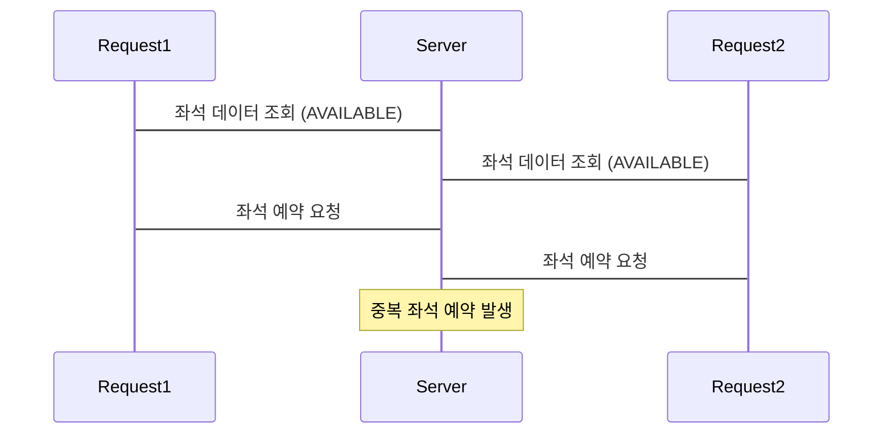

### 💰 결제 처리

예약 데이터 조회 시점에는 결제가 가능했지만, 조회 후 결제 완료 상태로 변경된 경우

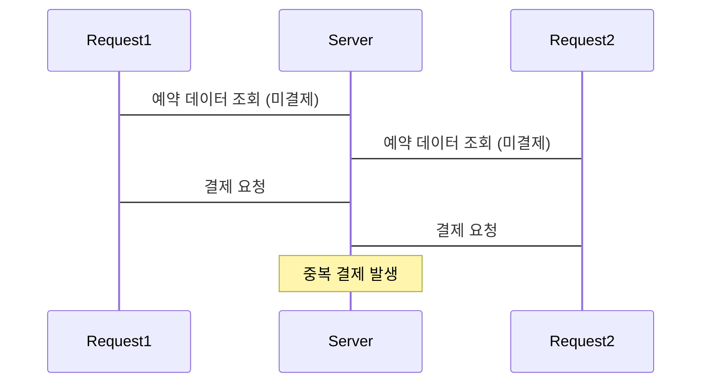

좌석 데이터 조회 시점에는 점유된 시점이었지만, 조회 후 예약 기간이 만료되어 사용자가 예약을 시도하는 경우

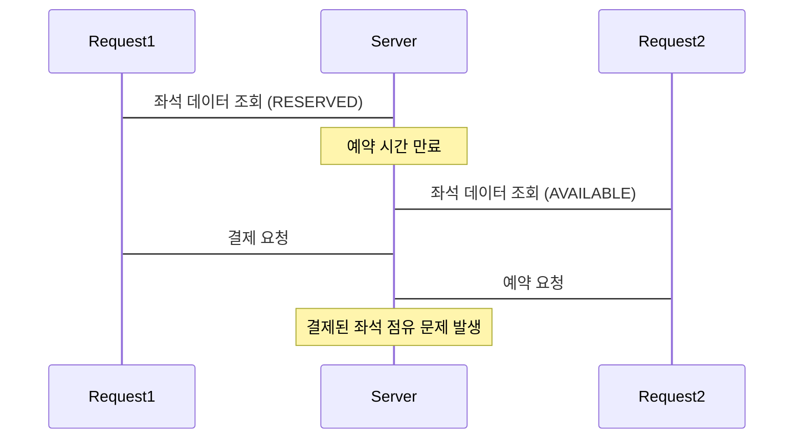

### 🏦 포인트 충전

포인트 충전이 이루어지기 전 조회가 이루어져, 이미 충전된 비용이 덮어 씌워지는 경우

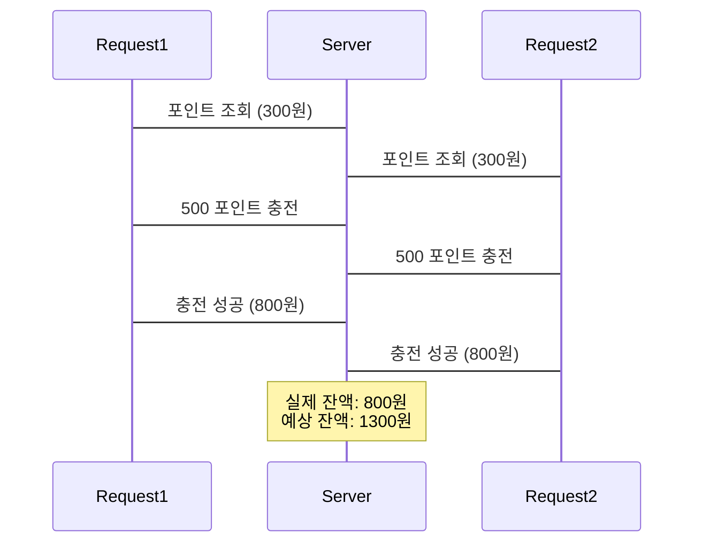

## 📈 성능 테스트 결과

위와 같은 동시성 이슈를 해결하기 위해서 **5가지 락**의 테스트를 진행했습니다. 테스트는 **좌석 예약 시나리오**와 **포인트 충전 시나리오**로 선택했습니다. 이유는 각각의 시나리오가 단일 수행 보장/다중 성공 보장이라는 상반된 상황으로 의미있는 결과를 도출할 수 있다고 판단했습니다.

**가정**

- 100ms 동안 10명, 100명, 1000명의 요청을 처리한 결과
- 스핀 락과 낙관적 락의 retry 딜레이 시간은 50ms로 설정
- 각각의 테스트는 10회 반복 수행
- 모든 요청은 따닥(?)이 아닌 정상 요청으로 가정

### 좌석 예약 시나리오

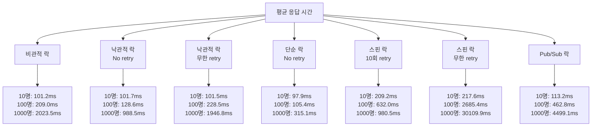

📋 좌석 예약 시나리오 세부 데이터

### 10명 요청

| 비관적 락 | 낙관적 락 | 낙관적 락 (무한 retry 50ms) | Simple Lock (Retry X) | Spin Lock (10회 retry 50ms) | Spin Lock (무한 retry 50ms) | Pub/Sub 락 |
| --------- | --------- | --------------------------- | --------------------- | --------------------------- | --------------------------- | ---------- |
| 104ms     | 102ms     | 107ms                       | 98ms                  | 208ms                       | 232ms                       | 93ms       |
| 94ms      | 99ms      | 95ms                        | 107ms                 | 175ms                       | 275ms                       | 103ms      |
| 94ms      | 105ms     | 96ms                        | 99ms                  | 180ms                       | 186ms                       | 131ms      |
| 100ms     | 104ms     | 106ms                       | 106ms                 | 226ms                       | 235ms                       | 141ms      |
| 96ms      | 89ms      | 104ms                       | 103ms                 | 257ms                       | 208ms                       | 115ms      |
| 102ms     | 105ms     | 93ms                        | 96ms                  | 177ms                       | 229ms                       | 129ms      |
| 107ms     | 101ms     | 99ms                        | 79ms                  | 262ms                       | 145ms                       | 112ms      |
| 110ms     | 98ms      | 112ms                       | 105ms                 | 189ms                       | 242ms                       | 98ms       |
| 101ms     | 113ms     | 108ms                       | 91ms                  | 165ms                       | 283ms                       | 101ms      |
| 104ms     | 101ms     | 95ms                        | 95ms                  | 263ms                       | 141ms                       | 109ms      |

### 100명 요청

| 비관적 락 | 낙관적 락 | 낙관적 락 (무한 retry 50ms) | Simple Lock (Retry X) | Spin Lock (10회 retry 50ms) | Spin Lock (무한 retry 50ms) | Pub/Sub 락 |
| --------- | --------- | --------------------------- | --------------------- | --------------------------- | --------------------------- | ---------- |
| 201ms     | 126ms     | 220ms                       | 110ms                 | 738ms                       | 3230ms                      | 473ms      |
| 208ms     | 125ms     | 219ms                       | 104ms                 | 602ms                       | 3297ms                      | 474ms      |
| 206ms     | 118ms     | 207ms                       | 100ms                 | 635ms                       | 2746ms                      | 491ms      |
| 233ms     | 129ms     | 234ms                       | 104ms                 | 600ms                       | 2383ms                      | 454ms      |
| 215ms     | 142ms     | 228ms                       | 102ms                 | 622ms                       | 1842ms                      | 447ms      |
| 195ms     | 130ms     | 220ms                       | 103ms                 | 615ms                       | 2505ms                      | 478ms      |
| 212ms     | 118ms     | 216ms                       | 110ms                 | 629ms                       | 1775ms                      | 444ms      |
| 208ms     | 118ms     | 249ms                       | 105ms                 | 625ms                       | 3008ms                      | 480ms      |
| 213ms     | 143ms     | 262ms                       | 103ms                 | 618ms                       | 2349ms                      | 465ms      |
| 199ms     | 137ms     | 230ms                       | 102ms                 | 636ms                       | 1715ms                      | 422ms      |

### 1000명 요청

| 비관적 락 | 낙관적 락 (Retry X) | 낙관적 락 (무한 retry 50ms) | Simple Lock (Retry X) | Spin Lock (10회 retry 50ms) | Spin Lock (무한 retry 50ms) | Pub/Sub 락 |
| --------- | ------------------- | --------------------------- | --------------------- | --------------------------- | --------------------------- | ---------- |
| 1914ms    | 939ms               | 2021ms                      | 299ms                 | 1238ms                      | 29322ms                     | 4308ms     |
| 2056ms    | 1066ms              | 2195ms                      | 331ms                 | 1102ms                      | 29813ms                     | 4485ms     |
| 2035ms    | 902ms               | 1512ms                      | 322ms                 | 907ms                       | 32866ms                     | 4511ms     |
| 2183ms    | 1023ms              | 1961ms                      | 322ms                 | 826ms                       | 31912ms                     | 4627ms     |
| 2166ms    | 1113ms              | 1732ms                      | 299ms                 | 819ms                       | 3223ms                      | 4185ms     |
| 2043ms    | 951ms               | 1588ms                      | 286ms                 | 846ms                       | 33926ms                     | 4766ms     |
| 1980ms    | 985ms               | 1769ms                      | 313ms                 | 930ms                       | 31129ms                     | 4394ms     |
| 2006ms    | 934ms               | 2063ms                      | 389ms                 | 863ms                       | 29132ms                     | 4895ms     |
| 1953ms    | 896ms               | 2050ms                      | 291ms                 | 1037ms                      | 30331ms                     | 4531ms     |
| 1899ms    | 1076ms              | 2577ms                      | 299ms                 | 1237ms                      | 31445ms                     | 4289ms     |

### 포인트 충전 시나리오

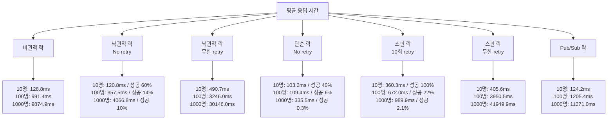

📋 포인트 충전 시나리오 세부 데이터

### 10명 요청

| 비관적 락 | 낙관적 락 | 낙관적 락 (무한 retry 50ms) | Simple Lock | Spin Lock (10회 retry 50ms) | Spin Lock (무한 retry 50ms) | Pub/Sub 락 |
| --------- | --------- | --------------------------- | ----------- | --------------------------- | --------------------------- | ---------- |
| 135ms     | 133ms     | 429ms                       | 112ms       | 325ms                       | 456ms                       | 110ms      |
| 114ms     | 146ms     | 559ms                       | 100ms       | 477ms                       | 360ms                       | 144ms      |
| 121ms     | 109ms     | 573ms                       | 93ms        | 485ms                       | 261ms                       | 134ms      |
| 122ms     | 124ms     | 454ms                       | 108ms       | 235ms                       | 647ms                       | 141ms      |
| 120ms     | 99ms      | 569ms                       | 96ms        | 262ms                       | 425ms                       | 112ms      |
| 125ms     | 130ms     | 634ms                       | 103ms       | 337ms                       | 388ms                       | 132ms      |
| 137ms     | 119ms     | 384ms                       | 129ms       | 331ms                       | 452ms                       | 109ms      |
| 111ms     | 112ms     | 637ms                       | 97ms        | 284ms                       | 294ms                       | 102ms      |
| 160ms     | 123ms     | 351ms                       | 113ms       | 271ms                       | 305ms                       | 153ms      |
| 143ms     | 113ms     | 317ms                       | 81ms        | 596ms                       | 470ms                       | 105ms      |

### 100명 요청

| 비관적 락 | 낙관적 락 | 낙관적 락 (무한 retry 50ms) | Simple Lock (Retry X) | Spin Lock (10회 retry 50ms) | Spin Lock (무한 retry 50ms) | Pub/Sub 락 |
| --------- | --------- | --------------------------- | --------------------- | --------------------------- | --------------------------- | ---------- |
| 920ms     | 345ms     | 3015ms                      | 111ms                 | 633ms                       | 4518ms                      | 1314ms     |
| 937ms     | 457ms     | 3237ms                      | 108ms                 | 850ms                       | 2930ms                      | 1038ms     |
| 1036ms    | 375ms     | 3348ms                      | 110ms                 | 672ms                       | 3822ms                      | 1248ms     |
| 989ms     | 334ms     | 3286ms                      | 117ms                 | 664ms                       | 4322ms                      | 1346ms     |
| 1028ms    | 335ms     | 3476ms                      | 103ms                 | 794ms                       | 5022ms                      | 1045ms     |
| 940ms     | 295ms     | 2546ms                      | 106ms                 | 871ms                       | 4899ms                      | 950ms      |
| 1157ms    | 340ms     | 2861ms                      | 119ms                 | 611ms                       | 5165ms                      | 1356ms     |
| 1102ms    | 341ms     | 3729ms                      | 107ms                 | 607ms                       | 4044ms                      | 1209ms     |
| 893ms     | 407ms     | 3198ms                      | 109ms                 | 635ms                       | 4214ms                      | 1257ms     |
| 912ms     | 346ms     | 3191ms                      | 104ms                 | 708ms                       | 3966ms                      | 1291ms     |

### 1000명 요청

| 비관적 락 | 낙관적 락 (Retry X) | 낙관적 락 (무한 retry 50ms) | Simple Lock (Retry X) | Spin Lock (10회 retry 50ms) | Spin Lock (무한 retry 50ms) | Pub/Sub 락 |
| --------- | ------------------- | --------------------------- | --------------------- | --------------------------- | --------------------------- | ---------- |
| 8856ms    | 2964ms              | 26231ms                     | 339ms                 | 953ms                       | 43954ms                     | 14609ms    |
| 10494ms   | 3952ms              | 26624ms                     | 356ms                 | 1242ms                      | 44294ms                     | 10650ms    |
| 8686ms    | 3479ms              | 28117ms                     | 315ms                 | 1428ms                      | 41837ms                     | 11373ms    |
| 9023ms    | 3908ms              | 25993ms                     | 339ms                 | 997ms                       | 43886ms                     | 9758ms     |
| 8964ms    | 4623ms              | 50556ms                     | 381ms                 | 1291ms                      | 41990ms                     | 10545ms    |
| 8869ms    | 3520ms              | 35556ms                     | 309ms                 | 949ms                       | 43281ms                     | 10770ms    |
| 10602ms   | 4702ms              | 26524ms                     | 344ms                 | 898ms                       | 41293ms                     | 10445ms    |
| 10532ms   | 4496ms              | 27302ms                     | 308ms                 | 1157ms                      | 42256ms                     | 11995ms    |
| 10641ms   | 5028ms              | 25858ms                     | 322ms                 | 1064ms                      | 41108ms                     | 11439ms    |
| 11082ms   | 3996ms              | 28699ms                     | 342ms                 | 899ms                       | 43407ms                     | 11126ms    |

## 📑 테스트 결과 분석

### 좌석 예약 시나리오

**시나리오 특징**

- 하나의 요청이 성공되면 다른 요청은 충돌이 발생해도 무방
- 요청의 시점에 따라 동일 요청이더라도 에러가 발생 (예약된 좌석 상태 OR 락 획득 실패)

**Lock별 성능 비교 및 분석**

1. 요청 수에 따른 성능 변화 (응답 빠른 순)

- 10명 & 100명 요청: Simple Lock > 낙관적 락 (No retry) > 비관적 락 > Pub/Sub 락 > Spin 락 (10회 Retry)
- 1000명 요청: Simple Lock > 낙관적 락 (No retry) > 비관적 락 > Spin 락 (10회 Retry) > Pub/Sub 락

2. 요청 수와 응답시간을 통한 데이터 분석

   10명의 요청을 처리 시, 대부분의 락이 비슷한 성능을 보였지만 1000명의 요청을 처리할 때는 가장 빠른 Simple Lock과 가장 느렸던 비관적 락 & Pub/Sub 락의 속도가 약 10배 정도 차이가 발생했습니다. 테스트 데이터를 통한 판단 시, 이는 비관적 락과 Pub/Sub 락의 특징으로 다른 락들이 동시적 수행 혹은 빠른 에러 발생으로 로직을 수행하는 것과 다르게 모든 로직을 하나씩 직렬적으로 처리하기에 발생했다고 판단했습니다. 또한, 충돌이 적은 구간에서는 Pub/Sub 락이 Spin 락보다 빠른 성능을 보였지만, 1000개의 요청에서는 Spin 락의 10회 Retry를 함에도 로직 수행률 자체가 낮아지며 Pub/Sub 락의 평균 응답시간이 더욱 느리게 보여졌습니다.

3. 성능 차이 분석 및 근거 제시

   **Simple 락 vs 낙관적 락**

   Simple Lock의 구현 상, lock 획득 Race를 한 이후 lock을 획득하지 못한 요청들은 Transaction이 생성되기도 전에 에러가 발생합니다. 반면에 낙관적 락은 Transaction을 생성 후 로직 수행 중에 좌석 상태 체크 혹은 충돌로 인한 에러 발생 후 Transaction을 롤백 해야합니다. 테스트 데이터를 통해 이 부분을 확인할 수 있었는데요. 이러한 특징으로 Simple Lock은 요청이 100배 증가하는 상황에서도 평균 응답 시간은 3배 정도만 증가한걸 볼 수 있습니다. 하지만 낙관적 락은 100명의 요청과 1000명의 요청의 평균 응답시간이 정직하게 10배가 증가하고 있음을 알 수 있습니다.

   **비관적 락 vs Pub/Sub 락**

   비관적 락과 Pub/Sub 락의 구현에 사용된 도구에 차이가 비슷한 동작임에도 두 락의 성능 차이를 발생시킨다고 판단했습니다. 정확하게 말하면 데이터베이스와 레디스에 차이라고 생각이 들었는데요. 데이터베이스로 제어되는 비관적 락은 락의 획득과 해제에 대한 Role을 데이터베이스에서 가져가고 이를 감지하는 시간이 빠를 수 밖에 없습니다. 반면에, 레디스는 락 획득과 해제의 과정에서 네트워크 통신과 메시지 브로커를 거치는 과정에서 발생하는 지연이 상대적 오버헤드로 발생한다고 생각됩니다. 이를 뒷 받침하는 데이터는 각각의 요청 별 평균 응답시간입니다. 비관적 락과 Pub/Sub 락의 각각 10, 100, 1000 요청별로 평균 응답시간이 약 20ms, 250ms, 2500ms 차이가 있음을 알 수 있습니다. 즉, transaction 내부 로직의 수행 시간은 동일하지만 이를 수행하기 전 본인의 순서를 감지하는게 요청별 약 2.0 ~ 2.5ms가 걸린다고 판단되었습니다. 이는 물론 현재 개인 네트워크 환경에서 발생한 부분으로 각 환경별 차이가 있을 수 있겠지만 요청별 일정 오버헤드가 발생한다는 부분을 알 수 있었습니다.

이러한 분석된 데이터를 기반으로 판단 시, 단일 성공이 보장되면서 빠르게 동시성 처리를 진행할 수 있는 낙관적 락과 Simple 락이 좌석 예약 시나리오에 적합하다고 판단했습니다.

---

### 포인트 충전 시나리오

**시나리오 특징**

- 모든 요청이 수행되어야 함
- 요청 자체에 문제가 없는 경우, 에러가 발생하지 않음

**Lock별 성능 비교 및 분석**

1. 요청 수에 따른 성능 변화 (응답 빠른 순)

   10명 요청: Pub/Sub 락 -> 비관적 락 -> Spin 락 (무한 Retry) -> 낙관적 락 (무한 retry)
   100명 & 1000명 요청: 비관적 락 -> Pub/Sub 락 -> 낙관적 락 (무한 retry) -> Spin 락 (무한 Retry)

2. 요청 수와 응답시간을 통한 데이터 분석

   좌석 예약 시나리오와 다르게 10명의 요청부터 락별로 성능차이가 크게 발생했습니다. 이는 좌석 예약 시나리오와 다르게 포인트 충전은 락 획득 실패 시, 에러를 발생시키는게 아닌 Retry를 통해 로직 수행을 진행했기 때문입니다. 따라서, 요청의 수가 커질수록 낙관적 락과 Spin 락의 충돌은 많아질 수 밖에 없고 평균 응답시간 또한 크게 증가했습니다. 앞선 좌석 예약 시나리오와 다르게 이번 시나리오에서는 비관적 락과 Pub/Sub 락의 평균 응답시간이 낮아졌고 반대로 상대적으로 빨랐던 낙관적 락과 Spin 락의 평균 응답시간이 올라갔습니다.

3. 성능 차이 분석 및 근거 제시

   **Spin 락 vs 낙관적 락**

   Spin 락과 낙관적 락 모두 로직을 수행 중 실패 시, 성공할때까지 무한 Retry를 하는 부분이 이번 시나리오에 공통점이었습니다. 따라서 충돌이 많이 발생하고 모든 로직을 수행해야하는 이번 시나리오에서 성능이 매우 낮게 측정 되었는데요. 그럼에도 두 락 사이에 성능적 차이는 약 30% 가까이 발생했습니다. 데이터를 보고 어떠한 이유로 낙관적 락이 Spin 락 보다 빠른지 의아했는데요. 결국 낙관적 락은 우선적으로 로직을 수행 후 충돌을 제어하는 반면, Spin 락은 락을 획득하는 과정에서부터 충돌을 제어하고 락을 획득한 요청부터 순차적으로 로직을 돌리는 차이가 이러한 차이를 만들었다고 생각이 들었습니다.

   **비관적 락 vs Pub/Sub 락**

   좌석 예약 시나리오와 같이 비관적 락과 Pub/Sub 락의 도구적 차이로 오는 성능 차이는 동일하다고 생각이 듭니다. 다만, 좌석 예약 시나리오와 비교하면 포인트 충전 시나리오에서는 두 락의 성능 차이가 거의 없다고 보여지는데요 (약 1.1배). 이유는 전체적인 로직 수행에 들어가는 시간이 커져서 상대적으로 메시지 브로커와 관련된 오버헤드의 비중이 적어졌기 때문입니다. 포인트 충전 시나리오는 좌석 예약 시나리오와 달리 결국 트랜잭션을 수행 후 커밋이 진행되야 하기에 전체적인 요청의 평균 응답시간이 긴 편입니다. 그렇기에 요청별 오버헤드는 비슷하게 약 2.0 ~ 2.5ms로 유지되더라도 이 시간이 전체 로직 수행시간에 미치는 상대적 영향도가 낮아졌다는 결과를 낼 수 있었습니다.

이러한 분석된 데이터를 기반으로 판단 시, 다중 성공이 보장되면서 가장 빠르게 동시성 처리를 진행할 수 있는 비관적 락과 Pub/Sub 락이 포인트 충전 시나리오에 적합하다고 판단했습니다.

## 🔏 락 방식의 장단점

| 제어 방식  | 장점                                                                    | 단점                                                                                         |
| ---------- | ----------------------------------------------------------------------- | -------------------------------------------------------------------------------------------- |
| 비관적 락  | - 데이터 일관성 보장 - 충돌 빈도 높을 때 효과적 - 순서 보장       | - DB 성능 저하 가능성 - 데드락 위험                                                       |
| 낙관적 락  | - 충돌 적을 때 높은 성능 - DB 부하 감소 - 확장성 좋음             | - 충돌 많을 때 성능 저하 - 재시도 로직 필요 - 상대적 구현 복잡 (재시도 및 에러 핸들링) |
| 단순 락    | - 구현 간단 - 매우 빠른 응답 시간                                    | - 충돌 시 처리 실패 - 재시도 로직 없음 - 다중 성공 시나리오에 부적합                   |
| 스핀 락    | - 짧은 대기 시간에 효과적 - 높은 처리량 가능 - 유연한 재시도 설정 | - CPU 집약적 - 충돌이 많을 때 성능 저하                                                   |
| Pub/Sub 락 | - 분산 환경에 적합 - 확장성 우수 - 안정적으로 원자적 처리 가능    | - 메시지 브로커 의존성 높음 - 네트워크 지연에 민감 - 상대적 구현 복잡                  |

## 👍 시나리오별 권장 락 방식

분석 결과를 바탕으로 각 시나리오에 대한 권장 락 방식을 제시합니다:

1. **좌석 예약**: 낙관적 락

   - 충돌이 발생하더라도 하나의 좌석만 예약이 되면 문제가 없음
   - 따라서 낙관적 락으로 진행 후, 락 충돌 혹은 좌석 상태 변경으로 인한 에러를 일괄적으로 Retry 없이 핸들링 할 수 있어 성능적으로 우위

2. **결제 처리**: 낙관적 락 + 비관적 락

   - 이미 진행된 예약에 대한 결제로 하나의 작업만 수행이 되야 함
   - 상대적으로 예약 자체에 대한 충돌 가능성 적음
   - 단, 포인트 사용 로직에서 포인트 충전과의 순차적 처리가 필요

3. **포인트 충전 (모두 유효한 요청으로 가정)**: 비관적 락

   - 모든 요청에 대한 로직 수행이 필요
   - 포인트 사용과 맞물려 동작할 수 있음으로, 각각의 수정이 순차적으로 처리가 필요

## 😎 맺으며

이번 분석을 통해, 시스템 요구사항에 따른 적절한 락 방식을 선택하는 능력을 향상시킬 수 있었습니다. 다양한 동시성 제어 방식을 직접 구현하고 테스트하는 과정에서, 예상과 실제 결과 사이의 차이를 경험하며 잘못 알고 있었던 부분들을 많이 이해하게 된것 같습니다.

앞으로의 프로젝트에서 이번 분석을 계기로 체계적인 분석과 검증 과정을 통해 더 나은 기술적 결정을 내릴 수 있도록 노력해야겠다고 느낀 주간이였습니다.

## 개요

대용량 트래픽이 예상되는 콘서트 예약 시스템을 위한 백엔드 애플리케이션입니다. 본 시스템은 다수의 서버 인스턴스 환경에서도 동시성 문제를 방지하고 안정적으로 작동할 수 있도록 설계되었습니다. 대기열을 이용한 유저 유입량 조절을 통해 서버 부하를 줄이고 효율적인 콘서트 예약 기능을 지원합니다.

## 주요 기능

- 대기열 시스템: 동시성 문제 해결을 위한 유저 대기열 관리
- 예약 기능: 예약 가능 날짜 및 좌석 조회, 좌석 예약 요청
- 결제 기능: 예약된 좌석에 대한 결제 처리
- 사용자 인증: JWT 기반 사용자 인증
- 포인트 관리: 잔액 충전 및 조회 기능

## 기술 스택

- 백엔드: NestJS, TypeScript
- 데이터베이스: PostgreSQL, TypeORM
- 테스트: Jest (Unit, Integration, e2e)
- 패키지관리: yarn

## 요구 사항

- 각 기능 및 제약사항에 대해 단위 테스트를 반드시 하나 이상 작성하도록 합니다.
- 다수의 인스턴스로 어플리케이션이 동작하더라도 기능에 문제가 없도록 작성하도록 합니다.
- 동시성 이슈를 고려하여 구현합니다.
- 대기열 개념을 고려해 구현합니다.

## API 목록

세부적인 API 명세는 [포스트맨 Document](https://documenter.getpostman.com/view/12809852/2sA3dyhAWT)로 작성했습니다.

- 유저 토큰 발급 API (`POST /users/queue`)
- 예약 가능 날짜 조회 API (`GET /concerts/:concertId/schedules/bookable`)
- 예약 가능 좌석 조회 API (`GET /concerts/schedules/:concertScheduleId/seats`)
- 좌석 예약 요청 API (`POST /concerts/seats/:concertSeatId/book`)
- 결제 API (`POST /concerts/bookings/:concertBookingId/pay`)
- 잔액 충전 API (`POST /points/charge`)
- 잔액 조회 API (`GET /points`)

## Milestone

프로젝트의 주요 [마일스톤](https://github.com/users/DongGunYoon/projects/2)은 다음과 같습니다.

## ERD

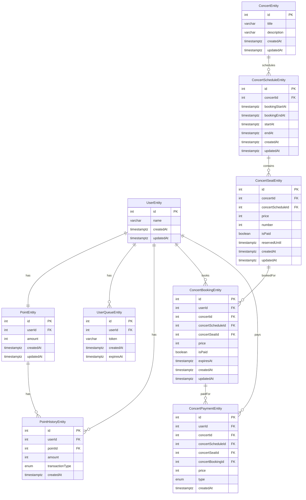

## 시퀀스 다이어그램

아래는 각 주요 API에 대한 시퀀스 다이어그램입니다. 이 다이어그램들은 각 API의 동작 흐름을 표현합니다.

### 유저 토큰 발급 API

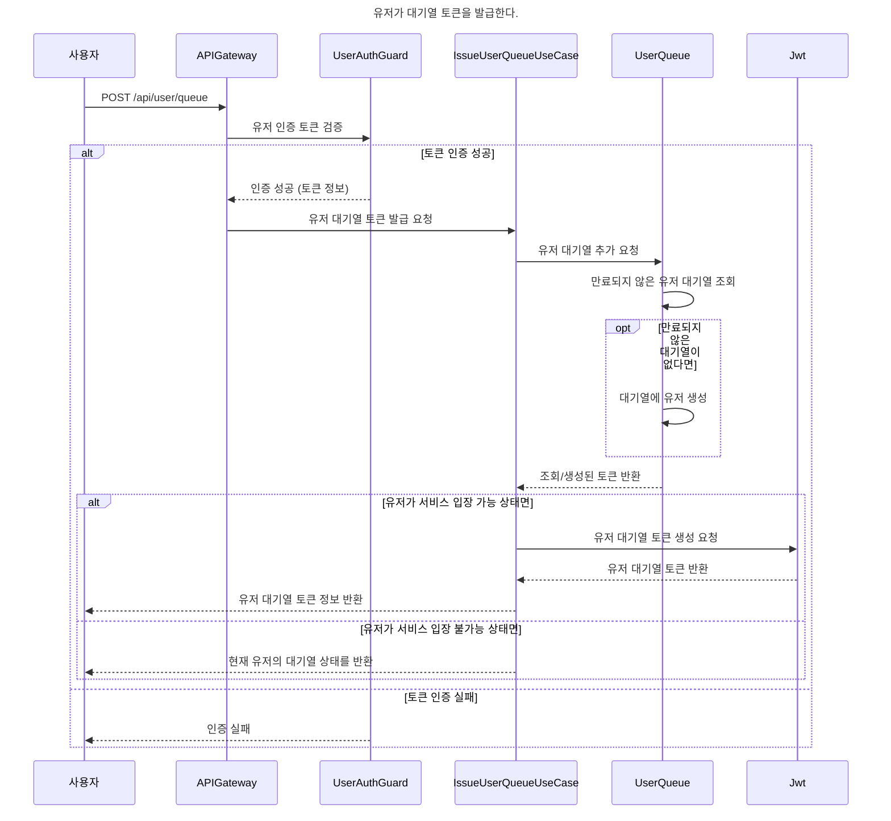

### 예약 가능 날짜 조회 API

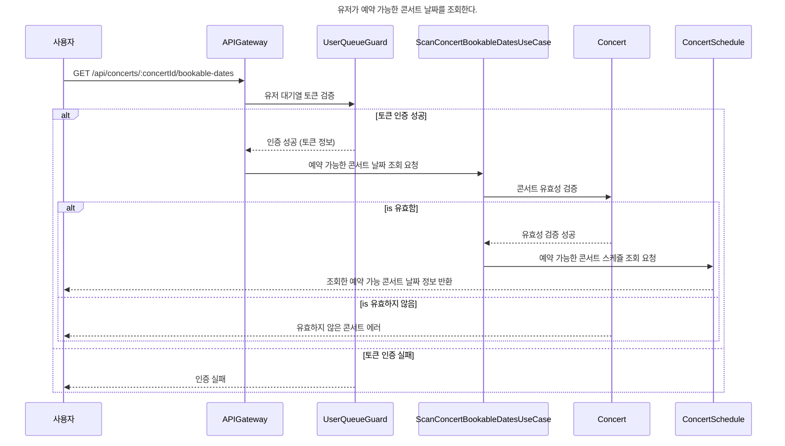

### 예약 가능 좌석 조회 API

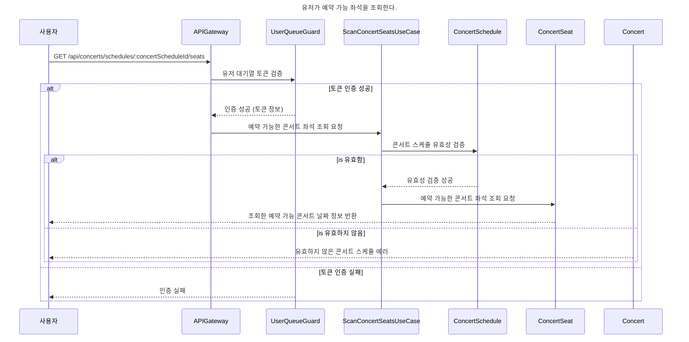

### 좌석 예약 요청 API

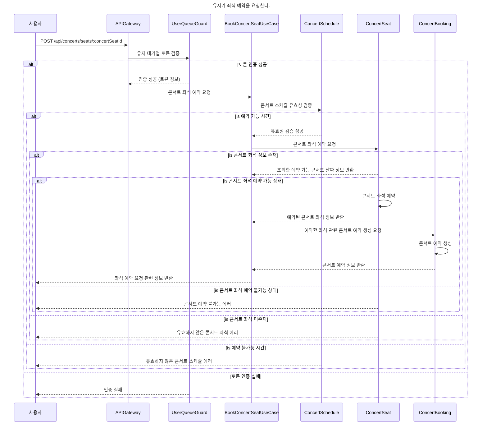

### 잔액 충전 API

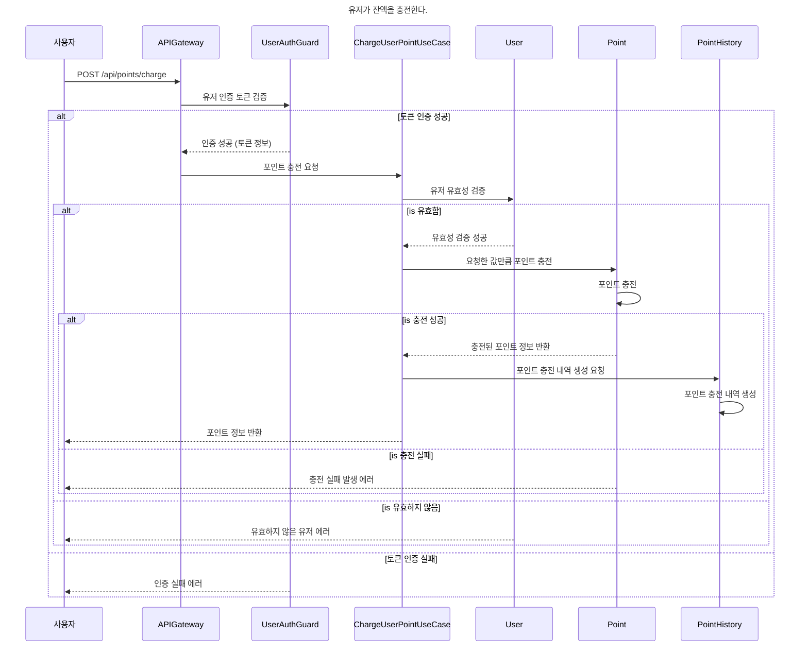

### 잔액 조회 API

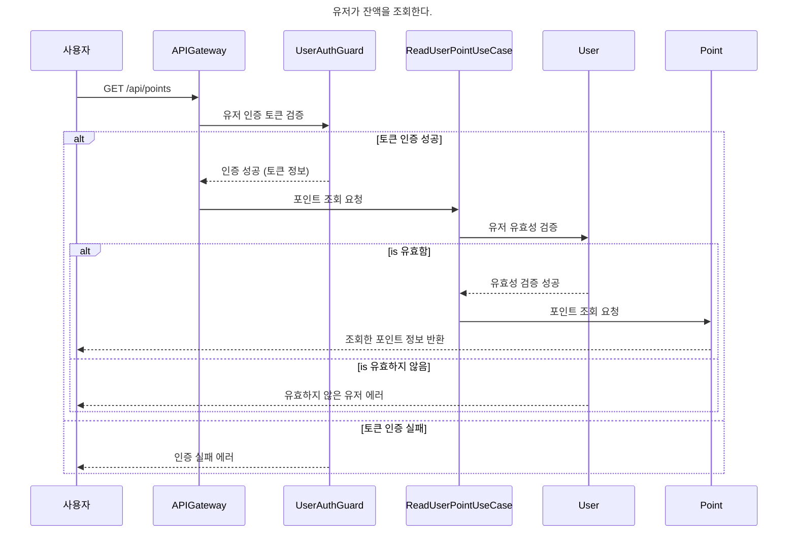

### 결제 API

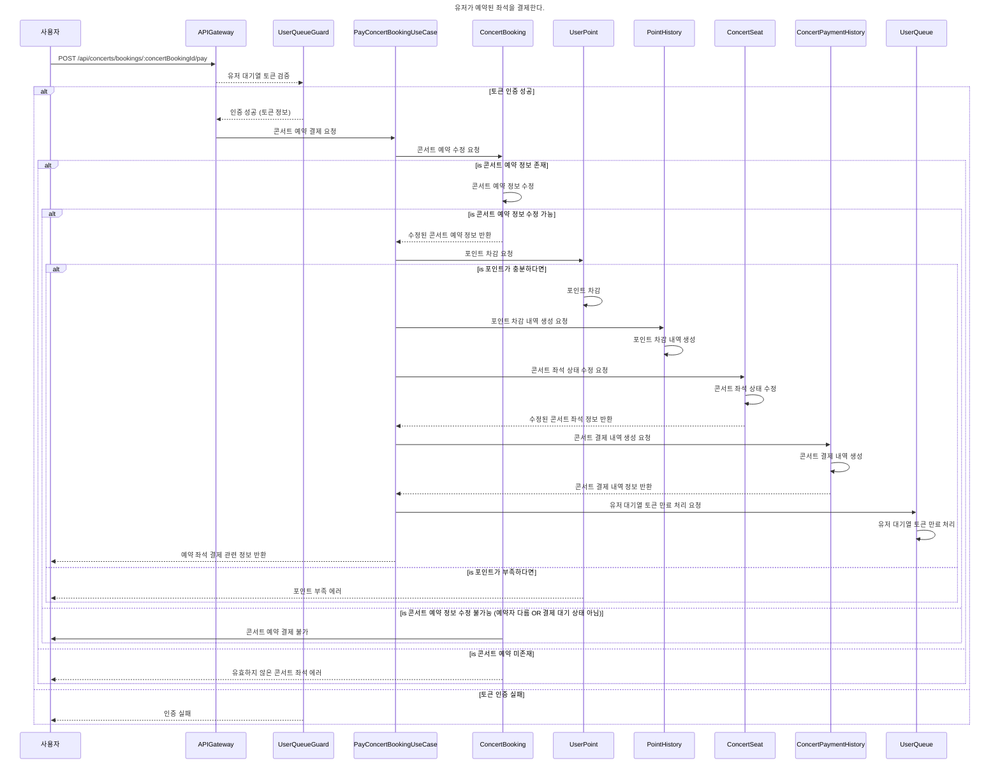
