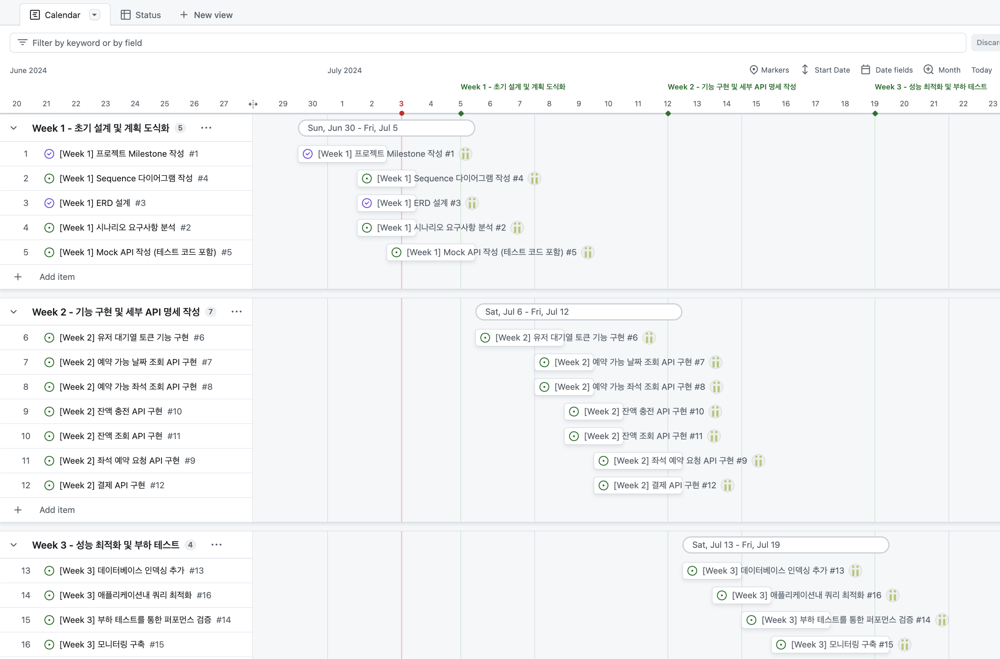
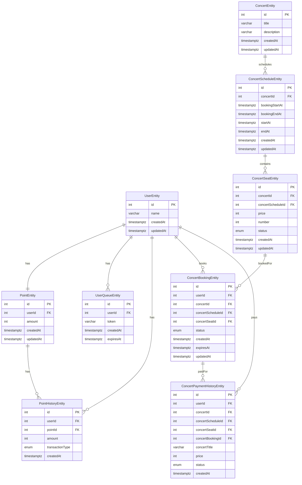
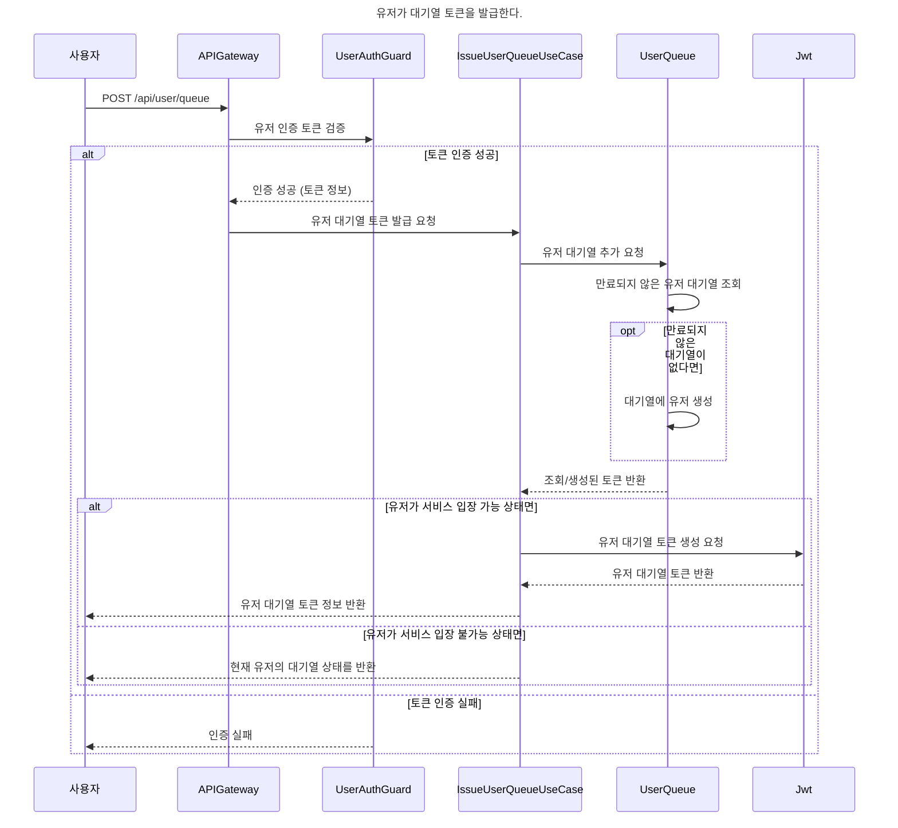
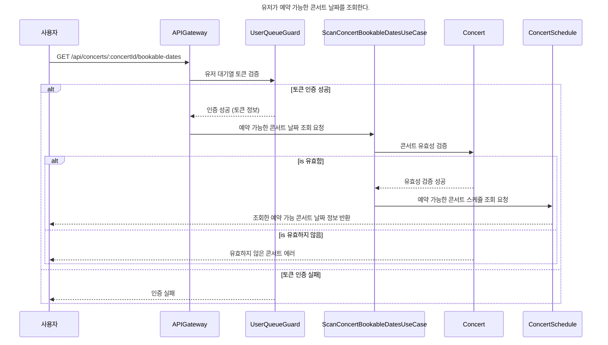
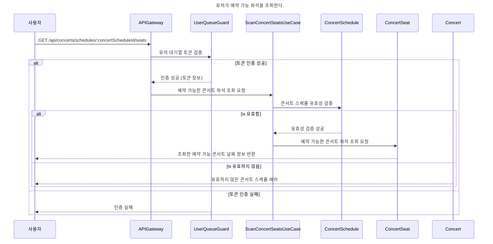
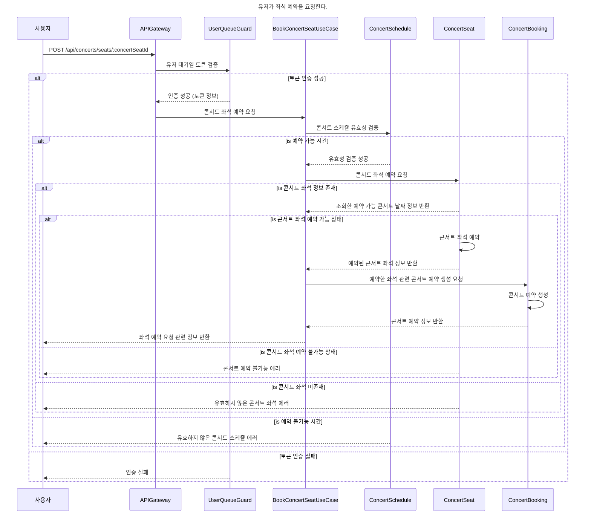
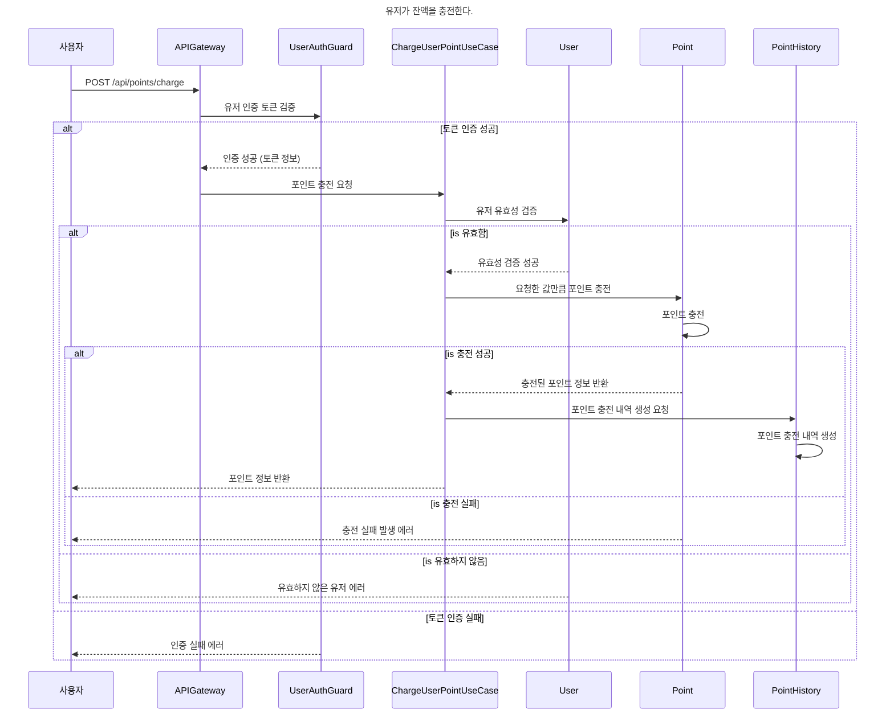
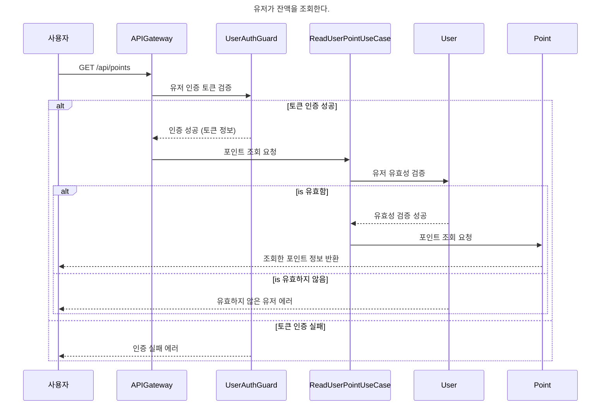
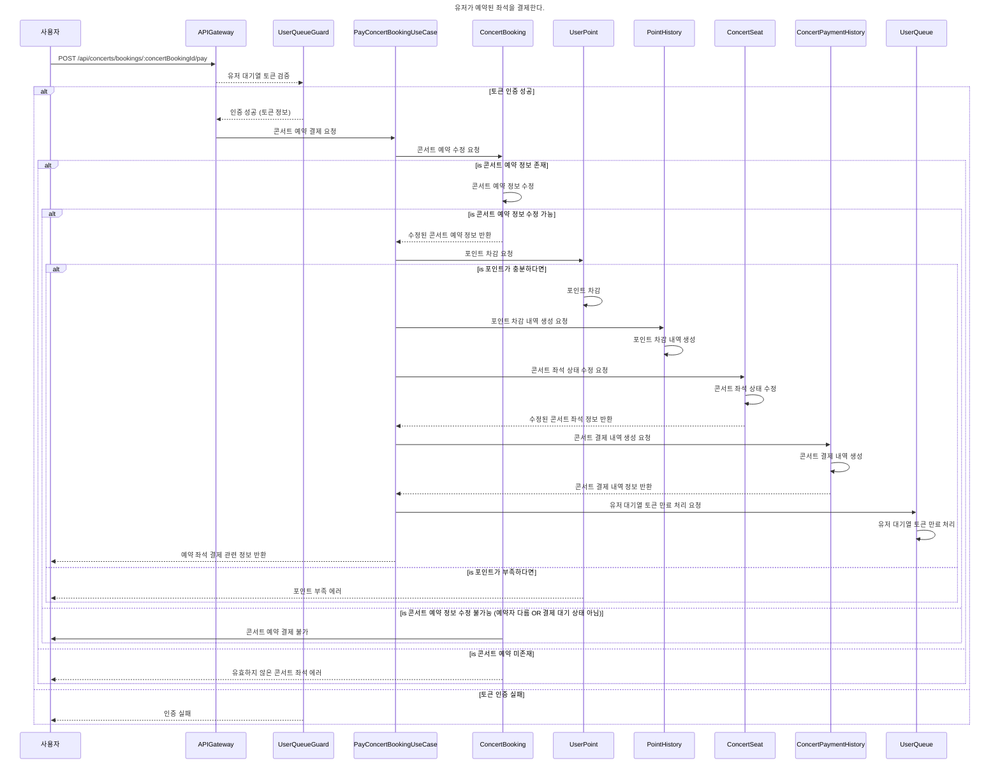

# High-Volume Concert Booking

## 개요

대용량 트래픽이 예상되는 콘서트 예약 시스템을 위한 백엔드 애플리케이션입니다. 본 시스템은 다수의 서버 인스턴스 환경에서도 동시성 문제를 방지하고 안정적으로 작동할 수 있도록 설계되었습니다. 대기열을 이용한 유저 유입량 조절을 통해 서버 부하를 줄이고 효율적인 콘서트 예약 기능을 지원합니다.

## 주요 기능

대기열 시스템: 동시성 문제 해결을 위한 유저 대기열 관리
예약 기능: 예약 가능 날짜 및 좌석 조회, 좌석 예약 요청
결제 기능: 예약된 좌석에 대한 결제 처리
사용자 인증: JWT 기반 사용자 인증
포인트 관리: 잔액 충전 및 조회 기능

## 기술 스택

- 백엔드: NestJS, TypeScript
- 데이터베이스: PostgreSQL, TypeORM
- 테스트: Jest (Unit, Integration, e2e)
- 패키지관리: yarn

## 요구 사항

- 각 기능 및 제약사항에 대해 단위 테스트를 반드시 하나 이상 작성하도록 합니다.
- 다수의 인스턴스로 어플리케이션이 동작하더라도 기능에 문제가 없도록 작성하도록 합니다.
- 동시성 이슈를 고려하여 구현합니다.
- 대기열 개념을 고려해 구현합니다.

## API 목록

세부적인 API 명세는 [포스트맨 Document](https://documenter.getpostman.com/view/12809852/2sA3dyhAWT)로 작성했습니다.

- 유저 토큰 발급 API (`POST /users/queue`)
- 예약 가능 날짜 조회 API (`GET /concerts/:concertId/schedules/bookable`)
- 예약 가능 좌석 조회 API (`GET /concerts/schedules/:concertScheduleId/seats`)
- 좌석 예약 요청 API (`POST /concerts/seats/:concertSeatId/book`)
- 결제 API (`POST /concerts/bookings/:concertBookingId/pay`)
- 잔액 충전 API (`POST /points/charge`)
- 잔액 조회 API (`GET /points`)

## Milestone

프로젝트의 주요 [마일스톤](https://github.com/users/DongGunYoon/projects/2)은 다음과 같습니다.

## ERD

## 시퀀스 다이어그램

아래는 각 주요 API에 대한 시퀀스 다이어그램입니다. 이 다이어그램들은 각 API의 동작 흐름을 표현합니다.

### 유저 토큰 발급 API

### 예약 가능 날짜 조회 API

### 예약 가능 좌석 조회 API

### 좌석 예약 요청 API

### 잔액 충전 API

### 잔액 조회 API

### 결제 API

