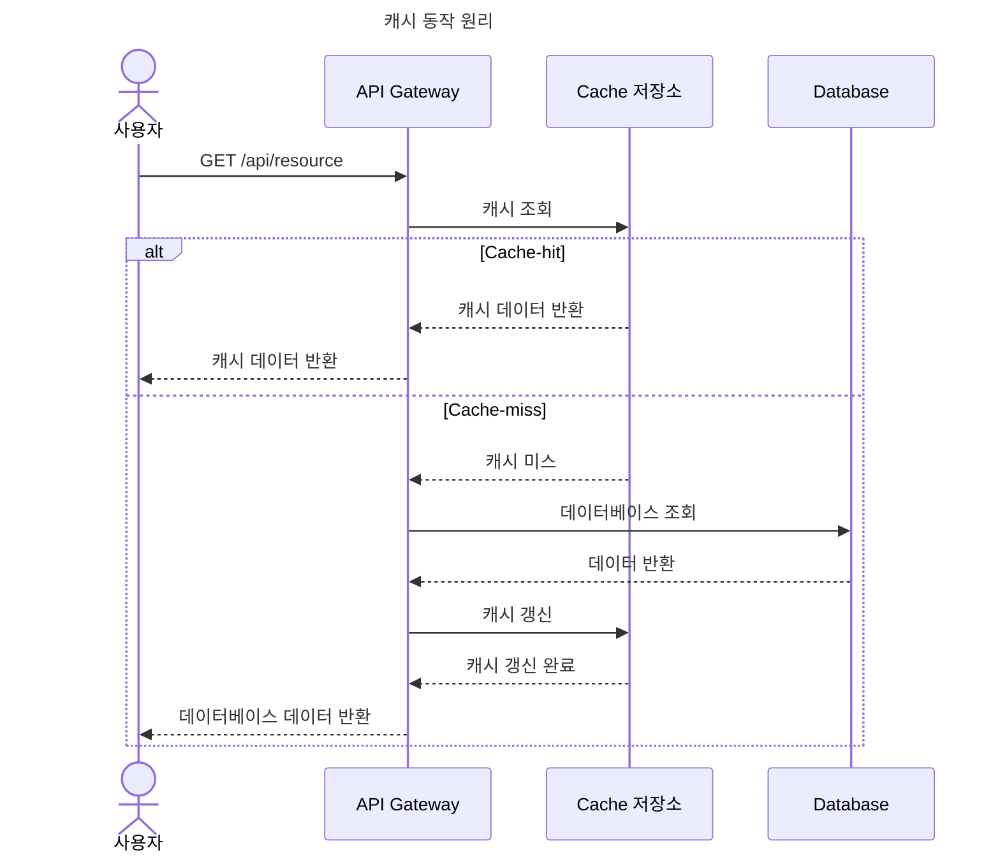
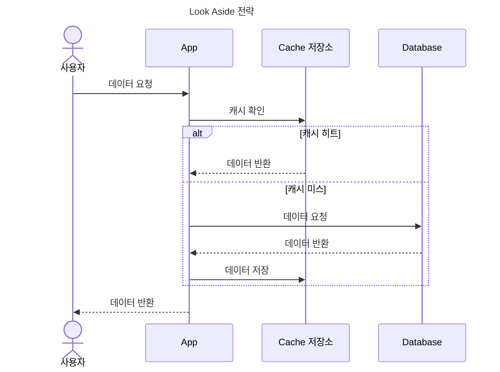
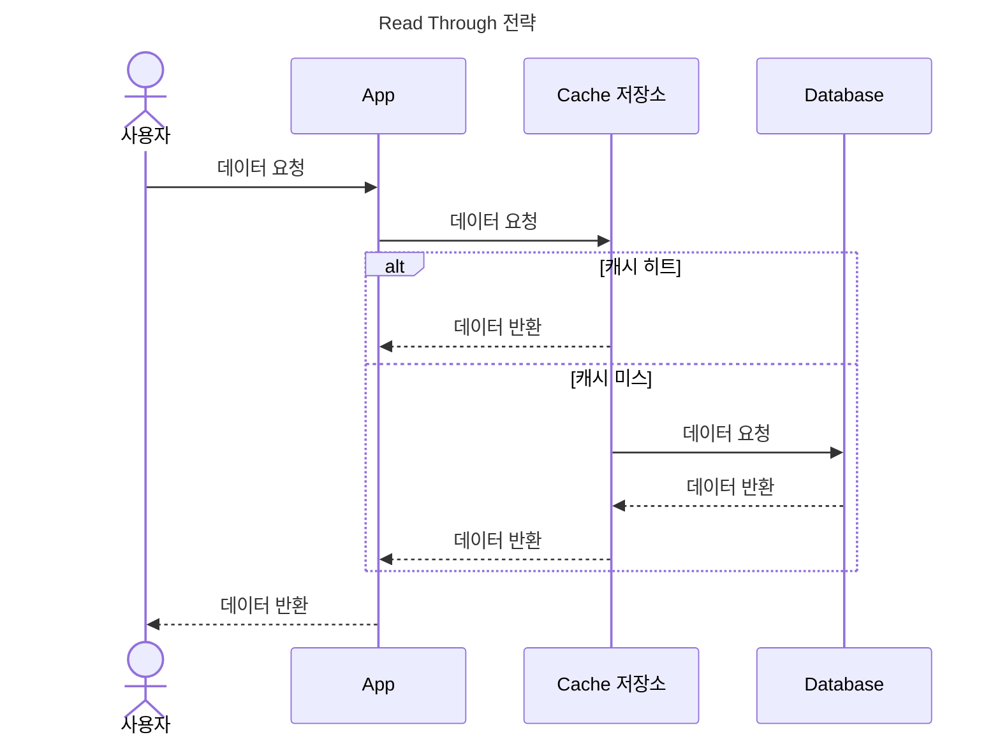
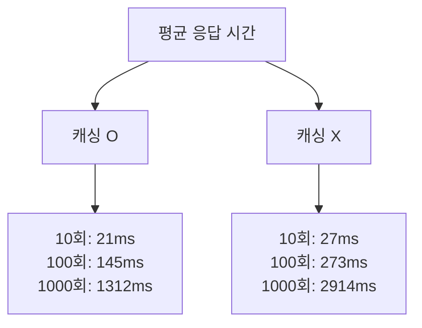

# 쿼리 분석 및 캐싱 전략 설계

## **🧐** 캐싱이란?

`NestJS` 공식 문서에서는 캐시를 아래와 같이 설명하고 있습니다.

> Caching is a great and simple **technique** that helps improve your app's performance. It acts as a temporary data store providing high performance data access.

간단하게 요약하면, 캐싱이란 애플리케이션의 성능을 향상시켜주는 간단하고 좋은 기술이라는 말인데요. 캐싱은 원본 데이터가 있는 곳이 아닌 별도의 저장소에 데이터를 복사해두고 적은 비용과 시간으로 데이터를 빠르게 조회하게 합니다. 따라서, 조회가 빈번하게 일어나는 경우나 조회 로직에 비용이 큰 곳이 캐싱에 주요 고려 대상이 됩니다.

## 📋 캐시 동작 원리

캐싱은 구현 방식에 따라 차이가 존재하지만 크게 아래 다섯 단계의 동작으로 구분됩니다.

1. **캐시 공간**: 빠른 접근이 가능한 메모리 영역에 캐시 저장소를 마련합니다
2. **캐시 조회**: 요청이 들어오면 먼저 캐시 저장소를 확인합니다.
3. **캐시 히트(Cache Hit)**: 캐시 저장소에 데이터가 있으면 즉시 반환합니다.
4. **캐시 미스(Cache Miss)**: 캐시에 데이터가 없으면 원본 소스에서 데이터를 가져와 캐시에 저장 후 반환합니다.
5. **캐시 갱신**: 캐시 공간 부족 또는 데이터 변경 시 캐시를 갱신합니다.

## 🗄️ 캐싱 레벨

일반적으로 소프트웨어에서 고려할 수 있는 캐싱 Level은 두 가지가 있는데요. 첫 번째는 서버와 같은 애플리케이션의 메모리에 데이터를 저장해서 활용하는 Application Level. 두 번째는 외부에 별도 캐시 저장소를 활용해서 제공하는 External Level 캐시가 있습니다.

### **Application Level 캐시**

**장점**

- 빠른 접근 속도
- 낮은 네트워크 비용

**단점**

- 서버 재시작 및 애플리케이션 종료에 의한 데이터 손실 가능
- 분산 환경에서의 데이터 일관성 문제

### **External Level 캐시**

**장점**

- 분산 환경에서의 데이터 일관성 유지
- 높은 가용성

**단점**

- 네트워크 오버헤드 발생
- 외부에 자원에 의존성 증가

## 🛠️ 캐싱 전략

캐싱은 위에 설명한것과 같이 다양한 장점이 있지만 그와 동시에 필수적으로 고민해볼 부분이 있는데요. 바로 데이터의 `갱신과 관리`입니다. 물론 변하지 않을 데이터라면 고민이 적겠지만 대부분의 자원들은 변하기 때문에 항상 어떻게 실제 데이터와의 싱크를 적절하게 유지할지 고민해야 하는데요. 캐싱에 대표적인 읽기 전략 두 가지와 데이터 갱신을 다루는 방식 두 가지를 알아보겠습니다.

### 읽기 전략

**Look Aside**

애플리케이션이 먼저 캐시를 확인하고, 캐시에 데이터가 없을 경우 데이터베이스에서 데이터를 가져와 캐시에 저장하는 방식입니다.

**장점**

- 캐시 장애 시 데이터베이스로 직접 요청을 전환할 수 있어 비교적 안전
- 자주 사용되는 데이터만 캐시에 저장되므로 캐시 공간을 효율적으로 사용가능

**단점**

- 캐시 미스 시 데이터베이스 조회로 인한 지연 발생
- 최초 요청 시 항상 데이터베이스 조회가 필요하여 초기 응답 시간 느림

**Read Through**

캐시가 데이터베이스와의 상호작용을 관리하며, 애플리케이션은 항상 캐시만을 통해 데이터를 요청하는 방식입니다.

**장점:**

- 애플리케이션 로직이 단순화되며, 캐시와 데이터베이스 간의 일관성 유지가 용이
- 캐시 미스 시 자동으로 데이터를 로드하므로 개발자가 별도로 관리할 필요가 없습니다.

**단점:**

- 캐시 계층에 장애가 발생하면 전체 시스템에 영향을 미침
- 모든 읽기 요청이 캐시를 통과해야 하므로, 캐시 계층의 성능이 중요
- 사용되지 않는 데이터도 캐시에 로드될 수 있어 캐시 공간 사용이 비효율적

### 갱신 전략

**Expiration**

캐싱하는 데이터에 “만료”를 설정하는 방식으로 캐싱을 진행하면서 얼마동안 이 데이터를 사용하겠다고 지정하는 방식입니다. 처음에 지정해둔 시간이 지나면 데이터가 삭제됩니다.

**Eviction**

명시적으로 캐시 데이터를 삭제하는 방식입니다. 따라서, 캐싱을 진행하며 설정하는게 아닌 의도적인 상황 혹은 시점에 캐시 데이터를 삭제할 때 사용됩니다.

## 📝 API별 쿼리 시나리오 세부 분석

이제 알아본 캐시의 특징과 전략들을 활용해서 현재 애플리케이션 쿼리들에 캐싱이 어울릴지? 어울린다면 어떤 캐싱 전략을 채택하면 좋을지 알아보겠습니다.

### 콘서트 목록 조회

콘서트 목록을 조회하는 API 입니다. 현재 서비스에 생성된 콘서트들의 정보를 반환받고 원하는 콘서트를 찾기 위해 제공됩니다. 여기서 찾은 콘서트 ID를 통해 추후 예약 가능한 콘서트 스케쥴 목록을 조회합니다.

콘서트 예약을 하기 위한 첫 관문으로, 대부분의 사용자가 자주 사용할 API입니다. 또한, 콘서트 정보가 변경될 일은 드물어 캐싱을 하기 좋은 API라고 판단됩니다. 특정한 주기를 가지고 변화되는 데이터가 아니라 새로운 콘서트의 생성 또는 수정이 발생할 때, 값이 변경되기에 Expiration이 아닌 Eviction 전략을 선택했습니다. Eviction을 하는 시나리오로는 콘서트의 생성 및 수정이 있습니다.

| 사용 빈도 | 변경 빈도 | 쿼리 복잡도 |
| --------- | --------- | ----------- |
| 높음      | 낮음      | 낮음        |

**캐싱 적용 O/X 데이터 비교**

콘서트 목록 조회의 캐싱 적용 전/후 데이터 비교입니다. 캐싱을 적용한것과 적용하지 않은 요청들의 평균 응답시간이 대략적으로 두 배 차이가 나는걸 볼 수 있습니다. 비교적 쿼리가 단순하고 캐싱 모듈간의 네트워크 오버헤드가 존재해 극적인 차이를 보이지는 않지만 충분한 개선은 이루어졌습니다. 또한, 응답시간과는 별개로 데이터베이스에 요청되는 쿼리 자체의 수가 줄어 부하를 분산 할 수 있는 부수적인 장점도 있습니다.

### 예약 가능한 스케쥴 목록 조회

예약 가능한 콘서트 스케쥴 목록을 조회하는 API 입니다. 특정한 콘서트 ID를 입력 받아 해당 콘서트의 예약 가능한 스케쥴 목록을 반환 받고 콘서트 좌석 정보를 조회하기 위해 제공됩니다. 여기서 찾은 콘서트 스케쥴 ID를 통해 추후 예약 가능한 좌석 목록을 조회합니다.

특정한 콘서트의 예약 가능 스케쥴을 조회하는 API로 대부분의 사용자가 자주 사용할 API입니다. 다만, 콘서트 기본 정보와 다르게 스케쥴을 변경 및 추가가 잦을 수 있지만 해당하는 콘서트의 스케쥴 추가 및 수정의 기준으로 Eviction 전략을 세우면 캐싱이 충분히 가능하다고 판단했습니다. 마찬가지로 주기를 가지고 변경되는 데이터가 아닌 명시적인 스케쥴 생성 및 수정으로 변경이 되기에 Expiration보다 Eviction 전략이 잘 맞는다고 판단했습니다.

| 사용 빈도 | 변경 빈도 | 쿼리 복잡도 |
| --------- | --------- | ----------- |
| 높음      | 중간      | 중간        |

**캐싱 적용 O/X 데이터 비교**

예약 가능한 좌석 목록 조회의 캐싱 적용 전/후 데이터 비교입니다. 캐싱을 적용하기 전, 요청 수와 응답 시간이 대략적으로 10배씩 증가하는걸 볼수 있습니다. 반면에, 캐싱을 적용한 응답 시간은 초기에는 캐싱을 적용하지 않은 요청과 크게 차이가 없어 보이지만 점점 큰 폭의 차이가 발생하는걸 볼 수 있습니다. 초기에 한번 캐싱을 적용하는데까지의 시간이 걸리고 이후에는 캐시를 구현한 모듈간의 네트워크 오버헤드만 발생하기 때문이라고 판단됩니다. 따라서 캐싱은 네트워크 오버헤드가 적으며 실질적인 쿼리의 비용이 무거울수록 효율적이라는걸 알 수 있습니다.

### 좌석 목록 조회

콘서트 스케쥴 좌석 목록을 조회하는 API 입니다. 특정한 콘서트 스케쥴 ID를 입력 받아 해당 콘서트 스케쥴의 좌3석 정보 목록을 반환 받고 좌석 예약을 진행하기 위해 제공됩니다. 여기서 찾은 콘서트 좌석 ID를 통해 추후 콘서트 좌석 예약이 가능합니다.

원하는 좌석을 찾아 예매하기 위해 사용되는 API로 많은 사용자가 사용하지만 인기 있는 자리의 빠른 변경과 실시간성에 가까운 데이터가 요구되는 API입니다. 따라서 캐싱을 고려한다면 짧은 주기와 잦은 eviction이 발생하는데 이는 오히려 캐시 스탬피드 현상 및 예측 어려움을 자아낼 수 있습니다.

| 사용 빈도 | 변경 빈도 | 쿼리 복잡도 |
| --------- | --------- | ----------- |
| 높음      | 높음      | 낮음        |

### 포인트 조회

사용자의 포인트를 조회하는 API 입니다. 자신의 토큰 정보를 기반으로 식별하여 자신의 현재 보유 포인트를 조회합니다.

사용자가 자신의 포인트를 조회하는 API입니다. 앞선 API들고 다르게 사용 빈도가 몰릴 일이 적고 사용자 개개인의 키를 통해 따로 캐싱을 해야하기에 유저의 수만큼 생성될 수 있습니다. 이는 그 만큼 많은 메모리를 사용해야 하며 쿼리 복잡도가 낮고 사용 빈도가 적은 데이터를 위한 트레이드 오프로는 과하다고 생각이 됩니다.

| 사용 빈도 | 변경 빈도 | 쿼리 복잡도 |
| --------- | --------- | ----------- |
| 낮음      | 중간      | 낮음        |

## 🎯 시나리오별 캐싱 전략 정리

| 쿼리 시나리오           | 캐싱 전략                                              | 사유                                                                                   |
| ----------------------- | ------------------------------------------------------ | -------------------------------------------------------------------------------------- |
| 콘서트 목록 조회        | - Look Aside - Eviction: 콘서트 추가 및 수정        | - 조회가 빈번하게 이루어지고, 추가 및 수정이 적다고 판단 - 데이터 변경 감지 가능    |
| 콘서트 스케쥴 목록 조회 | - Look Aside - Eviction: 콘서트 스케쥴 추가 및 수정 | - 조회가 빈번하게 이루어지고, 쿼리가 비교적 복잡하다고 판단 - 데이터 변경 감지 가능 |
| 콘서트 좌석 조회        | - 캐싱 사용 X                                          | - 실시간성이 중요하며 수정이 매우 빈번하게 발생한다고 판단                             |
| 유저 포인트 조회        | - 캐싱 사용 X                                          | - 조회가 빈번하지 않고 데이터 정합성이 중요하다고 판단                                 |

## 🍀 참고 자료

https://docs.nestjs.com/techniques/caching

https://www.techtarget.com/searchstorage/definition/cache

https://aws.amazon.com/ko/caching/

https://www.youtube.com/watch?v=c33ojJ7kE7M
