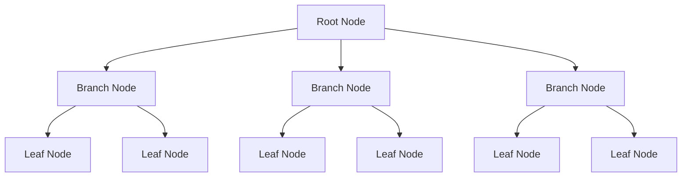
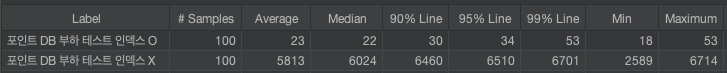
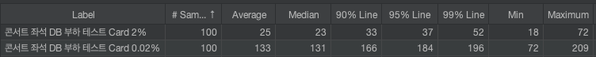
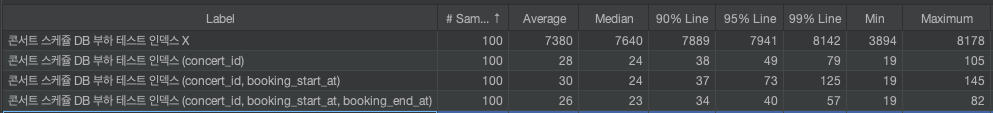

# DB Index를 통한 성능 개선

## **👋 서론**

이 글에서는 현재 개발된 애플리케이션에서 수행하는 쿼리들을 수집하고 분석하여, 인덱스 추가를 통한 성능 개선 과정을 다룹니다. 자주 조회되는 쿼리와 복잡한 쿼리를 파악하고, 인덱스 적용 전후의 성능을 비교 분석합니다.

## **🧐** DB 인덱스란?

**`PostgreSQL`** 공식 문서에서는 인덱스를 아래와 같이 설명하고 있습니다.

> Indexes are a common way to enhance database performance. An index allows the database server to find and retrieve specific rows much faster than it could do without an index. But indexes also add overhead to the database system as a whole, so they should be used sensibly.

한글로 번역해보면, 인덱스란 데이터베이스의 성능을 향상시켜주는 잘 알려진 방법이며 이를 적절하게 사용하면 특정한 데이터 row를 인덱스가 없을 때 보다 훨씬 빠르게 가지고 올 수 있다고 합니다. 단, 인덱스는 데이터베이스에 오버헤드를 증가시키기도 하기 때문에 신중하게 사용해야 한다고 합니다.

PostgreSQL은 B-Tree, Hash, GiST, SP-GiST, GIN, BRIN 등 총 6가지 인덱스 방식을 제공합니다. 이 중 B-Tree가 기본 설정이며 가장 일반적으로 사용됩니다.

### B-Tree 구조

B-Tree 인덱스는 다음과 같은 구성 요소를 가집니다.

- 루트 노드, 브랜치 노드, 리프 노드로 구성
- 항상 균형 잡힌 트리로 구성되어 성능에 안정성을 가짐
- 각 노드는 여러 개의 키와 포인터를 가짐
- 리프 노드는 데이터 주소를 가리키는 포인터를 가짐



### B-Tree의 장점

B-Tree는 다음과 같은 이유로 데이터베이스 인덱스로 널리 사용됩니다.

1. 안정적인 성능: 조회, 삽입, 삭제 모두 O(log n) 시간 복잡도 보장
2. 효율적인 저장 공간 사용: 하나의 노드에 여러 키를 저장 가능
3. 디스크 접근 최소화: 한 노드에서 여러 데이터 접근 가능

다른 인덱스 유형과 비교할 때, B-Tree는 범위 검색과 정렬에 특히 효과적이며, 다양한 쿼리 패턴에 대해 우수한 성능을 보입니다.

## 📌 현재 문제 파악 (인덱스 X)

현재 애플리케이션은 다음과 같은 문제점을 가지고 있습니다.

- PK를 제외한 Where절 검색 시 슬로우 쿼리 발생
- 대용량 데이터 처리 시 전체 테이블 스캔으로 인한 성능 저하
- 과도한 디스크 I/O로 인한 시스템 부하 증가

## 📝 쿼리 분석 및 Index 적용

현재 애플리케이션에서 PK만을 이용한 쿼리를 제외하면 아래 세 가지의 쿼리가 있습니다. 각각의 쿼리를 통해 다양한 인덱스의 테스트를 진행하며 인덱스의 특징과 각각의 쿼리에 알맞는 인덱스를 알아보겠습니다.

### 포인트 조회 (단일 인덱스)

유저 포인트 조회는 user_id를 Where절에 사용해서 조회하는 쿼리로 구성되어 있습니다. 이 때, user_id는 Point와 One-to-One 조건으로 100%의 Cardinality가 보장된 컬럼입니다. 인덱스를 구성하기 좋은 조건 중 하나인 높은 Cardinality의 단일 인덱스를 사용하여 적용 전/후에 어떤 성능적 차이를 만들어 내는지 비교 테스트를 진행했습니다.

**테스트 시나리오**

- 1000만 개의 포인트 데이터 생성
- user_id 컬럼에 대한 단일 인덱스 적용 전후 비교
- Cardinality: 100% (user_id와 Point는 One-to-One 관계)

**포인트 테이블 (user_id / Cardinality 100%)**

```sql
id         PRIMARY KEY
user_id    integer                                not null
amount     integer                                not null
created_at timestamp with time zone default now() not null
updated_at timestamp with time zone default now() not null
```

**실행 쿼리**

```sql
SELECT * FROM points
WHERE user_id = 100000;
```

**더미 생성**

```sql
-- 1000만 개의 포인트 데이터 생성

INSERT INTO points (user_id, amount)
SELECT
  generate_series,
  (random() * 10000)::integer
FROM generate_series(1, 10000000);
```

**성능 비교 (Explain)**

```sql
-- Index O
+----------------------------------------------------------------------------+
|QUERY PLAN                                                                  |
+----------------------------------------------------------------------------+
|Index Scan using idx_point_user on points  (cost=0.43..8.45 rows=1 width=28)|
|  Index Cond: (user_id = 100000)                                            |
+----------------------------------------------------------------------------+

-- Index X
+-------------------------------------------------------------------------------+
|QUERY PLAN                                                                     |
+-------------------------------------------------------------------------------+
|Gather  (cost=1000.00..126612.83 rows=1 width=28)                              |
|  Workers Planned: 2                                                           |
|  ->  Parallel Seq Scan on points  (cost=0.00..125612.73 rows=1 width=28)      |
|        Filter: (user_id = 100000)                                             |
|JIT:                                                                           |
|  Functions: 2                                                                 |
|  Options: Inlining false, Optimization false, Expressions true, Deforming true|
+-------------------------------------------------------------------------------
```



역시나 Cardinality가 100%인 단일 컬럼에 인덱스를 적용한 부분에 굉장히 큰 성능 차이를 보였습니다. Explain을 보면 인덱스를 적용한 테이블에서는 정상적으로 인덱스 설정이 적용된걸 확인할 수 있습니다. Jmeter를 활용해 100번의 실제 쿼리를 비교한 결과 평균 응답 시간이 약 250배 이상의 차이를 보였습니다.

### 좌석 목록 조회 (Cardinality 비교)

콘서트 스케쥴을 통한 좌석 목록 조회는 concert_schedule_id를 통해 목록을 조회합니다. 이 때, concert_schedule_id를 인덱싱해서 사용하면 효율이 좋을거라고 판단이 되는데 이는 Cardinality를 명백하게 따져볼 필요가 있습니다. 예를 들어 좌석이 500개인 콘서트의 스케쥴이 있다면 1:500 이라는 콘서트 스케쥴: 좌석 수 의 비율을 가지게 되고 이 수치를 계산하면 `Cardinality는 1 / 500 * 100 = 0.2%`라는 수치를 가지게 됩니다. 반대로 5000석 규모라면 이 수치의 `1/10인 0.02%`, 50석 규모라면 `10배인 2%`의 수치를 가지게 될겁니다. 이러한 좌석 규모의 특징정 차이(Cardinality의 차이)가 발생 할 때 어떤 성능적 차이를 만들 수 있는지 확인을 위해 좌석 규모가 각각 50, 5000을 가정해서 `Cardinality 0.02%, 2%` 성능 데이터를 비교해보도록 하겠습니다.

**테스트 시나리오**

- 1000만 개의 좌석 데이터 생성
- concert_schedule_id 컬럼의 Cardinality를 0.02%와 2%로 설정하여 비교
- Cardinality 차이에 따른 인덱스 효과 분석

**콘서트 좌석 테이블**

```sql
id                  PRIMARY KEY
concert_id          integer                                not null
concert_schedule_id integer                                not null
price               integer                                not null
number              integer                                not null
is_paid             boolean                                not null
reservedUntil       timestamp with time zone
created_at          timestamp with time zone default now() not null
updated_at          timestamp with time zone default now() not null
```

**실행 쿼리**

```sql
SELECT * FROM concert_seats
WHERE concert_schedule_id = 100;
```

**더미 생성**

```sql
-- 1000만 개의 좌석 (0.02% 카디널리티 / 2000개 스케쥴)

INSERT INTO concert_seats (concert_id, concert_schedule_id, price, number, is_paid)
SELECT
  floor(random() * 1000) + 1,
  floor(random() * 2000) + 1,
  (random() * 100 + 50)::integer,
  generate_series,
  false
FROM generate_series(1, 10000000);

-- 1000만 개의 좌석 (2% 카디널리티 / 200000개 스케쥴)

INSERT INTO concert_seats (concert_id, concert_schedule_id, price, number, is_paid)
SELECT
  floor(random() * 1000) + 1,
  floor(random() * 200000) + 1,
  (random() * 100 + 50)::integer,
  generate_series,
  false
FROM generate_series(1, 10000000);
```

**성능 비교 (Explain)**

```sql
-- Cardinality 2%
+-----------------------------------------------------------------------------------------------+
|QUERY PLAN                                                                                     |
+-----------------------------------------------------------------------------------------------+
|Bitmap Heap Scan on concert_seats  (cost=4.82..202.14 rows=50 width=49)                        |
|  Recheck Cond: (concert_schedule_id = 100)                                                    |
|  ->  Bitmap Index Scan on idx_concert_seat_concert_schedule  (cost=0.00..4.81 rows=50 width=0)|
|        Index Cond: (concert_schedule_id = 100)                                                |
+-----------------------------------------------------------------------------------------------+

-- Cardinality 0.02%
+--------------------------------------------------------------------------------------------------+
|QUERY PLAN                                                                                        |
+--------------------------------------------------------------------------------------------------+
|Bitmap Heap Scan on concert_seats  (cost=24.66..7505.38 rows=2093 width=49)                       |
|  Recheck Cond: (concert_schedule_id = 100)                                                       |
|  ->  Bitmap Index Scan on idx_concert_seat_concert_schedule  (cost=0.00..24.13 rows=2093 width=0)|
|        Index Cond: (concert_schedule_id = 100)                                                   |
+--------------------------------------------------------------------------------------------------+
```



Cardinality가 높을수록 인덱스의 효과가 크게 나타났습니다. 2% Cardinality에서는 0.02%에 비해 평균 응답 시간이 5배 이상 빨라졌습니다. 물론 Cardinality가 낮은 쿼리에서 조회된 데이터의 수 자체가 많아 네트워크 오버헤드의 영향이 있었을 수 있지만 감안하더라도 여전히 큰 차이를 보였습니다. 이는 인덱스 설계 시 컬럼의 Cardinality를 고려해야 함을 보여줌과 동시에 Cardinality 차이에 따른 성능 개선도를 보여줍니다.

### 예약 가능 스케쥴 목록 조회 (복합 인덱스)

**테스트 시나리오**

- 1000만 개의 콘서트 스케쥴 데이터 생성
- 콘서트 당 콘서트 스케쥴 약 100개로 가정 (concert_id Cardinality 1%)
- 약 50%의 콘서트 스케쥴을 현재 예약 가능 시간으로 가정 (예약 시작 ≤ 테스트 시간 < 예약 종료)
- concert_id, booking_start_at, booking_end_at 컬럼에 대한 복합 인덱스 적용
- 각 인덱스 조합에 따른 성능 비교

**콘서트 스케쥴 테이블**

```sql
id               PRIMARY KEY
concert_id       integer                                not null
booking_start_at timestamp with time zone               not null
booking_end_at   timestamp with time zone               not null
start_at         timestamp with time zone               not null
end_at           timestamp with time zone               not null
created_at       timestamp with time zone default now() not null
updated_at       timestamp with time zone default now() not null
```

**실행 쿼리**

```sql
SELECT * FROM concert_schedules
LEFT JOIN concerts ON concert_id = concerts.id
WHERE
	concert_id = 100
	AND booking_start_at <= CURRENT_TIMESTAMP
  AND booking_end_at > CURRENT_TIMESTAMP;
```

**더미 생성**

```sql
-- 1000만 개의 스케쥴 (1% 카디널리티 concert_id / 50% 예약 가능 조건)

WITH schedule_data AS (
  SELECT
    floor(random() * 100000) + 1 AS concert_id,
    CASE
      WHEN random() < 0.5 THEN
        CURRENT_TIMESTAMP - (random() * INTERVAL '30 days')
      ELSE
        CURRENT_TIMESTAMP + (random() * INTERVAL '30 days')
    END AS booking_start_at
  FROM generate_series(1, 10000000)
)
INSERT INTO concert_schedules (concert_id, booking_start_at, booking_end_at, start_at, end_at)
SELECT
  concert_id,
  booking_start_at,
  booking_start_at + INTERVAL '50 days' AS booking_end_at,
  booking_start_at + INTERVAL '50 days' AS start_at,
  booking_start_at + INTERVAL '50 days' AS end_at
FROM schedule_data;
```

**성능 비교 (Explain)**

```sql
-- 인덱스 적용 X
+-------------------------------------------------------------------------------------------------------------------------------+
|QUERY PLAN                                                                                                                     |
+-------------------------------------------------------------------------------------------------------------------------------+
|Gather  (cost=1008.17..197856.76 rows=51 width=1010)                                                                           |
|  Workers Planned: 2                                                                                                           |
|  ->  Hash Left Join  (cost=8.17..196851.66 rows=21 width=1010)                                                                |
|        Hash Cond: (concert_schedules.concert_id = concerts.id)                                                                |
|        ->  Parallel Seq Scan on concert_schedules  (cost=0.00..196843.20 rows=21 width=56)                                    |
|              Filter: ((concert_id = 100) AND (booking_start_at <= CURRENT_TIMESTAMP) AND (booking_end_at > CURRENT_TIMESTAMP))|
|        ->  Hash  (cost=8.16..8.16 rows=1 width=954)                                                                           |
|              ->  Index Scan using "PK_6ca96059628588a3988a5f3236a" on concerts  (cost=0.14..8.16 rows=1 width=954)            |
|                    Index Cond: (id = 100)                                                                                     |
|JIT:                                                                                                                           |
|  Functions: 14                                                                                                                |
|  Options: Inlining false, Optimization false, Expressions true, Deforming true                                                |
+-------------------------------------------------------------------------------------------------------------------------------+

-- concert_id 인덱스 적용
+-------------------------------------------------------------------------------------------------------------+
|QUERY PLAN                                                                                                   |
+-------------------------------------------------------------------------------------------------------------+
|Nested Loop Left Join  (cost=5.36..414.81 rows=51 width=1010)                                                |
|  Join Filter: (concert_schedules.concert_id = concerts.id)                                                  |
|  ->  Bitmap Heap Scan on concert_schedules  (cost=5.21..405.88 rows=51 width=56)                            |
|        Recheck Cond: (concert_id = 100)                                                                     |
|        Filter: ((booking_start_at <= CURRENT_TIMESTAMP) AND (booking_end_at > CURRENT_TIMESTAMP))           |
|        ->  Bitmap Index Scan on idx_concert_schedule_concert  (cost=0.00..5.20 rows=102 width=0)            |
|              Index Cond: (concert_id = 100)                                                                 |
|  ->  Materialize  (cost=0.14..8.17 rows=1 width=954)                                                        |
|        ->  Index Scan using "PK_6ca96059628588a3988a5f3236a" on concerts  (cost=0.14..8.16 rows=1 width=954)|
|              Index Cond: (id = 100)                                                                         |
+-------------------------------------------------------------------------------------------------------------+

-- concert_id, booking_start_at 인덱스 적용
+--------------------------------------------------------------------------------------------------------------+
|QUERY PLAN                                                                                                    |
+--------------------------------------------------------------------------------------------------------------+
|Nested Loop Left Join  (cost=5.10..215.63 rows=51 width=1010)                                                 |
|  Join Filter: (concert_schedules.concert_id = concerts.id)                                                   |
|  ->  Bitmap Heap Scan on concert_schedules  (cost=4.96..206.70 rows=51 width=56)                             |
|        Recheck Cond: ((concert_id = 100) AND (booking_start_at <= CURRENT_TIMESTAMP))                        |
|        Filter: (booking_end_at > CURRENT_TIMESTAMP)                                                          |
|        ->  Bitmap Index Scan on idx_concert_schedule_concert_booking_start  (cost=0.00..4.95 rows=51 width=0)|
|              Index Cond: ((concert_id = 100) AND (booking_start_at <= CURRENT_TIMESTAMP))                    |
|  ->  Materialize  (cost=0.14..8.17 rows=1 width=954)                                                         |
|        ->  Index Scan using "PK_6ca96059628588a3988a5f3236a" on concerts  (cost=0.14..8.16 rows=1 width=954) |
|              Index Cond: (id = 100)                                                                          |
+--------------------------------------------------------------------------------------------------------------+

-- concert_id, booking_start_at, booking_end_at 인덱스 적용
+-----------------------------------------------------------------------------------------------------------------------------------+
|QUERY PLAN                                                                                                                         |
+-----------------------------------------------------------------------------------------------------------------------------------+
|Nested Loop Left Join  (cost=5.36..215.89 rows=51 width=1010)                                                                      |
|  Join Filter: (concert_schedules.concert_id = concerts.id)                                                                        |
|  ->  Bitmap Heap Scan on concert_schedules  (cost=5.22..206.96 rows=51 width=56)                                                  |
|        Recheck Cond: ((concert_id = 100) AND (booking_start_at <= CURRENT_TIMESTAMP) AND (booking_end_at > CURRENT_TIMESTAMP))    |
|        ->  Bitmap Index Scan on idx_concert_schedule_concert_booking  (cost=0.00..5.20 rows=51 width=0)                           |
|              Index Cond: ((concert_id = 100) AND (booking_start_at <= CURRENT_TIMESTAMP) AND (booking_end_at > CURRENT_TIMESTAMP))|
|  ->  Materialize  (cost=0.14..8.17 rows=1 width=954)                                                                              |
|        ->  Index Scan using "PK_6ca96059628588a3988a5f3236a" on concerts  (cost=0.14..8.16 rows=1 width=954)                      |
|              Index Cond: (id = 100)                                                                                               |
+-----------------------------------------------------------------------------------------------------------------------------------+
```



역시나 index가 적용되지 않은 쿼리와 적용한 쿼리의 평균 응답시간의 차이는 200배 이상 발생하였습니다. 하지만 concert_id의 단일 인덱스 적용과 booking_start_at과 booking_end_at을 추가한 복합 인덱스에 큰 성능 차이는 없었습니다. 오히려 (concert_id, booking_start_at)의 복합 인덱스에서는 약소하지만 concert_id의 단일 인덱스보다 평균 응답 시간이 느린 현상도 발생했습니다. 이는 다음과 같은 이유로 설명할 수 있습니다.

- concert_id의 선택성이 이미 높아 대부분의 필터링이 이루어짐
- booking_start_at과 booking_end_at의 범위 조건이 인덱스 사용을 제한적으로 만듦
- 데이터 분포에 따라 복합 인덱스의 효과가 달라질 수 있음

이 결과는 Where절에 사용된다고 컬럼을 무조건적으로 인덱스에 추가하는 것이 좋은 것은 아니며, 실제 데이터와 쿼리 패턴을 고려한 신중한 인덱스 설계가 필요함을 보여줍니다.

## 🎯 인덱스 추가 테이블 정리

| 테이블            | 인덱스 컬럼         | 인덱스 이름                  |
| ----------------- | ------------------- | ---------------------------- |
| concert_schedules | concert_id          | idx_concert_schedule_concert |
| concert_seats     | concert_schedule_id | idx_concert_seat_schedule    |
| points            | user_id             | idx_point_user               |

## 📊 성능 테스트 결과 정리

### 포인트 테이블

| 인덱스   | 평균   | 90%    | 95%    | 99%    |
| -------- | ------ | ------ | ------ | ------ |
| 인덱스 X | 5813ms | 6460ms | 6510ms | 6701ms |
| user_id  | 23ms   | 30ms   | 34ms   | 53ms   |

### 콘서트 좌석

| 인덱스            | 평균  | 90%   | 95%   | 99%   |
| ----------------- | ----- | ----- | ----- | ----- |
| 0.02% Cardinality | 133ms | 166ms | 184ms | 196ms |
| 2% Cardinality    | 25ms  | 33ms  | 37ms  | 52ms  |

### 콘서트 스케쥴

| 인덱스                                           | 평균   | 90%    | 95%    | 99%    |
| ------------------------------------------------ | ------ | ------ | ------ | ------ |
| 인덱스 X                                         | 7380ms | 7889ms | 7941ms | 8142ms |
| concert_id                                       | 28ms   | 38ms   | 49ms   | 79ms   |
| concert_id<br>booking_start_at                   | 30ms   | 37ms   | 73ms   | 125ms  |
| concert_id<br>booking_start_at<br>booking_end_at | 26ms   | 34ms   | 40ms   | 57ms   |

이 결과를 통해 다음과 같은 인사이트를 얻을 수 있었습니다.

1. 높은 Cardinality를 가진 컬럼의 인덱스 효과가 큼
2. 복합 인덱스는 신중하게 설계해야 하며, 항상 더 많은 컬럼을 포함하는 것이 좋은 것은 아님
3. 실제 데이터 분포와 쿼리 패턴을 고려한 인덱스 설계가 중요함

## 테스트 환경

**💻 하드웨어 환경**

- OS: macOS (Sonoma 14.4.1)
- Model: Apple M1 Pro, 10-core CPU , 14-core GPU
- Memory: 16GB LPDDR5
- Storage: 512GB SSD

**📡 소프트웨어 환경**

- NodeJS (18.17.x)
- PostgreSQL (13.5)
- Jmeter (5.6.3)
- Docker

## 🍀 참고 자료

- [PostSQL Indexes](https://www.postgresql.org/docs/current/indexes.html)
- [B-Tree로 인덱스(index)에 대해 쉽고 완벽하게 이해하기](https://mangkyu.tistory.com/286)
- [B tree가 왜 DB 인덱스(index)로 사용되는지를 설명합니다](https://www.youtube.com/watch?v=liPSnc6Wzfk&list=LL&index=1)
- [jmeter postgresql driver 사용하여 쿼리하기](https://jinane.tistory.com/111)
