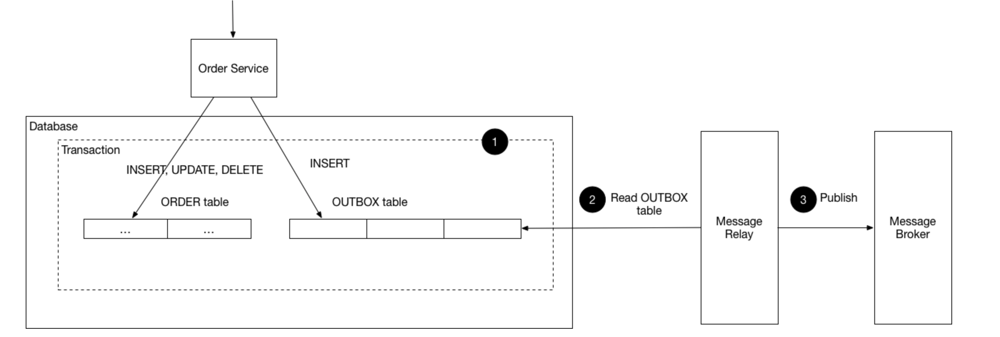

# Kafka를 통한 EDA 적용기

## **👋 서론**

이 문서에서는 CQRS EventBus를 통해 구현되어 있는 로직을 Kafka를 적용한 트랜잭셔널 메시징으로 전환하는 과정을 소개합니다. 이러한 전환을 통해 분산 시스템에서의 이벤트 처리와 데이터 일관성을 개선하고자 합니다.

## 🔍 현재 문제 파악

현재 CQRS 라이브러리의 EventBus 객체를 통해 모놀리식 구조에서의 EDA(Event-Driven Architecture)가 적용되어 있습니다. 하지만 이 방식에는 다음과 같은 문제점들이 존재합니다.

1. 이벤트 유실: 이벤트가 정상적으로 발행되지 않았을 때 데이터 유실이 발생할 수 있습니다.
2. 이벤트 소비 실패: 이벤트가 발행되었지만 소비자가 정상적으로 처리하지 못했을 때 데이터 불일치가 발생할 수 있습니다.
3. 분산 환경 지원 부족: 서비스가 분산 환경으로 확장될 때 서비스 간 이벤트 통신이 어려워집니다.

## 🧐 해결 방안

앞선 문제들을 해결하기 위해 다음과 같은 접근 방식을 채택했습니다.

1. 트랜잭셔널 메시징 도입: 데이터베이스 작업과 메시지 발행(아웃박스)을 원자적으로 처리하여 데이터 일관성을 보장합니다.
2. 메시지 브로커 사용: 분산 환경에서 서비스 간 안정적인 메시지 전달을 위해 Kafka를 도입합니다.
3. 아웃박스 패턴 적용: 이벤트 발행의 신뢰성을 높이고 실패 시 재시도 메커니즘을 구현합니다.

### 메시지 브로커 선택: Kafka

여러 메시지 브로커 중 Kafka의 다음과 같은 장점들로 선택을 하게 됐습니다.

1. 높은 처리량: 대용량 데이터 처리에 최적화되어 있습니다.
2. 낮은 지연 시간: 실시간에 가까운 메시지 처리가 가능합니다.
3. 내구성과 신뢰성: 분산 시스템으로 설계되어 높은 가용성을 제공합니다.
4. 확장성: 클러스터 구성을 통해 쉽게 확장할 수 있습니다.
5. 데이터 영속성: 디스크에 데이터를 저장하여 데이터 손실 위험을 줄입니다.

### 트랜잭셔널 메시징: 아웃박스 패턴

트랜잭셔널 메시징을 구현하기 위해 아웃박스 패턴을 선택했습니다.

1. 데이터 일관성: 데이터베이스 작업과 메시지 발행을 원자적으로 처리합니다.
2. 안정성: 시스템 장애 시에도 메시지 손실을 방지합니다.
3. 순서 보장: 이벤트의 발생 순서를 유지할 수 있습니다.

## 🛠️ 트랜잭셔널 아웃박스 패턴 구현

Kafka와 트랜잭셔널 아웃박스 패턴을 활용하여 앞서 언급한 문제를 해결하기 위해 다음과 같은 구현 전략을 수립했습니다.

1. Outbox 엔티티 생성: 이벤트 데이터를 임시 저장할 Outbox 테이블을 생성합니다.
2. 트랜잭션 내 Outbox 레코드 생성: 비즈니스 로직 실행 시 Outbox 레코드를 같은 트랜잭션 내에서 생성합니다.
3. 이벤트 발행 실패 핸들링: Outbox 테이블의 레코드를 주기적으로 스케줄링하여 Kafka로 메시지가 발행되지 않으면 다시 발행합니다.



### Outbox 엔티티 구현

```tsx
@Entity('outbox')
@Index('idx_outbox_status_created_at', ['status', 'createdAt'])
export class OutboxEntity {
  @PrimaryGeneratedColumn()
  id: number;

  @Column()
  topic: string;

  @Column()
  message: string;

  @Column()
  status: OutboxStatus;

  @CreateDateColumn({ name: 'created_at', type: 'timestamptz' })
  createdAt: Date;

  @UpdateDateColumn({ name: 'updated_at', type: 'timestamptz' })
  updatedAt: Date;
}
```

이 엔티티는 발행될 이벤트의 정보를 저장합니다. `topic`은 Kafka 토픽을, `message`는 이벤트 내용을, `status`는 이벤트의 처리 상태를 나타냅니다. 인덱스를 통해 실패한 이벤트를 조회 성능을 고려했습니다.

### Scheduler를 통한 실패 핸들링

```tsx
@Injectable()
export class OutboxScheduler {
  constructor(private readonly handleFailedOutboxesUseCase: HandleFailedOutboxesUseCase) {}

  @Cron(CronExpression.EVERY_5_MINUTES)
  async handleFailedOutboxes() {
    await this.handleFailedOutboxesUseCase.execute();
  }
}

@Injectable()
export class HandleFailedOutboxesUseCase {
  constructor(
    private readonly outboxService: OutboxService,
    private readonly messageSender: OutboxKafkaMessageSender,
  ) {}

  async execute(): Promise<void> {
    const failedOutboxes = await this.outboxService.findFailed();
    failedOutboxes.forEach(outbox => this.messageSender.sendMessage(outbox.topic, outbox));
  }
}
```

이 스케줄러는 5분마다 실행되어 실패한 이벤트를 재발행합니다. `HandleFailedOutboxesUseCase`는 실패한 Outbox 레코드를 조회하고 Kafka로 재발행하는 로직을 담당합니다. 이를 통해 일시적인 네트워크 문제나 Kafka 서버 다운과 같은 상황에서도 이벤트 발행의 신뢰성을 보장할 수 있습니다.

## 🐳 Kafka 설치 및 NestJS 적용

### Docker Compose 설정

```yaml
version: '3.8'
services:
  zookeeper:
    image: confluentinc/cp-zookeeper:latest
    environment:
      ZOOKEEPER_CLIENT_PORT: 2181
      ZOOKEEPER_TICK_TIME: 2000
    ports:
      - 2181:2181

  kafka:
    image: confluentinc/cp-kafka:latest
    depends_on:
      - zookeeper
    ports:
      - 9092:9092
    environment:
      KAFKA_BROKER_ID: 1
      KAFKA_ZOOKEEPER_CONNECT: zookeeper:2181
      KAFKA_ADVERTISED_LISTENERS: PLAINTEXT://kafka:29092,PLAINTEXT_HOST://localhost:9092
      KAFKA_LISTENER_SECURITY_PROTOCOL_MAP: PLAINTEXT:PLAINTEXT,PLAINTEXT_HOST:PLAINTEXT
      KAFKA_INTER_BROKER_LISTENER_NAME: PLAINTEXT
      KAFKA_AUTO_CREATE_TOPICS_ENABLE: 'true'
      KAFKA_OFFSETS_TOPIC_REPLICATION_FACTOR: 1

volumes:
  kafka:
```

이 Docker Compose 설정은 Kafka와 Zookeeper를 실행할 수 있게 해줍니다. Zookeeper는 Kafka의 분산 조정을 담당하며, Kafka는 실제 메시지 브로커 역할을 수행합니다. 환경 변수를 통해 각 서비스의 설정을 조정할 수 있으며, 포트 매핑을 통해 호스트 시스템에서 접근 가능하도록 설정되어 있습니다.

### NestJS에서 Kafka 연동

NestJS에서 Kafka를 사용하기 위해 `@nestjs/microservices` 패키지를 사용합니다. 다음과 같이 Kafka 클라이언트를 설정합니다.

```tsx
async function bootstrap() {
  const app = await NestFactory.create(AppModule);

  app.connectMicroservice<MicroserviceOptions>({
    transport: Transport.KAFKA,
    options: {
      client: {
        brokers: ['localhost:9092'],
      },
      consumer: {
        groupId: 'offset-consumer',
      },
    },
  });

  app.connectMicroservice<MicroserviceOptions>({
    transport: Transport.KAFKA,
    options: {
      client: {
        brokers: ['localhost:9092'],
      },
      consumer: {
        groupId: 'data-platform-consumer',
      },
    },
  });

  await app.startAllMicroservices();
  await app.listen(3000);
}

bootstrap();
```

이 설정은 NestJS 애플리케이션에 Kafka 마이크로서비스를 연결합니다. 두 개의 다른 컨슈머 그룹(`offset-consumer`와 `data-platform-consumer`)을 설정하여 서로 다른 목적의 이벤트 소비를 가능하게 했습니다.

### 메시지 발행

```tsx
@Injectable()
export class BookingKafkaMessageSender {
  constructor(@Inject('BOOKING_SERVICE') private readonly bookingClient: ClientKafka) {}

  sendMessage(topic: string, outbox: Outbox): void {
    this.bookingClient.emit(topic, JSON.stringify(outbox));
  }
}
```

이 클래스는 Kafka로 메시지를 발행하는 역할을 합니다. `BookingKafkaMessageSender`는 다음과 같은 특징을 가집니다.

- `BOOKING_SERVICE`라는 이름으로 주입된 `ClientKafka` 인스턴스를 사용합니다.
- `sendMessage` 메소드는 주어진 토픽으로 Outbox 객체를 JSON 문자열로 변환하여 발행합니다.

### 메시지 소비

```tsx
@Injectable()
export class OutboxBookingConsumer {
  constructor(private readonly outboxService: OutboxService) {}

  @EventPattern('booking.completed')
  async handleOutboxStatus(@Payload() data: { value: Outbox }) {
    await this.outboxService.toPublished(data.value.id);
  }
}
```

이 클래스는 Kafka에서 메시지를 소비하는 역할을 합니다. `OutboxBookingConsumer`의 주요 특징은 다음과 같습니다.

- `@EventPattern` 데코레이터를 사용하여 'booking.completed' 토픽의 메시지를 구독합니다.
- 메시지를 수신하면 `handleOutboxStatus` 메소드가 호출됩니다.
- 수신된 Outbox 객체의 ID를 사용하여 해당 Outbox 레코드의 상태를 'PUBLISHED'로 업데이트합니다.
- 이를 통해 이벤트가 성공적으로 소비될 수 있음을 데이터베이스에 기록하여 신뢰성을 향상시킵니다.

## 🎯 요약 정리

- **데이터 일관성 강화**: 트랜잭셔널 아웃박스 패턴을 통해 데이터베이스 작업과 이벤트 발행의 원자성을 보장하여 데이터 불일치 문제를 해결했습니다.
- **시스템 신뢰성 향상**: Kafka의 높은 내구성과 가용성, 그리고 실패한 이벤트의 재처리 메커니즘을 통해 메시지 손실 가능성을 크게 줄였습니다.
- **확장성 개선**: 분산 환경에서의 이벤트 통신이 가능해져, 새로운 서비스 추가와 시스템 확장이 용이해졌습니다.

## 👨‍💻 사용 기술 및 버전

- NodeJS: 18.17.1
- NestJS: 10.3.2
- @nestjs/cqrs: 10.2.7
- @nestjs/microservices: 10.3.10
- kafkajs: 2.2.4

## 🍀 참고 자료

- [NestJS - Kafka](https://docs.nestjs.com/microservices/kafka)
- [NestJS 마이크로서비스에 Kafka 구성하기](https://velog.io/@atesi/nestjs-%EB%A7%88%EC%9D%B4%ED%81%AC%EB%A1%9C%EC%84%9C%EB%B9%84%EC%8A%A4-Kafka-%EA%B5%AC%EC%84%B1%ED%95%98%EA%B8%B0)
- [트랜잭셔널 아웃박스 패턴의 실제 구현 사례](https://medium.com/@greg.shiny82/%ED%8A%B8%EB%9E%9C%EC%9E%AD%EC%85%94%EB%84%90-%EC%95%84%EC%9B%83%EB%B0%95%EC%8A%A4-%ED%8C%A8%ED%84%B4%EC%9D%98-%EC%8B%A4%EC%A0%9C-%EA%B5%AC%ED%98%84-%EC%82%AC%EB%A1%80-29cm-0f822fc23edb))
- [Transactional Outbox 패턴으로 메시지 발행 보장하기](https://ridicorp.com/story/transactional-outbox-pattern-ridi/)
- [Microservices Pattern: Transactional outbox](https://microservices.io/patterns/data/transactional-outbox.html)
