## **👋 서론**

이 문서에서는 부하 테스트를 통한 현재 서비스 내 기능들의 성능을 측정합니다. 측정된 성능 지표를 통해 개선점을 찾아내고 적용하는 과정을 진행합니다. 또한 장애와 관련된 내용을 정리하고 가상의 장애 대응 문서를 통한 서비스 분석을 진행합니다.

## **🧐** 부하 테스트란?

부하 테스트는 서비스에 일정량의 부하를 가하여 시스템의 성능, 안정성, 확장성을 평가하는 중요한 과정입니다. 이를 통해 아래와 같은 목표들을 달성할 수 있습니다.

- **성능 한계 파악**

  시스템이 처리할 수 있는 최대 동시 접속자 수나 초당 처리 가능한 트랜잭션 수 등을 파악함으로서, 서비스의 확장 계획을 수립하는 데 필요한 정보를 얻을 수 있습니다.

- **비용 최적화**

  적절한 서버 스펙과 인프라 구성을 결정하는 데 도움을 줍니다. 과도한 리소스 할당으로 인한 불필요한 비용 발생을 방지하고, 동시에 부족한 리소스로 인한 서비스 장애를 예방할 수 있습니다.

- **사용자 경험 개선**

  높은 부하 상황에서 발생할 수 있는 응답 지연이나 오류를 미리 파악하고 개선함으로써, 실제 서비스 운영 시 사용자들에게 더 나은 경험을 제공할 수 있습니다.

- **장애 복구 능력 검증**

  고부하 상황에서 시스템의 일부가 실패했을 때, 장애 극복 메커니즘이 제대로 작동하는지 확인할 수 있습니다.

## 📌 테스트 대상 선정

- 모든 쿼리 API에 대한 부하 테스트
- 핵심 기능 시나리오 단위 테스트

### 대기열 진입 시나리오

1. 대기열 진입
2. 대기열 조회

### 예약 시나리오

1. 포인트 충전 API
2. 예약 가능한 스케줄 목록 조회 API
3. 좌석 목록 조회 API
4. 좌석 예약 API
5. 예약 결제 API

## 데이터 준비

테스트의 정확성을 위해 실제 운영 환경과 유사한 데이터셋을 준비해야 했습니다. 다음과 같은 데이터를 기준으로 이번 테스트를 진행했습니다.

- 콘서트 데이터: 10,000 개의 콘서트
- 스케쥴 데이터: 각 콘서트당 10개의 스케줄, 총 100,000개
- 좌석 데이터: 각 스케줄당 50개의 좌석, 총 5,000,000개
- 사용자 & 포인트 데이터: 1,000,000명의 가상 사용자 & 포인트

```sql
-- 콘서트 데이터 생성
INSERT INTO concerts (title, description)
SELECT
  'Concert ' || generate_series,
  'Description for concert ' || generate_series
FROM generate_series(1, 10000);

-- 스케줄 데이터 생성
WITH schedule_data AS (
  SELECT
    floor(random() * 10000) + 1 AS concert_id,
    CASE
      WHEN random() < 0.5 THEN
        CURRENT_TIMESTAMP - (random() * INTERVAL '30 days')
      ELSE
        CURRENT_TIMESTAMP + (random() * INTERVAL '30 days')
    END AS booking_start_at
  FROM generate_series(1, 100000)
)
INSERT INTO concert_schedules (concert_id, booking_start_at, booking_end_at, start_at, end_at)
SELECT
  concert_id,
  booking_start_at,
  booking_start_at + INTERVAL '50 days' AS booking_end_at,
  booking_start_at + INTERVAL '50 days' AS start_at,
  booking_start_at + INTERVAL '50 days' AS end_at
FROM schedule_data;

-- 좌석 데이터 생성
INSERT INTO concert_seats (concert_id, concert_schedule_id, price, number, is_paid)
SELECT
  floor(random() * 10000) + 1,
  floor(random() * 100000) + 1,
  (random() * 100 + 50)::integer,
  generate_series,
  false
FROM generate_series(1, 5000000);

-- 사용자 및 포인트 데이터 생성
INSERT INTO users (name)
SELECT
  'user' || generate_series,
FROM generate_series(1, 1000000);

INSERT INTO points (user_id, amount)
SELECT
  u.id,
  (random() * 10000)::integer
FROM users u;
```

## 🎯 개별 API 부하 테스트 및 대응과정

- 개별 API 부하 테스트는 Docker를 이용한 가상 컨테이너 2 CPU, 2G Mem로 테스트를 진행
- 각각의 API에 적절한 캐싱과 Index가 적용되어 있는 최종 코드로 테스트를 진행
- 각각의 API가 TPS 100 이상을 처리할 수 있는지 검증 (120 사용자로 30초 스트레스 테스트 진행)

### 콘서트 목록 조회 API

모든 유저가 콘서트 예약을 진행하기 위해 가장 먼저 진입해야 하는 API입니다. 테스트는 30초 동안 120명의 가상 사용자를 통해 진행했으며 각 요청 사이에 500~800ms의 대기 시간을 가지게 지정했습니다.

**목표**

- 모든 요청 200 Status Code
- P99 500ms 이하
- max 1s 이하
- TPS 100처리

**K6 스크립트**

```tsx
import http from 'k6/http';
import { check, sleep } from 'k6';

export const options = {
  vus: 120, // 가상 사용자 수
  duration: '30s', // 테스트 지속 시간
};

export default function () {
  const res = http.get('http://app:3000/concerts', {
    tags: { name: 'ConcertScan' },
  });

  check(res, { 'status was 200': r => r.status === 200 }); // 응답 상태가 200인지 확인합니다.

  sleep((Math.random() * 500 + 300) / 1000); // 각 요청 사이에 Think Time 300 ~ 800ms 대기
}
```

**결과**

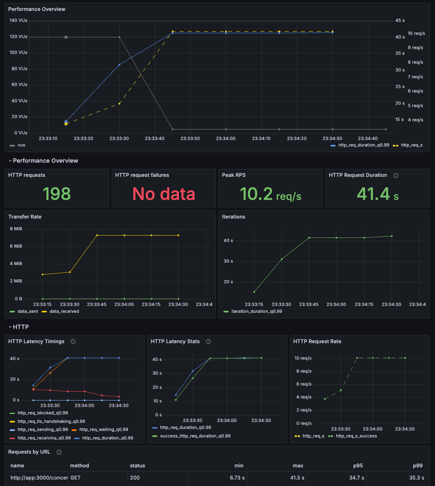
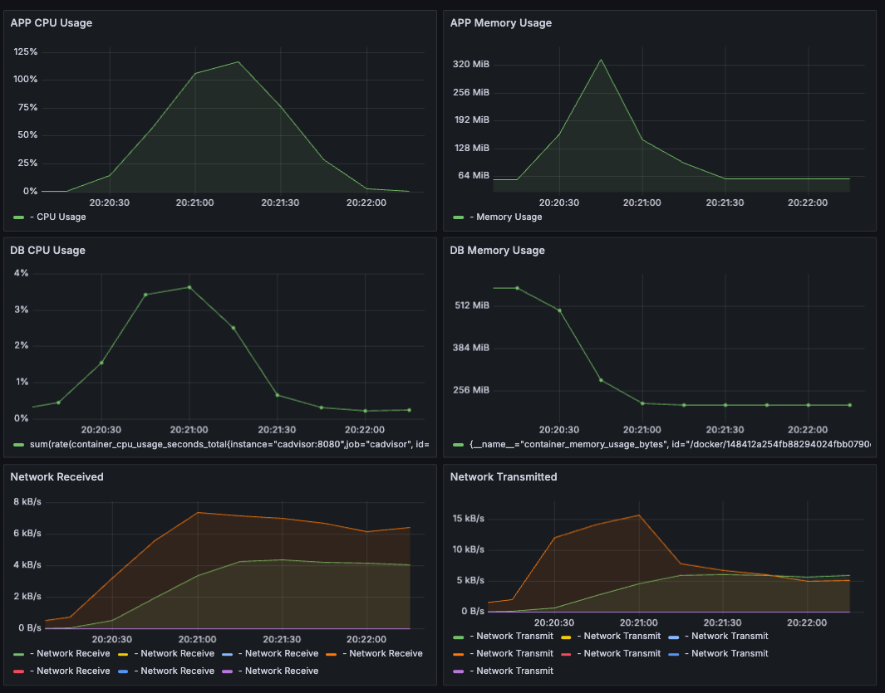

```bash
     checks.........................: 100.00% ✓ 198      ✗ 0
     data_received..................: 158 MB  3.5 MB/s
     data_sent......................: 16 kB   364 B/s
     http_req_blocked...............: avg=8.81ms   min=2.37µs  med=13.17ms  max=16.38ms p(90)=15.74ms  p(95)=15.94ms
     http_req_connecting............: avg=4.2ms    min=0s      med=1.56ms   max=13.36ms p(90)=12.55ms  p(95)=12.84ms
     http_req_duration..............: avg=22.25s   min=3.73s   med=20.72s   max=41.11s  p(90)=40.17s   p(95)=40.71s
       { expected_response:true }...: avg=22.25s   min=3.73s   med=20.72s   max=41.11s  p(90)=40.17s   p(95)=40.71s
     http_req_failed................: 0.00%   ✓ 0        ✗ 198
     http_req_receiving.............: avg=1.75s    min=894.5µs med=1.07s    max=10.14s  p(90)=4.31s    p(95)=4.93s
     http_req_sending...............: avg=844.79µs min=8.04µs  med=106.37µs max=94.04ms p(90)=670.59µs p(95)=2.32ms
     http_req_tls_handshaking.......: avg=0s       min=0s      med=0s       max=0s      p(90)=0s       p(95)=0s
     http_req_waiting...............: avg=20.49s   min=2.12s   med=20.34s   max=40.16s  p(90)=38.85s   p(95)=39.36s
     http_reqs......................: 198     4.433704/s
     iteration_duration.............: avg=22.82s   min=4.25s   med=21.25s   max=41.75s  p(90)=40.66s   p(95)=41.25s
     iterations.....................: 198     4.433704/s
     vus............................: 5       min=5      max=120
     vus_max........................: 120     min=120    max=120

running (0m44.7s), 000/120 VUs, 198 complete and 0 interrupted iterations
```

**평가**

예상에 크게 못 미치는 결과가 나왔습니다. 특히 응답 시간과 TPS가 목표치에 크게 미달했습니다. 데이터 수신량을 보면 198개의 요청에 비해 과도하게 높은 158MB의 응답량을 확인할 수 있었습니다. 이는 페이지네이션이 적용되지 않아 매 요청마다 약 10,000건의 콘서트 정보가 반환되었고, 이로인한 네트워크 오버헤드 문제임을 확인했습니다.

**대응**

해당 문제를 발견하고 페이지네이션을 적용하여 한 번에 10개씩의 콘서트 목록을 조회하도록 변경했습니다. 이후 동일한 K6 스크립트로 해당 API의 테스트를 다시 진행했습니다. 이전보다 현저히 높은 처리량과 응답 속도를 확인 할 수 있었습니다.

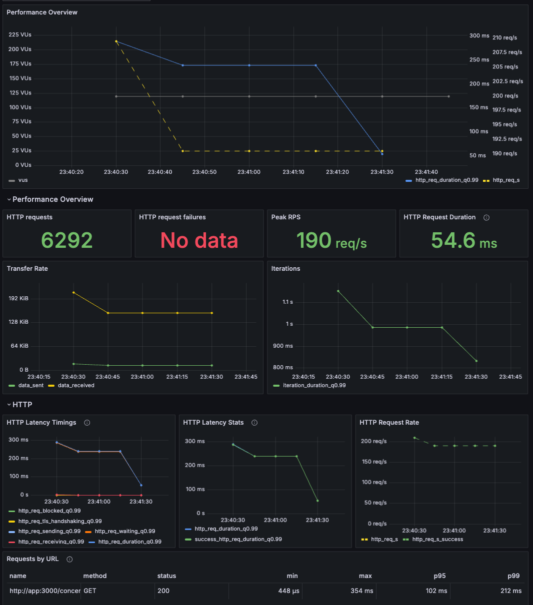
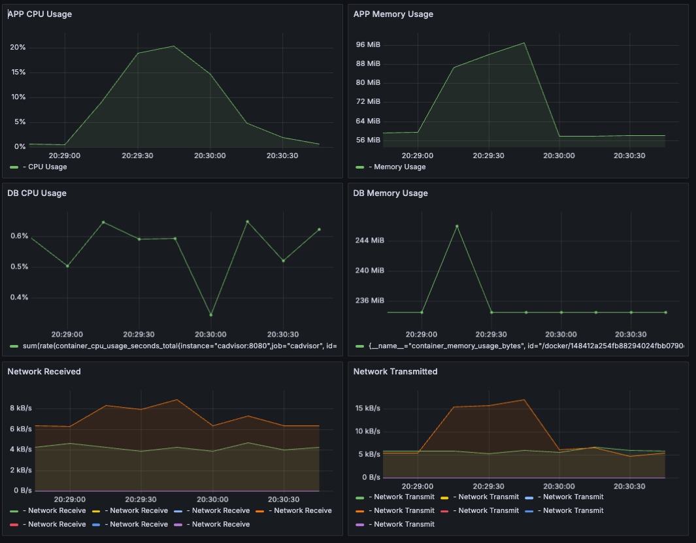

```bash
     checks.........................: 100.00% ✓ 6292       ✗ 0
     data_received..................: 6.3 MB  206 kB/s
     data_sent......................: 516 kB  17 kB/s
     http_req_blocked...............: avg=201.27µs min=625ns    med=2µs      max=25.52ms  p(90)=6.54µs   p(95)=13.72µs
     http_req_connecting............: avg=28.22µs  min=0s       med=0s       max=11.32ms  p(90)=0s       p(95)=0s
     http_req_duration..............: avg=24.1ms   min=457.29µs med=1.07ms   max=731.49ms p(90)=70.04ms  p(95)=164.15ms
       { expected_response:true }...: avg=24.1ms   min=457.29µs med=1.07ms   max=731.49ms p(90)=70.04ms  p(95)=164.15ms
     http_req_failed................: 0.00%   ✓ 0          ✗ 6292
     http_req_receiving.............: avg=91.74µs  min=5.87µs   med=31.33µs  max=39.8ms   p(90)=99.52µs  p(95)=148.36µs
     http_req_sending...............: avg=100.4µs  min=2.62µs   med=7.83µs   max=87.92ms  p(90)=30.49µs  p(95)=71.45µs
     http_req_tls_handshaking.......: avg=0s       min=0s       med=0s       max=0s       p(90)=0s       p(95)=0s
     http_req_waiting...............: avg=23.9ms   min=426.91µs med=1.02ms   max=731.44ms p(90)=66.43ms  p(95)=163.66ms
     http_reqs......................: 6292    204.530656/s
     iteration_duration.............: avg=577.66ms min=301.33ms med=572.78ms max=1.46s    p(90)=778.12ms p(95)=802.56ms
     iterations.....................: 6292    204.530656/s
     vus............................: 120     min=120      max=120
     vus_max........................: 120     min=120      max=120

running (0m30.8s), 000/120 VUs, 6292 complete and 0 interrupted iterations
```

### 콘서트 스케쥴 목록 조회 API

예약이 가능한 콘서트 스케쥴 목록을 조회하는 API입니다. 이 API 또한 콘서트 목록 조회와 같이 콘서트 예약을 진행하기 위해서는 항상 진행되어야 하는 API입니다. 테스트는 30초 동안 120명의 가상 사용자를 통해 진행했으며 각 요청 사이에 500~800ms의 대기 시간을 가지게 지정했습니다.

**목표**

- 모든 요청 200 Status Code
- P99 500ms 이하
- max 1s 이하
- TPS 100처리

**K6 스크립트**

```tsx
import http from 'k6/http';
import { check, sleep } from 'k6';

export const options = {
  vus: 120, // 가상 사용자 수
  duration: '30s', // 테스트 지속 시간
};

export default function () {
  const randomConcertId = Math.floor(Math.random() * 10000) + 1;

  const res = http.get(`http://app:3000/concerts/${randomConcertId}/schedules/bookable`, {
    tags: { name: 'BookableScheduleScan' },
  });

  check(res, { 'status was 200': r => r.status === 200 });

  sleep((Math.random() * 500 + 300) / 1000); // 각 요청 사이에 Think Time 300 ~ 800ms 대기
}
```

**결과**

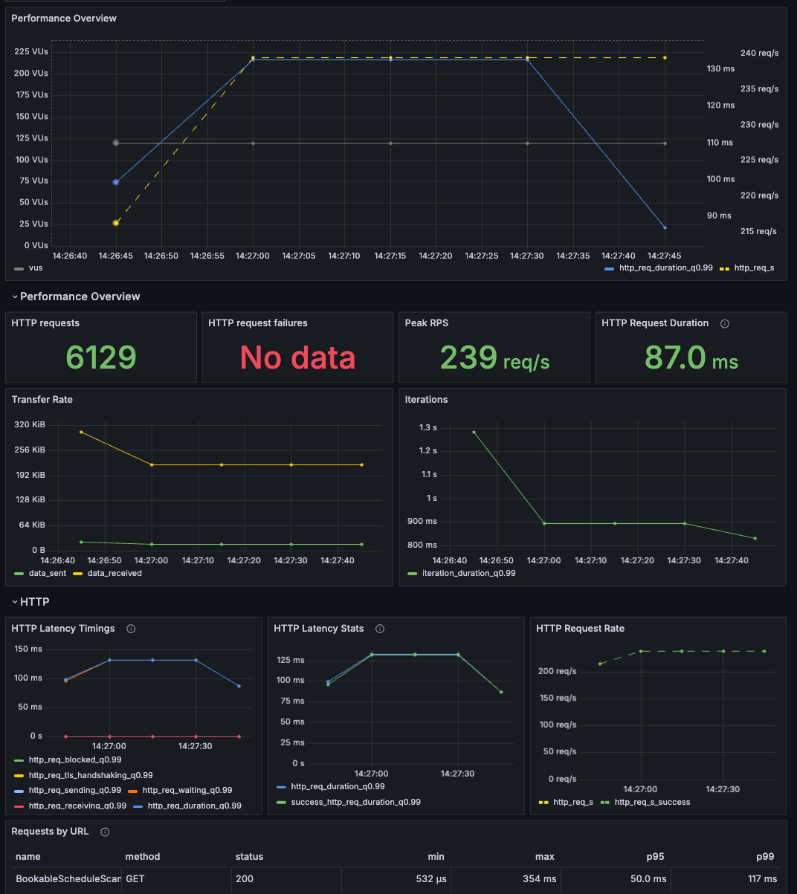
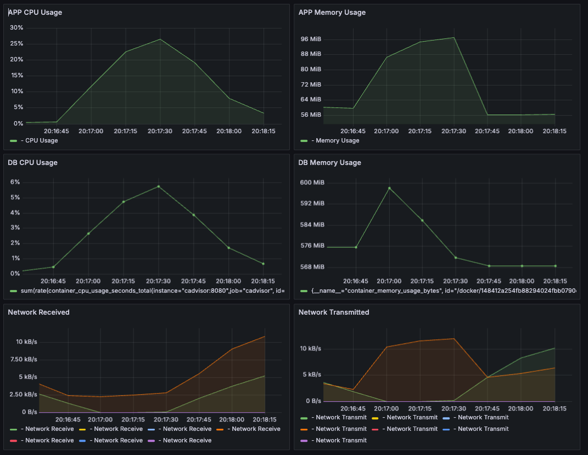

```bash
     checks.........................: 100.00% ✓ 6129       ✗ 0
     data_received..................: 8.7 MB  282 kB/s
     data_sent......................: 649 kB  21 kB/s
     http_req_blocked...............: avg=251.91µs min=708ns    med=2.41µs  max=17.69ms p(90)=7.62µs   p(95)=16.34µs
     http_req_connecting............: avg=92.74µs  min=0s       med=0s      max=12.1ms  p(90)=0s       p(95)=0s
     http_req_duration..............: avg=37.19ms  min=535.08µs med=2.73ms  max=1.2s    p(90)=43ms     p(95)=123.35ms
       { expected_response:true }...: avg=37.19ms  min=535.08µs med=2.73ms  max=1.2s    p(90)=43ms     p(95)=123.35ms
     http_req_failed................: 0.00%   ✓ 0          ✗ 6129
     http_req_receiving.............: avg=63.73µs  min=7.16µs   med=38.16µs max=12.55ms p(90)=106.81µs p(95)=149.67µs
     http_req_sending...............: avg=84.16µs  min=2.75µs   med=9.58µs  max=46.43ms p(90)=34.8µs   p(95)=90.4µs
     http_req_tls_handshaking.......: avg=0s       min=0s       med=0s      max=0s      p(90)=0s       p(95)=0s
     http_req_waiting...............: avg=37.04ms  min=503.58µs med=2.67ms  max=1.2s    p(90)=42.2ms   p(95)=122.79ms
     http_reqs......................: 6129    199.077858/s
     iteration_duration.............: avg=592.66ms min=302.5ms  med=574.3ms max=1.95s   p(90)=783.64ms p(95)=879.73ms
     iterations.....................: 6129    199.077858/s
     vus............................: 120     min=120      max=120
     vus_max........................: 120     min=120      max=120

running (0m30.8s), 000/120 VUs, 6129 complete and 0 interrupted iterations
```

**평가**

콘서트 스케쥴 목록 조회 API는 기존 목표로 진행했던 항목을 모두 만족하는 결과를 보여줬습니다. max 응답 시간도 354ms에 p99는 117ms로 굉장히 안정적인 성능을 보여줬습니다. 또한 Peak RPS가 239로 기존 목표했던 초당 100처리량을 달성할 수 있음을 확인했습니다.

### 콘서트 좌석 목록 조회 API

콘서트 스케쥴 좌석 목록을 조회하는 API 입니다. 특정한 콘서트 스케쥴 ID를 입력 받아 해당 콘서트 스케쥴의 좌석 정보 목록을 반환 받고 좌석 예약을 진행하기 위해 제공됩니다. 콘서트 목록 조회와 콘서트 스케쥴 목록 조회와 다르게 변경이 잦은 API로 캐싱 처리가 되어 있지 않습니다. 테스트는 30초 동안 120명의 가상 사용자를 통해 진행했으며 각 요청 사이에 500~800ms의 대기 시간을 가지게 지정했습니다.

**목표**

- 모든 요청 200 Status Code
- P99 500ms 이하
- max 1s 이하
- TPS 100처리

**K6 스크립트**

```tsx
import http from 'k6/http';
import { check, sleep } from 'k6';

export const options = {
  vus: 120, // 가상 사용자 수
  duration: '30s', // 테스트 지속 시간
};

export default function () {
  const scheduleId = Math.floor(Math.random() * 100000) + 1;

  const res = http.get(`http://app:3000/concerts/schedules/${scheduleId}/seats`, {
    tags: { name: 'ConcertSeatScan' },
  });

  check(res, { 'status was 200': r => r.status === 200 });

  sleep((Math.random() * 500 + 300) / 1000); // 각 요청 사이에 Think Time 300 ~ 800ms 대기
}
```

**결과**

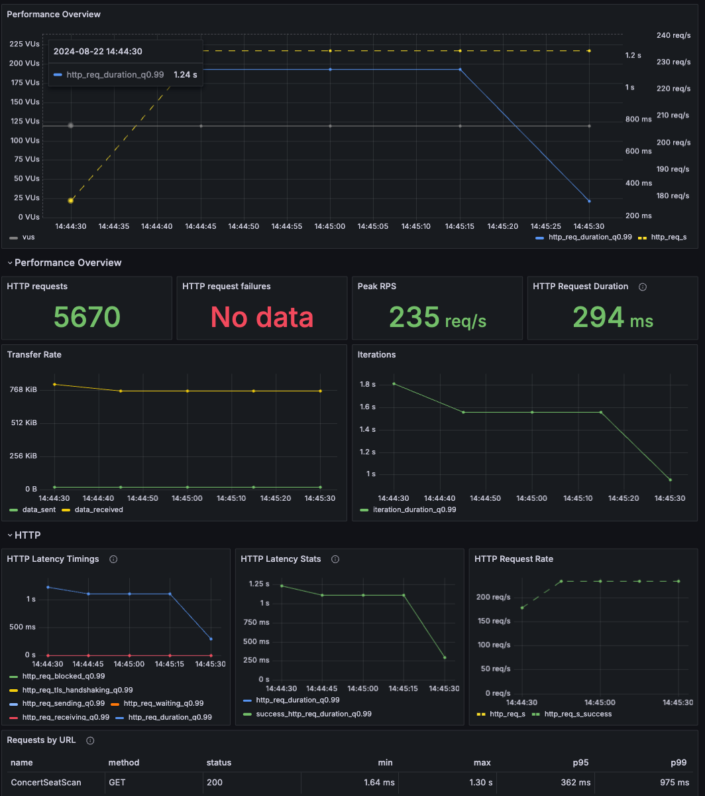
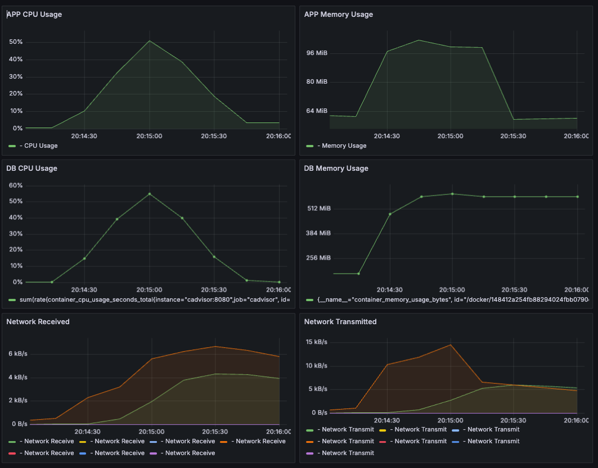

```bash
     checks.........................: 100.00% ✓ 5670       ✗ 0
     data_received..................: 27 MB   865 kB/s
     data_sent......................: 589 kB  19 kB/s
     http_req_blocked...............: avg=212.11µs min=625ns    med=2.75µs  max=55.05ms p(90)=9.66µs   p(95)=29.86µs
     http_req_connecting............: avg=90.89µs  min=0s       med=0s      max=10.33ms p(90)=0s       p(95)=0s
     http_req_duration..............: avg=80.24ms  min=1.66ms   med=6.75ms  max=1.28s   p(90)=259.38ms p(95)=351.81ms
       { expected_response:true }...: avg=80.24ms  min=1.66ms   med=6.75ms  max=1.28s   p(90)=259.38ms p(95)=351.81ms
     http_req_failed................: 0.00%   ✓ 0          ✗ 5670
     http_req_receiving.............: avg=106.95µs min=11.54µs  med=54.12µs max=83.28ms p(90)=153.38µs p(95)=232.19µs
     http_req_sending...............: avg=161.03µs min=3.08µs   med=12.37µs max=98.92ms p(90)=50.48µs  p(95)=147.81µs
     http_req_tls_handshaking.......: avg=0s       min=0s       med=0s      max=0s      p(90)=0s       p(95)=0s
     http_req_waiting...............: avg=79.98ms  min=1.62ms   med=6.65ms  max=1.28s   p(90)=259.03ms p(95)=350.84ms
     http_reqs......................: 5670    184.409959/s
     iteration_duration.............: avg=640.24ms min=303.62ms med=619.5ms max=2.07s   p(90)=888.49ms p(95)=1.03s
     iterations.....................: 5670    184.409959/s
     vus............................: 120     min=120      max=120
     vus_max........................: 120     min=120      max=120

running (0m30.7s), 000/120 VUs, 5670 complete and 0 interrupted iterations
```

**평가**

콘서트 좌석 목록 조회 API는 대부분의 목표를 달성했습니다. 최대 응답 시간이 목표를 약간 초과했지만, TPS와 P99 응답 시간은 목표를 충분히 달성했습니다. 이 API는 캐싱이 적용되지 않았음에도 불구하고 상대적으로 좋은 성능을 보여주었습니다.

### 포인트 조회 API

사용자의 포인트를 조회하는 API 입니다. 콘서트 예약을 위해 필수적으로 필요한 API가 아니라 상대적으로 적은 트래픽이 예상되는 API 입니다. 위에 API들고 다르게 비교적 완화된 목표를 설정했습니다. 테스트는 30초 동안 120명의 가상 사용자를 통해 진행했으며 각 요청 사이에 500~800ms의 대기 시간을 가지게 지정했습니다.

**목표**

- 모든 요청 200 Status Code
- P99 500ms 이하
- max 1s 이하
- TPS 50처리

**K6 스크립트**

```tsx
import http from 'k6/http';
import { check, sleep } from 'k6';

export const options = {
  vus: 120, // 가상 사용자 수
  duration: '30s', // 테스트 지속 시간
};

export default function () {
  const res = http.get('http://app:3000/points', {
    tags: { name: 'PointScan' },
  });

  check(res, { 'status was 200': r => r.status === 200 });

  sleep((Math.random() * 500 + 300) / 1000); // 각 요청 사이에 Think Time 300 ~ 800ms 대기
}
```

**결과**

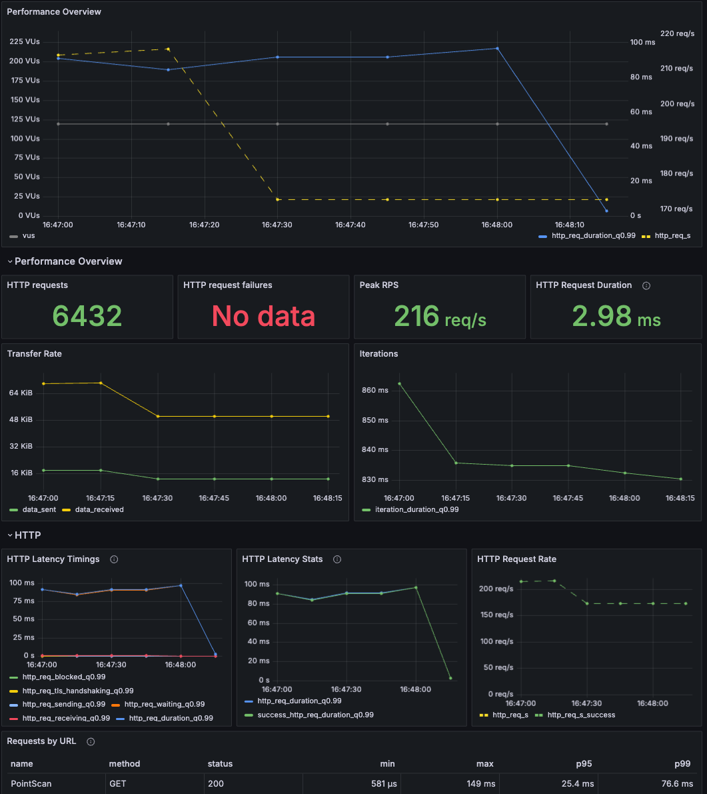
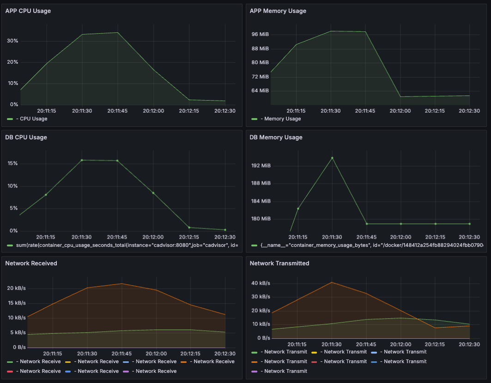

```bash
     checks.........................: 100.00% ✓ 6432       ✗ 0
     data_received..................: 2.1 MB  70 kB/s
     data_sent......................: 559 kB  18 kB/s
     http_req_blocked...............: avg=506.53µs min=625ns    med=2.54µs   max=30.59ms  p(90)=8.2µs    p(95)=17.04µs
     http_req_connecting............: avg=213.12µs min=0s       med=0s       max=23.02ms  p(90)=0s       p(95)=0s
     http_req_duration..............: avg=11.63ms  min=617.62µs med=1.86ms   max=296.08ms p(90)=14.97ms  p(95)=64.96ms
       { expected_response:true }...: avg=11.63ms  min=617.62µs med=1.86ms   max=296.08ms p(90)=14.97ms  p(95)=64.96ms
     http_req_failed................: 0.00%   ✓ 0          ✗ 6432
     http_req_receiving.............: avg=73.22µs  min=6.54µs   med=38.45µs  max=32.82ms  p(90)=110.44µs p(95)=164.72µs
     http_req_sending...............: avg=81.68µs  min=2.79µs   med=11.33µs  max=31.51ms  p(90)=38.08µs  p(95)=80.78µs
     http_req_tls_handshaking.......: avg=0s       min=0s       med=0s       max=0s       p(90)=0s       p(95)=0s
     http_req_waiting...............: avg=11.48ms  min=558.83µs med=1.79ms   max=295.94ms p(90)=14.81ms  p(95)=63.14ms
     http_reqs......................: 6432    208.904917/s
     iteration_duration.............: avg=564.39ms min=301.78ms med=562.07ms max=1.06s    p(90)=766.18ms p(95)=789.44ms
     iterations.....................: 6432    208.904917/s
     vus............................: 120     min=120      max=120
     vus_max........................: 120     min=120      max=120

running (0m30.8s), 000/120 VUs, 6432 complete and 0 interrupted iterations
```

**평가**

포인트 조회 API는 모든 목표를 크게 상회하는 성능을 보여주었습니다. max와 p99 응답시간이 각각 149ms, 76.6ms로 굉장히 안정적이고 좋은 성능을 보여줬으며 높은 TPS 수치를 보여줬습니다. 또한 DB와 Service에 CPU와 Memory 부하도 크게 발견되지 않았습니다.

## **📕** 테스트 시나리오 부하 테스트 및 대응과정

- 테스트 시나리오 부하 테스트는 Docker를 이용한 가상 컨테이너 2CPU 2GB Mem으로 테스트를 진행
- 각각의 시나리오에 맞는 Think Time을 설정
- 각각의 시나리오 TPS가 앞선 API 들의 평균적인 TPS가 나오는지 검증 (100 사용자로 30초 스트레스 테스트 진행)

### 콘서트 예약 시나리오

서비스에 중심이 되는 콘서트 예약을 진행하는 일렬의 과정에 대한 테스트 시나리오를 작성해서 부하 테스트를 진행했습니다. 테스트는 30초 동안 100명의 가상 사용자를 통해 진행했으며 각 API 요청 사이에 500~800ms의 대기 시간을 가지게 지정했습니다.

**시나리오**

1. 임의의 유저 선택
2. 유저 포인트 충전
3. 콘서트 스케쥴 조회
4. 콘서트 좌석 조회
5. 콘서트 예약
6. 콘서트 결제

**목표**

- 모든 요청 200 Status Code
- 모든 요청 P99 350ms 이하
- 모든 요청 max 500ms 이하
- TPS 100 처리

**K6 스크립트**

```tsx
import http from 'k6/http';
import { check, sleep } from 'k6';
import { randomIntBetween, randomItem } from 'https://jslib.k6.io/k6-utils/1.2.0/index.js';

export const options = {
  vus: 100, // 가상 사용자 수
  duration: '30s', // 테스트 지속 시간
};

export default function () {
  const userId = randomIntBetween(1, 1000000); // 1 ~ 100만 랜덤

  charge(userId); // 포인트 충전

  const scheduleId = getScheduleId(); // 콘서트 스케쥴 ID 획득

  if (scheduleId == null) {
    console.log('예약 가능한 스케쥴이 없습니다.');
    return;
  }

  const seatId = getSeatId(scheduleId); // 콘서트 좌석 ID 획득

  if (scheduleId == null) {
    console.log('예약 가능한 좌석이 없습니다.');
    return;
  }

  const bookingId = getBookingId(userId, scheduleId, seatId); // 콘서트 예약

  pay(userId, bookingId); // 콘서트 결제
}

function charge(userId) {
  const chargeAmount = randomIntBetween(1000, 10000);
  const requestPayload = JSON.stringify({ amount: chargeAmount });

  const response = http.post(`http://app:3000/points/${userId}/charge`, requestPayload, {
    headers: { 'Content-Type': 'application/json' },
    tags: { name: 'PointCharge' },
  });

  check(response, { 'status was 200': r => r.status === 200 });

  sleep((Math.random() * 500 + 300) / 1000); // 각 요청 사이에 Think Time 300 ~ 800ms 대기
}

function getScheduleId() {
  const concertId = randomIntBetween(1, 10000);

  const response = http.get(`http://app:3000/concerts/${concertId}/schedules/bookable`, {
    tags: { name: 'BookableScheduleScan' },
  });

  check(response, { 'status was 200': r => r.status === 200 });

  sleep((Math.random() * 500 + 300) / 1000); // 각 요청 사이에 Think Time 300 ~ 800ms 대기

  const bookableSchedules = response.json().data;

  if (bookableSchedules.length == 0) return null;

  return randomItem(bookableSchedules).id;
}

function getSeatId(scheduleId) {
  const response = http.get(`http://app:3000/concerts/schedules/${scheduleId}/seats`, {
    tags: { name: 'ConcertSeatScan' },
  });

  check(response, { 'status was 200': r => r.status === 200 });

  sleep((Math.random() * 500 + 300) / 1000); // 각 요청 사이에 Think Time 300 ~ 800ms 대기

  const availableSeats = response.json().data.filter(seat => seat.isAvailable);

  if (availableSeats.length == 0) return null;

  return randomItem(availableSeats).id;
}

function getBookingId(userId, scheduleId, seatId) {
  const requestPayload = JSON.stringify({ userId: userId, concertScheduleId: scheduleId });

  const response = http.post(`http://app:3000/concerts/seats/${seatId}/book`, requestPayload, {
    headers: { 'Content-Type': 'application/json' },
    tags: { name: 'ConcertBook' },
  });

  check(response, { 'status was 200': r => r.status === 200 });

  sleep((Math.random() * 500 + 300) / 1000); // 각 요청 사이에 Think Time 300 ~ 800ms 대기

  return response.json().data.id;
}

function pay(userId, bookingId) {
  const requestPayload = JSON.stringify({ userId: userId });

  const response = http.post(`http://app:3000/concerts/bookings/${bookingId}/pay`, requestPayload, {
    headers: { 'Content-Type': 'application/json' },
    tags: { name: 'ConcertPay' },
  });

  check(response, { 'status was 200': r => r.status === 200 });

  sleep((Math.random() * 500 + 300) / 1000); // 각 요청 사이에 Think Time 300 ~ 800ms 대기

```

**결과**

```bash
     checks.........................: 100.00% ✓ 5162       ✗ 0
     data_received..................: 7.4 MB  222 kB/s
     data_sent......................: 762 kB  23 kB/s
     http_req_blocked...............: avg=69.45µs  min=833ns    med=3.12µs  max=34.76ms  p(90)=10.33µs  p(95)=24.2µs
     http_req_connecting............: avg=38.6µs   min=0s       med=0s      max=17.55ms  p(90)=0s       p(95)=0s
     http_req_duration..............: avg=55.52ms  min=865.91µs med=10.1ms  max=561.81ms p(90)=187.72ms p(95)=269.2ms
       { expected_response:true }...: avg=55.52ms  min=865.91µs med=10.1ms  max=561.81ms p(90)=187.72ms p(95)=269.2ms
     http_req_failed................: 0.00%   ✓ 0          ✗ 5162
     http_req_receiving.............: avg=90.71µs  min=8.29µs   med=50.47µs max=61.02ms  p(90)=134.62µs p(95)=189.41µs
     http_req_sending...............: avg=169.64µs min=4.08µs   med=24.33µs max=145.57ms p(90)=79.87µs  p(95)=160.86µs
     http_req_tls_handshaking.......: avg=0s       min=0s       med=0s      max=0s       p(90)=0s       p(95)=0s
     http_req_waiting...............: avg=55.26ms  min=786.54µs med=10.01ms max=561.73ms p(90)=187.64ms p(95)=268.32ms
     http_reqs......................: 5162    155.032708/s
     iteration_duration.............: avg=3.03s    min=980.7ms  med=3.05s   max=4.4s     p(90)=3.55s    p(95)=3.72s
     iterations.....................: 1036    31.114662/s
     vus............................: 5       min=5        max=100
     vus_max........................: 100     min=100      max=100

running (0m33.3s), 000/100 VUs, 1036 complete and 0 interrupted iterations
```

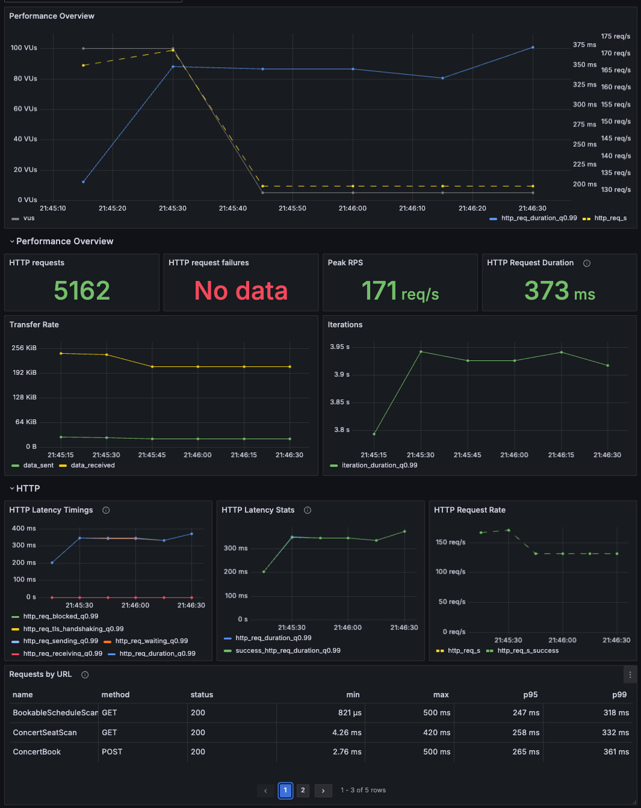
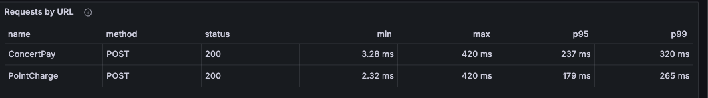
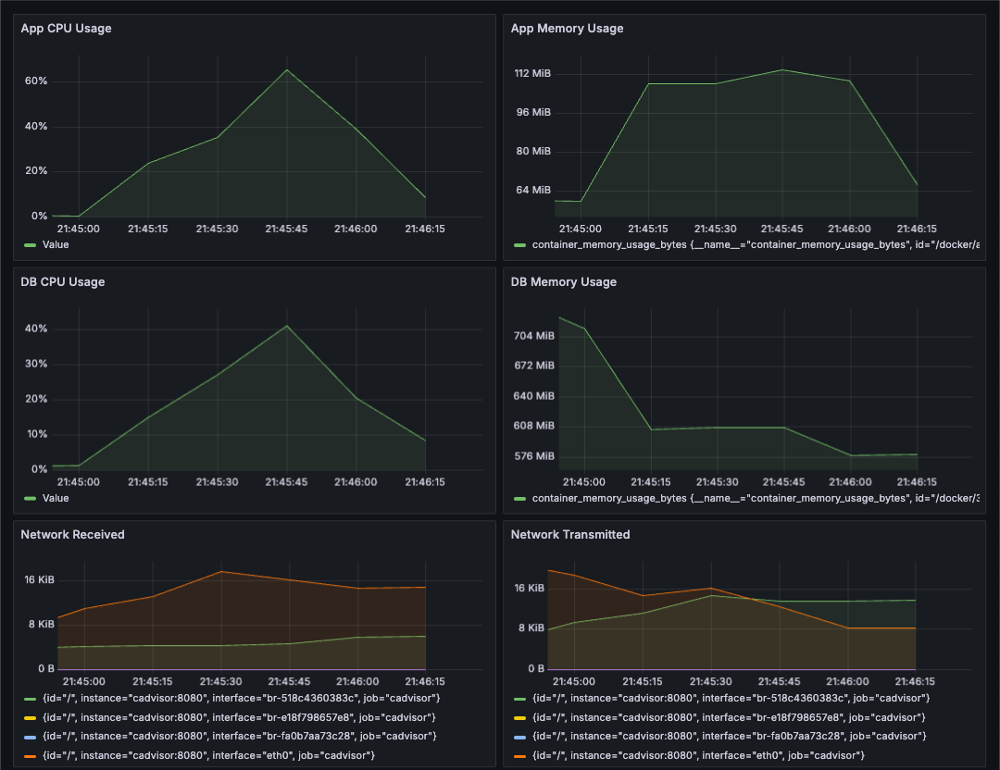

**평가**

시나리오에 실행되는 모든 API들이 목표 수치를 만족했습니다. 30초 동안 총 5,000건 이상의 API를 처리했으며 Peak TPS 수치는 약 171/s로 확인되었습니다. 모든 API들의 max 응답 시간 또한 500ms 이하로 집계되었습니다. 적절한 인덱스와 캐싱을 통해 2CPU와 2GB Mem 상황에서 기대했던 결과를 낼 수 있어 만족스러웠습니다.

### 대기열 진입 시나리오 (DB & Redis 비교)

서비스의 유입량 조절을 통해 원활한 서비스 운영을 도와주는 대기열 시나리오에 관련하여 부하 테스트를 진행했습니다. 테스트는 각각 DB로 적용되어 있던 이전 구현과 Redis로 변경된 현재 구현의 비교를 진행했습니다. 대기열 시나리오는 서비스에서 가장 많은 요청을 단기간에 받을 수 있는 시나리오로 짧은 Think Time과 상대적으로 높은 목표를 설정했습니다. 테스트는 30초 동안 100명의 가상 사용자를 통해 진행했으며 각 API 요청 사이에 50~100ms의 대기 시간을 가지게 지정했습니다.

**시나리오**

1. 임의의 유저 선택
2. 대기열 진입
3. 대기열 조회

**목표**

- 모든 요청 200 Status Code
- 모든 요청 P99 100ms 이하
- 모든 요청 max 300ms 이하
- TPS 500 처리

**K6 스크립트**

```tsx
import http from 'k6/http';
import { check, sleep } from 'k6';
import { randomIntBetween } from 'https://jslib.k6.io/k6-utils/1.2.0/index.js';

export const options = {
  vus: 100, // 가상 사용자 수
  duration: '30s', // 테스트 지속 시간
};

export default function () {
  const userId = randomIntBetween(1, 1000000);

  enqueueToken(userId);

  scanQueueToken(userId);
}

function enqueueToken(userId) {
  const response = http.post(`http://app:3000/token/${userId}`, null, {
    tags: { name: 'EnqueueToken' },
  });

  check(response, { 'status was 200': r => r.status === 200 });

  sleep((Math.random() * 50 + 50) / 1000); // 각 요청 사이에 Think Time 50 ~ 100ms 대기
}

function scanQueueToken(userId) {
  const response = http.get(`http://app:3000/token/${userId}`, {
    tags: { name: 'ScanToken' },
  });

  check(response, { 'status was 200': r => r.status === 200 });

  sleep((Math.random() * 50 + 50) / 1000); // 각 요청 사이에 Think Time 50 ~ 100ms 대기
}
```

**Database 구현체 결과**

```bash
     checks.........................: 100.00% ✓ 22358      ✗ 0
     data_received..................: 8.3 MB  273 kB/s
     data_sent......................: 2.5 MB  82 kB/s
     http_req_blocked...............: avg=84.06µs  min=500ns    med=1.66µs   max=33.8ms   p(90)=3.66µs   p(95)=6.38µs
     http_req_connecting............: avg=39.47µs  min=0s       med=0s       max=15.44ms  p(90)=0s       p(95)=0s
     http_req_duration..............: avg=57.85ms  min=15.95µs  med=25.38ms  max=943.66ms p(90)=126.99ms p(95)=231.7ms
       { expected_response:true }...: avg=57.85ms  min=15.95µs  med=25.38ms  max=943.66ms p(90)=126.99ms p(95)=231.7ms
     http_req_failed................: 0.00%   ✓ 0          ✗ 22358
     http_req_receiving.............: avg=67.82µs  min=6.29µs   med=29.66µs  max=101.19ms p(90)=100.13µs p(95)=143.37µs
     http_req_sending...............: avg=80.71µs  min=2.33µs   med=7.25µs   max=146.27ms p(90)=26.47µs  p(95)=56.58µs
     http_req_tls_handshaking.......: avg=0s       min=0s       med=0s       max=0s       p(90)=0s       p(95)=0s
     http_req_waiting...............: avg=57.71ms  min=0s       med=25.31ms  max=943.54ms p(90)=126.66ms p(95)=231.46ms
     http_reqs......................: 22358   736.286399/s
     iteration_duration.............: avg=271.38ms min=113.77ms med=224.55ms max=1.11s    p(90)=429.01ms p(95)=557.79ms
     iterations.....................: 11179   368.1432/s
     vus............................: 100     min=100      max=100
     vus_max........................: 100     min=100      max=100

running (0m30.4s), 000/100 VUs, 11179 complete and 0 interrupted iterations
```

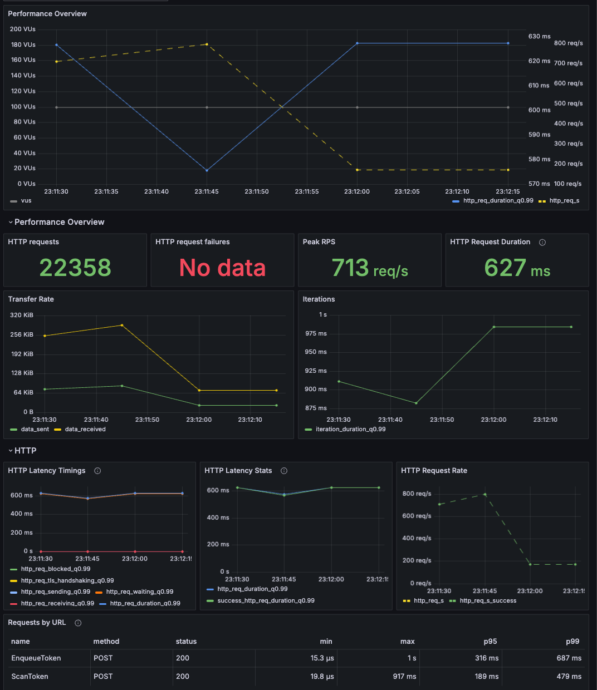
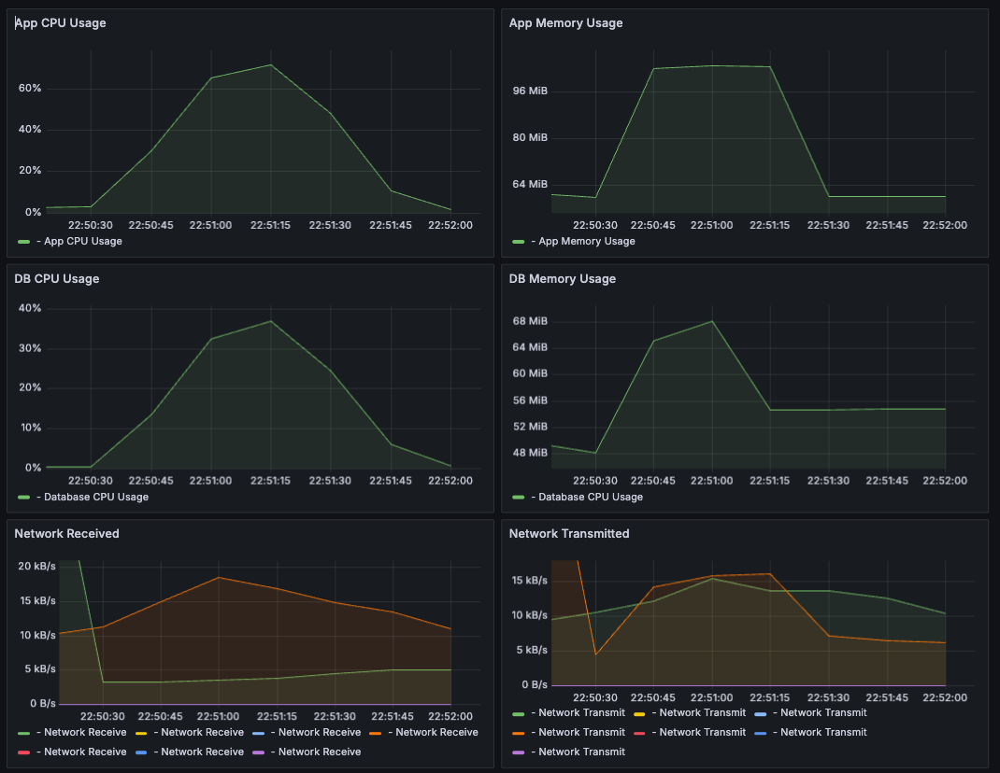

**평가**

기존 목표했던 TPS(500) 수치는 peak 기준으로 만족했지만 응답 시간이 max 기준 1초 가까이 지연되며 목표 수치보다 현저히 떨어진 수치로 동작했습니다. 또한 기존 어떤 API 부하 테스트보다 데이터베이스에 부하가 크게 작용했습니다. 대기열은 많은 부하가 몰리는 상황을 가정하고 만들어진 기능이기에 개선된 성능이 필요합니다.

**Redis 구현체 결과**

```bash
     checks.........................: 100.00% ✓ 36522       ✗ 0
     data_received..................: 13 MB   435 kB/s
     data_sent......................: 3.5 MB  116 kB/s
     http_req_blocked...............: avg=9.95µs   min=500ns    med=1.16µs   max=17.87ms  p(90)=2.37µs   p(95)=3.5µs
     http_req_connecting............: avg=4.12µs   min=0s       med=0s       max=13.65ms  p(90)=0s       p(95)=0s
     http_req_duration..............: avg=6.08ms   min=374.41µs med=1.36ms   max=216.2ms  p(90)=8.9ms    p(95)=24.06ms
       { expected_response:true }...: avg=6.08ms   min=374.41µs med=1.36ms   max=216.2ms  p(90)=8.9ms    p(95)=24.06ms
     http_req_failed................: 0.00%   ✓ 0           ✗ 36522
     http_req_receiving.............: avg=42.17µs  min=4.87µs   med=20.66µs  max=23.46ms  p(90)=88.7µs   p(95)=131.37µs
     http_req_sending...............: avg=31.16µs  min=2.12µs   med=4.58µs   max=143.23ms p(90)=16.58µs  p(95)=34.37µs
     http_req_tls_handshaking.......: avg=0s       min=0s       med=0s       max=0s       p(90)=0s       p(95)=0s
     http_req_waiting...............: avg=6ms      min=350µs    med=1.31ms   max=216.16ms p(90)=8.84ms   p(95)=23.95ms
     http_reqs......................: 36522   1210.524518/s
     iteration_duration.............: avg=164.67ms min=103.55ms med=158.97ms max=391.62ms p(90)=196.31ms p(95)=236.57ms
     iterations.....................: 18261   605.262259/s
     vus............................: 100     min=100       max=100
     vus_max........................: 100     min=100       max=100

running (0m30.2s), 000/100 VUs, 18261 complete and 0 interrupted iterations
```

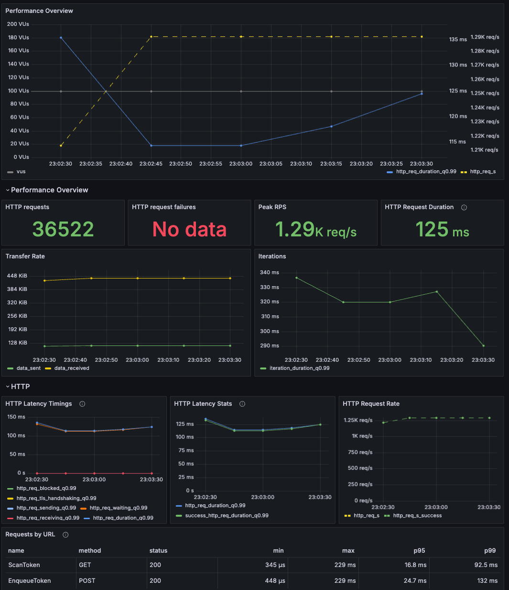
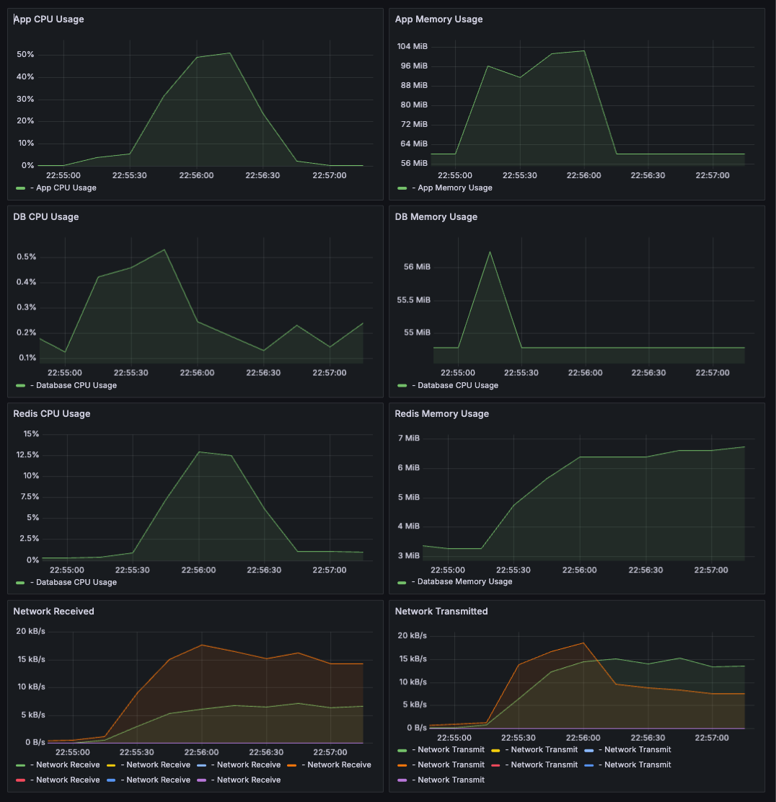

**평가**

데이터베이스를 사용했을 때 보다 약 1.5배 많은 처리량과 평균 약 5배 정도 빠른 응답 시간을 보여줬습니다. 레디스의 CPU가 사용되기는 했지만 12.5% 수준으로 크지 않았으며 DB에 전혀 부담을 주지 않아 전반적인 서비스 품질에 긍정적인 역할을 했습니다.

## 🙆‍♂️ 결론 및 종합 분석

**전반적인 성능 평가**
대부분의 API와 시나리오에서 목표로 한 성능 지표를 달성했습니다. 특히 Redis를 활용한 대기열 시스템의 성능 향상이 크게 확인되었습니다.

**주요 개선 포인트**

- 페이지네이션 적용을 통한 대량 데이터 처리 최적화
- Redis 활용을 통한 대기열 시스템 성능 개선

**병목 지점**

- 콘서트 좌석 목록 조회 API의 최대 응답 시간
- 복잡한 예약 시나리오에서의 일부 지연

**향후 개선 방향**

- 분산 트레이싱 도구 도입을 통한 세부적인 성능 분석
- 마이크로서비스 아키텍처 검토를 통한 시스템 확장성 개선
- 지속적인 성능 모니터링 및 알림 시스템 구축

**인프라 확장 계획**

- 현재 2 CPU, 2GB RAM 환경에서 안정적인 성능을 보이고 있으나, 향후 사용자 증가에 대비한 단계적 인프라 확장 계획 수립 필요
<details>
<summary>1 CPU, 1GB RAM 환경 콘서트 시나리오 결과 보기</summary>

```bash
     checks.........................: 100.00% ✓ 27698      ✗ 0
     data_received..................: 9.9 MB  329 kB/s
     data_sent......................: 2.7 MB  88 kB/s
     http_req_blocked...............: avg=77.16µs  min=500ns    med=1.58µs   max=50.65ms  p(90)=3.79µs   p(95)=6.87µs
     http_req_connecting............: avg=8.7µs    min=0s       med=0s       max=26.07ms  p(90)=0s       p(95)=0s
     http_req_duration..............: avg=29.1ms   min=324.12µs med=3.6ms    max=765.41ms p(90)=61.51ms  p(95)=160.84ms
       { expected_response:true }...: avg=29.1ms   min=324.12µs med=3.6ms    max=765.41ms p(90)=61.51ms  p(95)=160.84ms
     http_req_failed................: 0.00%   ✓ 0          ✗ 27698
     http_req_receiving.............: avg=100.86µs min=5.29µs   med=19.5µs   max=496.13ms p(90)=85.87µs  p(95)=138.58µs
     http_req_sending...............: avg=126.13µs min=2.12µs   med=6.54µs   max=433.57ms p(90)=25.79µs  p(95)=73.06µs
     http_req_tls_handshaking.......: avg=0s       min=0s       med=0s       max=0s       p(90)=0s       p(95)=0s
     http_req_waiting...............: avg=28.87ms  min=311.16µs med=3.54ms   max=765.32ms p(90)=60.91ms  p(95)=160.27ms
     http_reqs......................: 27698   917.427509/s
     iteration_duration.............: avg=217.01ms min=103.12ms med=173.59ms max=1.31s    p(90)=337.84ms p(95)=531.5ms
     iterations.....................: 13849   458.713755/s
     vus............................: 100     min=100      max=100
     vus_max........................: 100     min=100      max=100

running (0m30.2s), 000/100 VUs, 13849 complete and 0 interrupted iterations
```

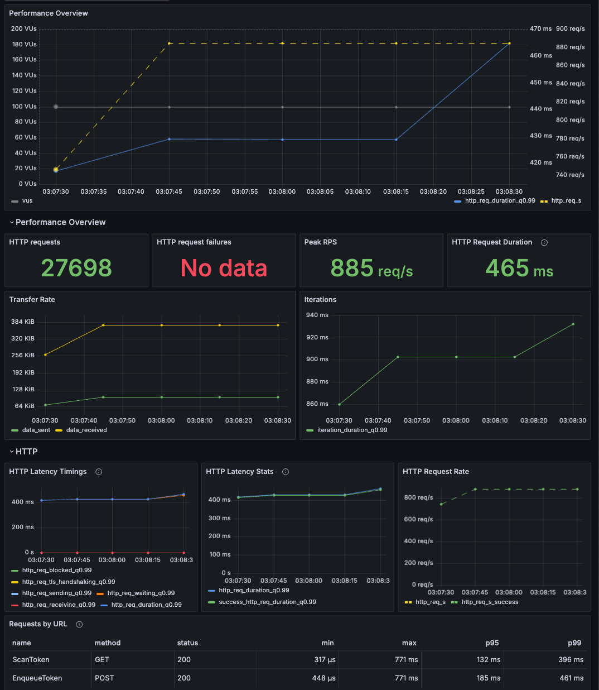

</details>

## **🧐 장애**란?

장애란 시스템이나 서비스가 정상적으로 작동하지 않는 상태를 의미합니다. 이는 사용자 경험에 부정적인 영향을 미치며, 비즈니스 운영에 심각한 지장을 줄 수 있습니다. 장애 관리는 이러한 문제를 예방하고, 발생 시 신속하게 대응하여 시스템의 가용성과 신뢰성을 유지하는 것을 목표로 합니다.

## 🚧 장애 대응 능력 검증하기

시스템의 안정성과 신뢰성을 평가하기 위해서는 장애 대응 능력을 객관적으로 측정할 수 있는 지표 및 협약이 필요합니다. 이를 위해 다음과 같은 세 가지 용어를 활용할 수 있습니다.

### SLI (Service Level Indicator)

SLI는 서비스의 성능이나 품질을 측정하는 구체적인 지표입니다. 이는 서비스의 핵심 특성을 수치화하여 나타냅니다.

- 가용성: 서비스가 정상적으로 작동하는 시간의 비율
- 응답 시간: 요청에 대한 시스템의 응답 속도
- 처리량: 단위 시간당 처리할 수 있는 요청의 수
- 오류율: 전체 요청 중 오류가 발생한 비율

### SLO (Service Level Objective)

SLO는 SLI에 대한 목표치를 설정한 것입니다. 이는 서비스 품질에 대한 약속이며, 내부적으로 합의된 성능 목표를 나타냅니다.

- 월간 가용성 99.9% 이상 유지
- 95%의 요청에 대해 응답 시간 200ms 이하 유지
- 초당 1,000개 이상의 요청 처리
- 오류율 0.1% 이하 유지

### SLA (Service Level Agreement)

SLA는 서비스 제공자와 고객 간에 합의된 서비스 수준에 대한 공식적인 계약입니다. SLA는 SLO를 기반으로 하지만, 법적 구속력이 있으며 서비스 불이행 시의 보상 조항 등이 포함됩니다. SLA의 주요 구성 요소는 다음과 같습니다:

1. 서비스 설명: 제공되는 서비스의 상세 내용
2. 성능 지표: 측정될 SLI와 목표치(SLO)
3. 측정 방법: 성능을 측정하고 보고하는 방식
4. 책임과 역할: 서비스 제공자와 고객의 책임 명시
5. 보상 정책: SLA 위반 시 적용될 보상 내용

## 🛟 가상 장애 대응 문서

### 장애 발생

대기열 기능에 부하가 몰리는 시점에 서버가 Down되어 모든 유저들이 서비스 이용을 하지 못하는 장애가 발생

### 장애 원인

- 뉴진스 콘서트 예약 오픈에 다량의 유저들이 인입
- 초당 1,000건 이상의 요청이 대기열 진입 API로 인입
- 점진적으로 응답시간이 느려지다 결국 서버가 다운
- 데이터베이스 커넥션 풀 고갈로 인한 쓰레드 타임아웃 발생
- 대기열 관리 로직의 비효율적인 구현으로 인한 CPU 과부하

### 장애 발생 시간

- **발생:** 2024년 8월 23일 오전 10시 31분 12초
- **인지:** 2024년 8월 23일 오전 10시 35분 03초
- **해결:** 2024년 8월 23일 오전 10시 58분 29초
- **총 장애 시간:** 27분 17초

### 임팩트

- 콘서트 예약을 진행하러 들어온 약 11만명의 유저들이 27분간 서비스 이용 불가
- 추후 진행될 에스파 콘서트 계약 취소 (약 17억원 규모)
- 하이브 측 손해 배상금 청구 (약 5천만원 규모)
- 소셜 미디어를 통한 부정적 여론 형성 및 브랜드 이미지 하락

### 장애 대응 과정

**장애 감지**

- 10:35 - 모니터링 시스템에서 서버 CPU 사용률 임계치 초과 알람 발생
- 10:36 - 대기열 API 응답 시간 증가 알람 발생

**초기 대응**

- 10:37 - 온콜 엔지니어에게 자동 알림 발송
- 10:39 - 긴급 대응 팀 소집 (DevOps, 백엔드, 인프라 담당자)
- 10:41 - 초기 장애 원인 분석 시작

**장애 해결 과정**

- 10:45 - 서버 리소스 증설 (스케일 아웃)
- 10:50 - 데이터베이스 커넥션 풀 확장
- 10:55 - 서비스 정상화 확인 테스트 진행
- 10:58 - 서비스 완전 복구 확인

### 장애 대응책

**Short-Term**

- 빠른 해결을 위해 데이터베이스와 서버의 사양을 스케일 업 및 스케일 아웃 진행
- 장애 발생 시, 빠르게 인지할 수 있는 슬랙 알림 설정 강화
- 대기열 서버의 자동 스케일링 정책 수립 및 적용
- 긴급 장애 대응 매뉴얼 업데이트 및 팀 내 공유

**Mid-Term**

- 데이터베이스로 작업되어 있는 대기열 기능 Redis로 이관
- 대기열 시스템의 아키텍처 개선 (마이크로서비스 분리 고려)
- 성능 테스트 시나리오 개선 및 정기적인 부하 테스트 실시

**Long-Term**

- 대규모 트래픽 처리 경험이 풍부한 시니어 개발자 채용
- 개발 조직 내 지속적인 성장을 위한 스터디 결성 및 기술 공유 세션 결성
- 장애 복구 자동화 시스템 구축

### 고객 대응 및 보상 계획

- 영향받은 사용자 대상 사과문 발송 및 보상 정책 수립
- 고객 서비스 팀 대상 장애 관련 FAQ 제공
- 공식 채널을 통한 장애 원인 및 개선 계획 투명하게 공개

## 😱 그 외 장애 발생 가능 분석

### 데이터베이스 슬로우 쿼리

데이터베이스 슬로우 쿼리는 여러 가지 이유로 발생할 수 있습니다. 그 중 가장 빈번하게 발생하는 이유로는 인덱싱의 영향이 있습니다. 1,000만 건의 데이터가 있는 테이블에서 인덱싱의 유무에 따른 성능 차이와 잠재적 장애 가능성을 분석해보겠습니다.

```sql
-- Index O
+----------------------------------------------------------------------------+
|QUERY PLAN                                                                  |
+----------------------------------------------------------------------------+
|Index Scan using idx_point_user on points  (cost=0.43..8.45 rows=1 width=28)|
|  Index Cond: (user_id = 100000)                                            |
+----------------------------------------------------------------------------+

-- Index X
+-------------------------------------------------------------------------------+
|QUERY PLAN                                                                     |
+-------------------------------------------------------------------------------+
|Gather  (cost=1000.00..126612.83 rows=1 width=28)                              |
|  Workers Planned: 2                                                           |
|  ->  Parallel Seq Scan on points  (cost=0.00..125612.73 rows=1 width=28)      |
|        Filter: (user_id = 100000)                                             |
|JIT:                                                                           |
|  Functions: 2                                                                 |
|  Options: Inlining false, Optimization false, Expressions true, Deforming true|
+-------------------------------------------------------------------------------
```

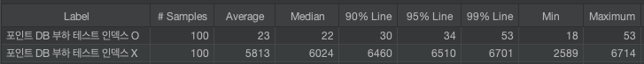

**분석 결과**

- EXPLAIN을 통한 분석에서 cost 수치가 최소 1,000배 이상 차이나는 것을 확인할 수 있습니다.
- 실제 쿼리 실행 시, 100번의 반복에서 평균적으로 약 250배 이상의 시간 차이가 발생했습니다.
- 인덱스 미적용 시, 평균 5초의 지연이 발생할 수 있으며, 이는 심각한 성능 저하로 이어질 수 있습니다.

**대응 방안**

- 주요 쿼리에 대한 정기적인 실행 계획 검토
- 인덱스 설계 및 최적화 작업 정례화
- 쿼리 성능 모니터링 도구 도입 (예: pg_stat_statements)
- ORM 사용 시 생성되는 쿼리 주기적 검토

### Thread Timeout

쓰레드가 특정 작업을 수행하는 데 예상보다 더 오랜 시간이 걸리거나, 무한 대기 상태에 빠져 설정된 시간 내에 작업을 완료하지 못하는 경우를 말합니다.

**주요 원인**

- 데드락(Deadlock): 두 개 이상의 쓰레드가 서로의 자원을 기다리며 무한 대기하는 상황
- 리소스 부족: CPU, 메모리, 네트워크 등의 리소스 부족으로 인한 처리 지연
- 과도한 부하: 시스템에 처리 능력 이상의 요청이 들어오는 경우

**대응 방안**

- 모니터링 강화: 쓰레드 상태와 시스템 리소스를 지속적으로 모니터링
- 로깅 개선: 타임아웃 발생 시 상세한 로그를 남겨 원인 분석에 활용
- 비동기 처리: 장시간 실행되는 작업을 비동기(이벤트)로 처리하여 메인 쓰레드의 블로킹 방지
- 서킷 브레이커 패턴: 반복적인 타임아웃 발생 시 해당 기능을 일시적으로 차단하여 시스템 보호

## 👋 마치며

부하 테스트와 장애 대응 문서를 작성하며 정말 많은 부분들이 고민되어야 하고, 좋은 장애 대응 과정을 가져가는것에 대한 중요성을 깨달을 수 있었습니다. 이제 마지막 챕터까지 진행해서 모든 항해 과정이 끝나게 되었는데 앞으로도 10주 동안 학습한 것과 같이 꾸준하게 학습하며 성장하는 개발자가 될 수 있도록 노력해야겠다는 생각을 했습니다.

## 🍀 참고 문서

- [k6를 이용한 부하테스트 방법](https://sjparkk-dev1og.tistory.com/221)
- [우아한 장애대응](https://techblog.woowahan.com/4886)
- [Monitoring Docker Containers](https://medium.com/@varunjain2108/monitoring-docker-containers-with-cadvisor-prometheus-and-grafana-d101b4dbbc84)
- [SLO, SLI 및 SLA란](https://newrelic.com/kr/blog/best-practices/what-are-slos-slis-slas)
- [장애 대응 능력을 확인할 수 있는 지표](https://www.whatap.io/bbs/board.php?bo_table=blog&wr_id=220&page=2)
