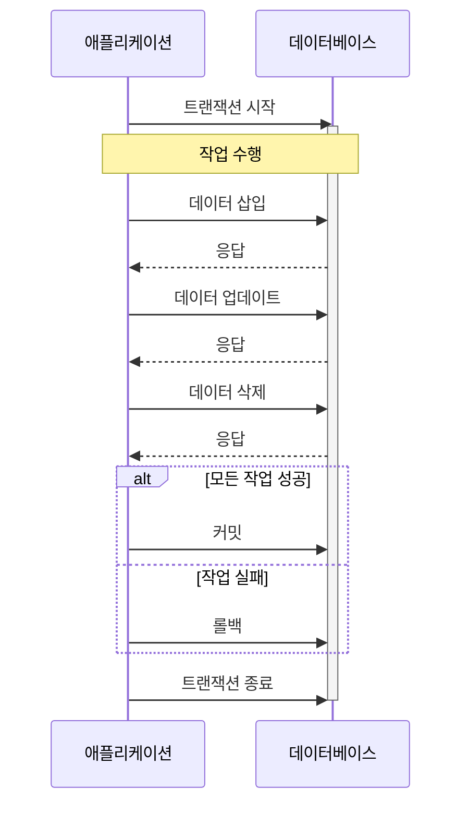
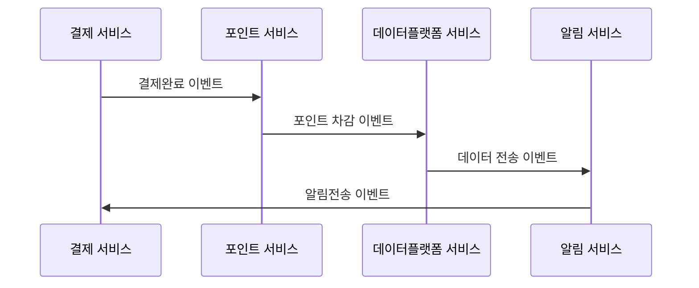
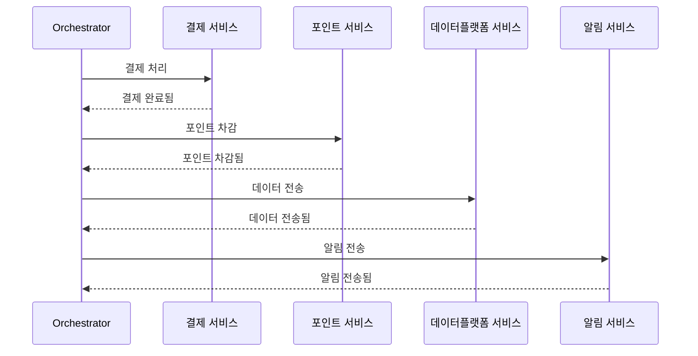

# 현재 트랜잭션의 문제와 해결방안

## 👋 서론

이 글에서는 현재 개발된 애플리케이션의 트랜잭션 범위와 그 한계점을 이해하고, 서비스가 MSA(Microservices Architecture)로 확장되는 시나리오를 가정하여 서비스 분리와 트랜잭션 처리의 문제점, 그리고 이를 해결하기 위한 설계 방안을 논의하겠습니다.

## **🧐** 트랜잭션이란?

**`PostgreSQL`** 공식 문서에서는 트랜잭션을 아래와 같이 설명하고 있습니다.

> *Transactions* are a fundamental concept of all database systems. The essential point of a transaction is that it bundles multiple steps into a single, all-or-nothing operation.

간단히 요약하면, 트랜잭션은 데이터베이스 작업을 여러 단계로 나누어도 이를 하나의 원자적인 작업처럼 처리하도록 보장하는 메커니즘입니다. 예를 들어, A와 B 작업이 있을 때, 두 작업이 모두 성공해야 트랜잭션이 완료되고, 하나라도 실패하면 모든 작업이 취소(롤백)되는 방식입니다. 이러한 특성을 통해 데이터의 정합성과 원자성을 유지할 수 있습니다. 그러나 트랜잭션에도 한계와 문제점이 존재하며, 이 문제들을 어떻게 해결할 수 있을지 알아보겠습니다.

## 📋 현재 시스템의 트랜잭션 범위 분석

- **사용자 인증 및 토큰 발급**
  - 사용자 로그인 검증
  - 토큰 생성 및 저장
- **대기열 관리**
  - 사용자 대기열 입장
  - 대기 순서 관리
- **좌석 예약**
  - 가용 좌석 확인
  - 좌석 선택 및 임시 예약
  - 최종 예약 확정
- **결제 처리**
  - 결제 정보 검증
  - 결제 처리
  - 결제 결과 기록

위와 같은 범위의 기능들이 현재 단일 데이터베이스 내에서 ACID 속성을 보장하며 처리되고 있습니다. 현재 구조에서 트랜잭션이 애플리케이션과 상호 작용하는 흐름은 아래와 같습니다.

- **트랜잭션 시작**: 데이터베이스와의 작업이 시작됩니다.
- **작업 수행**: 데이터 삽입, 업데이트, 삭제 등 여러 작업이 순차적으로 실행됩니다.
- **커밋/롤백 결정**: 모든 작업이 성공적으로 완료되면 커밋하여 변경사항을 확정합니다. 하나라도 실패하면 롤백하여 모든 변경사항을 취소합니다.
- **트랜잭션 종료**: 트랜잭션이 종료되고 자원들이 해제됩니다.



이러한 트랜잭션 모델은 단일 데이터베이스 환경에서는 데이터의 일관성을 보장하는 효과적인 방법입니다. 그러나 서비스 규모가 확장되고 MSA로 전환될 경우, 이 방식에 한계와 여러 고려사항이 생겨납니다.

## 📐 서비스 분리 설계

콘서트 예약 시스템을 MSA로 전환할 때 다음과 같이 서비스를 분리할 수 있습니다.

- **대기열 서비스:** 대기열을 관리하고 활성 유저 및 토큰 관리
- **콘서트 서비스**: 콘서트와 관련된 스케쥴 및 좌석 정보 관리
- **예약 서비스**: 사용자의 예약 요청을 처리하고 전체 예약 프로세스 관리
- **결제 서비스**: 결제 처리 및 결제 정보 관리
- **사용자 서비스**: 사용자 정보 관리 및 인증 관리

이러한 서비스 분리로 인해 기존의 단일 트랜잭션 모델을 그대로 적용하기 어려워지며, 새로운 트랜잭션 관리 방안이 필요합니다.

## 🤯 MSA 환경에서의 트랜잭션 처리 한계

현재 구조에서 MSA 구조로 서비스가 확장 및 분리될 때, 트랜잭션과 관련하여 다음과 같은 문제점들이 발생할 수 있습니다.

- **분산 트랜잭션의 복잡성**: 여러 서비스에 걸친 트랜잭션 관리가 복잡해집니다.
- **데이터 일관성 유지의 어려움**: 각 서비스가 독립적인 데이터베이스를 가질 경우, 전체 시스템의 데이터 일관성을 유지하기가 어려워집니다.
- **성능 저하**: 분산 환경에서의 트랜잭션 처리는 네트워크 지연과 추가적인 조정 작업으로 인해 성능 저하를 야기할 수 있습니다.
- **롤백의 복잡성**: 분산 환경에서 부분적으로 성공한 트랜잭션을 롤백하는 것이 매우 복잡하고 어려울 수 있습니다.

## 🗣️ 이벤트 기반 아키텍처 (EDA)

서비스가 MSA 형태로 확장될 경우, 기존의 단일 트랜잭션 모델을 위에 설명한 다양한 이유로 그대로 적용하기 어렵습니다. 따라서 트랜잭션을 효과적으로 관리할 수 있는 새로운 접근이 필요합니다. 이 문제를 해결하기 위해 비동기 처리와 이벤트 기반 아키텍처(EDA)를 도입할 수 있습니다.

이벤트 기반 아키텍처에서는 서비스 간 결합도를 낮추고, 각 서비스가 독립적으로 동작할 수 있도록 이벤트를 통해 통신합니다. 이를 통해 다음과 같은 이점을 얻을 수 있습니다.

- **비동기 처리**: 작업을 비동기로 처리하여 트랜잭션의 범위를 축소하고, 특정 작업의 실패가 전체 시스템에 영향을 미치지 않도록 합니다.
- **관심사 분리**: 각 서비스가 자신만의 책임 영역을 가질 수 있도록 하여 복잡성을 줄이고, 유지보수성을 향상시킵니다.

## 📕 SAGA 패턴 적용

SAGA 패턴은 MSA 환경에서 분산 트랜잭션을 관리하기 위한 효과적인 방법입니다. SAGA는 일련의 로컬 트랜잭션들로 구성되며, 각 로컬 트랜잭션은 단일 서비스 내에서 데이터를 업데이트하고 메시지 또는 이벤트를 발행하여 다음 로컬 트랜잭션을 트리거합니다. SAGA 패턴을 구현하는 방식에는 크게 두 가지가 있습니다.

### Choreography-based SAGA

이 방식은 각 서비스가 자신의 작업을 완료한 후, 다음 작업을 수행할 서비스에 이벤트를 전달하는 방식입니다. 각 서비스가 독립적으로 이벤트를 처리하며, 중앙에서의 제어가 필요하지 않습니다. 하지만 서비스 간의 결합도가 높아질 수 있다는 단점이 있습니다.

- 장점: 구현이 간단하고 이해하기 쉽습니다.
- 단점: 서비스 간 결합도가 높아질 수 있고, 전체 흐름을 파악하기 어려울 수 있습니다.



### Orchestration-based SAGA

이 방식에서는 중앙에서 오케스트레이터가 전체 프로세스를 관리합니다. 오케스트레이터가 각 서비스에 명령을 내리고, 서비스들이 이를 처리하며, 모든 작업이 완료되면 트랜잭션이 종료됩니다. 이 방식은 더 많은 제어와 관리를 제공하지만, 오케스트레이터의 복잡도가 증가할 수 있습니다.

- 장점: 복잡한 워크플로우 관리가 용이하고, 중앙에서 전체 흐름을 파악할 수 있습니다.
- 단점: 오케스트레이터가 단일 실패 지점이 될 수 있고, 구현이 복잡할 수 있습니다.



### 보상 트랜잭션

SAGA 패턴에서는 각 단계에서 실패가 발생할 경우, 이전 단계들의 작업을 취소하기 위한 보상 트랜잭션이 필요합니다. 예를 들어:

- 포인트 서비스에서 차감이 실패하면, 결제 서비스에서 완료된 결제를 취소해야 합니다.
- 데이터플랫폼 서비스에서 데이터 저장에 실패하면, 차감된 포인트를 복구하고, 결제 서비스에서 완료된 결제를 취소해야 합니다.

### NestJS에서 이벤트 사용하기

NestJS에는 cqrs라는 CQRS 패턴의 코드와 이벤트 기반 아키텍처에 사용을 도와주는 라이브러리가 있습니다. 이를 통해 `이벤트 정의`, `이벤트 발행`, `이벤트 소비`를 할 수 있습니다. 자세한 부분은 [NestJS 공식문서](https://docs.nestjs.com/recipes/cqrs)에서 확인이 가능합니다. 아래와 같은 방식을 통해 예약 서비스에서 데이터 플랫폼 서비스에 이벤트를 발행하고 소비했습니다.

```tsx
// 이벤트 정의
export class BookingCompletedEvent {
  constructor(
    public readonly booking: ConcertBooking,
    public readonly transactionId: EventTrasactionIdEnum,
  ) {}
}

// 이벤트 발행
async createBooking(dto: CreateConcertBookingDTO, entityManager: EntityManager): Promise<ConcertBooking> {
  let booking = ConcertBooking.create(dto);
  booking = await this.concertBookingRepository.save(booking, entityManager);

	// 이벤트 발행
  this.eventBus.publish(new BookingCompletedEvent(booking, EventTrasactionIdEnum.CONCERT_BOOKING_COMPLETED));

  return booking;
}

// 이벤트 소비
@EventsHandler(BookingCompletedEvent)
export class DataPlatformBookingCompletedHandler implements IEventHandler<BookingCompletedEvent> {
  constructor(private readonly dataPlatformService: DataPlatformService) {}

  async handle(event: BookingCompletedEvent) {
    try {
      await this.dataPlatformService.sendBookingResult(event.booking);
    } catch (error) {
      if (event.transactionId === EventTrasactionIdEnum.CONCERT_BOOKING_COMPLETED) {
        // 보상 트랜잭션이 존재 시, 작성
      }
    }
  }
}

```

위와 같이 이벤트를 발행하고 소비하는 방식을 통해 MSA로 확장된 서비스에서 유연성을 지키고 데이터 정합성을 챙기며 개발을 할 수 있습니다.

## 🎯 요약 정리

MSA로의 전환은 시스템의 확장성과 유연성을 크게 향상시킬 수 있지만, 동시에 트랜잭션 관리의 복잡성을 증가시킵니다. SAGA 패턴, 이벤트 기반 아키텍처, 보상 트랜잭션 등의 기법을 적절히 활용하여 이러한 복잡성을 관리하고, 시스템의 일관성과 신뢰성을 유지할 수 있어야 합니다.

- **이벤트 기반 아키텍처** 도입을 통해 서비스 간 결합도를 낮추고, 비동기 처리로 트랜잭션의 범위를 축소합니다.
- **SAGA 패턴**을 적용하여 분산 트랜잭션의 일관성을 관리합니다.
- **모니터링 및 로깅 시스템**을 강화하여 분산 환경에서의 문제를 신속하게 파악하고 해결할 수 있도록 합니다.
- **각 서비스의 독립성**을 고려하여 신중하게 서비스를 분리합니다.

## 🍀 참고 자료

- [PostgreSQL Transactions](https://www.postgresql.org/docs/current/tutorial-transactions.html)
- [Microservices Pattern: Pattern: Saga](https://microservices.io/patterns/data/saga.html)
- [NestJS - CQRS](https://docs.nestjs.com/recipes/cqrs)
- [Medium - 마이크로서비스 사가 패턴](https://medium.com/@greg.shiny82/%EB%A7%88%EC%9D%B4%ED%81%AC%EB%A1%9C%EC%84%9C%EB%B9%84%EC%8A%A4-%EC%82%AC%EA%B0%80-%ED%8C%A8%ED%84%B4-544fc1adf5f3)
