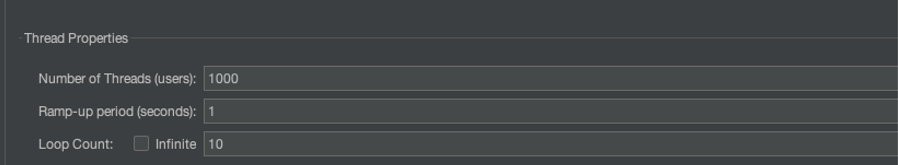
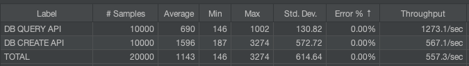
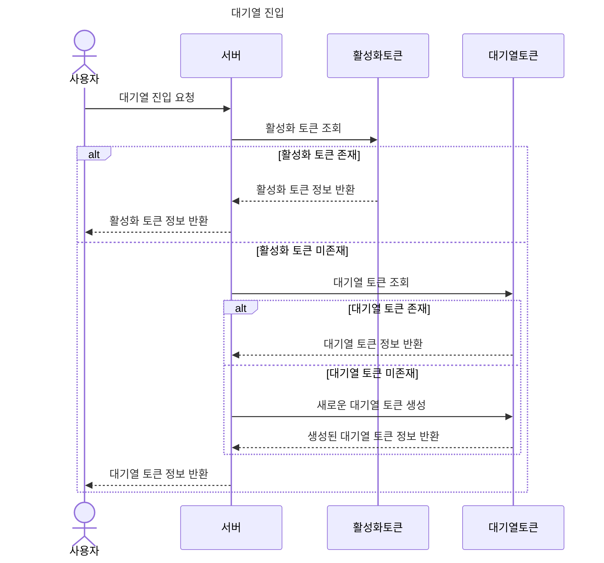
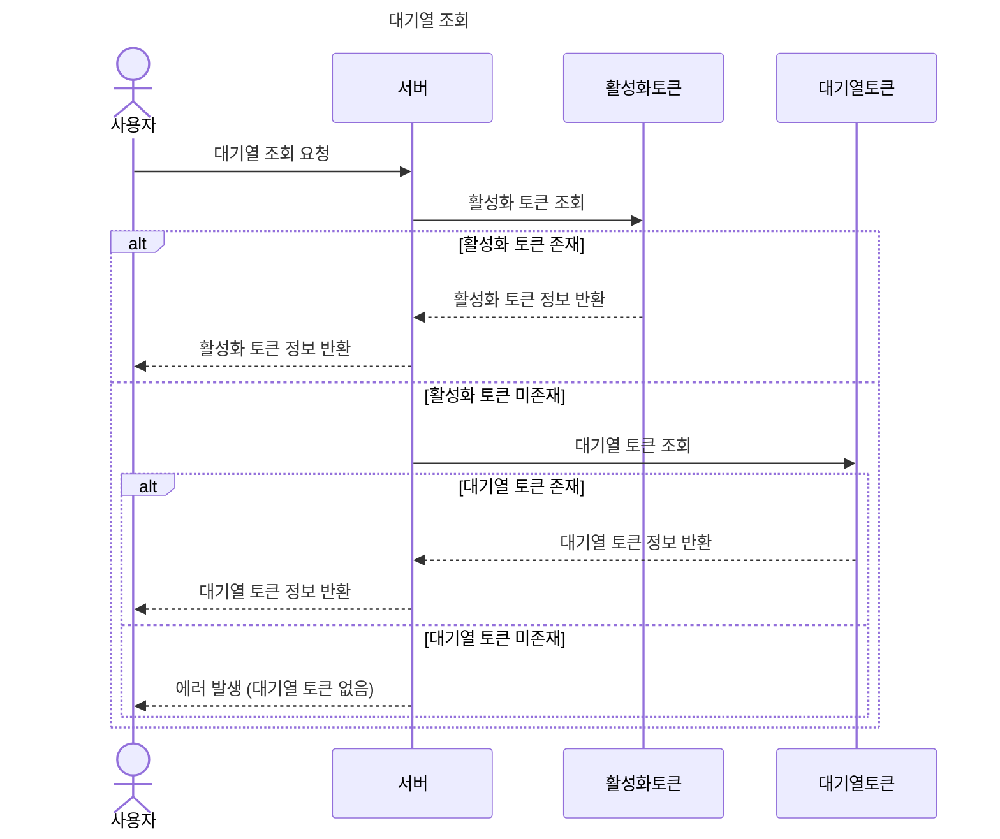
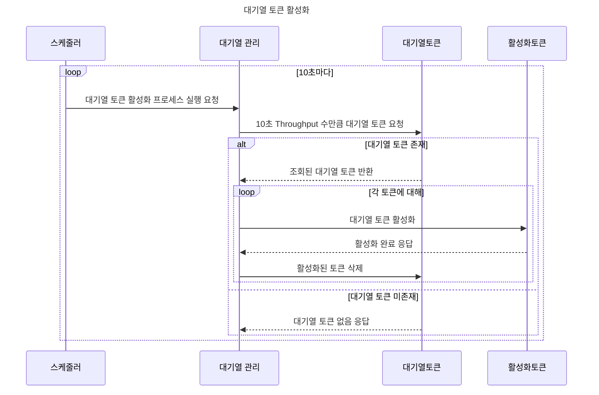
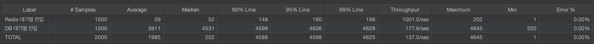

# 대기열 시스템 이관 (DB → Redis)

## **🧐 대기열이란?**

대기열이란 짧은 시간에 집중되는 트래픽을 효율적으로 관리하고 서버의 부하 분산을 위해 사용되는 시스템입니다. 콘서트 예매와 같이 특정 시점에 트래픽이 집중되는 도메인에서는 효율적인 대기열 구현이 필수적입니다. 예를 들어, 많은 사용자가 동시에 접속을 요청할 때, 대기열 시스템은 사용자를 순서대로 입장시켜 서버 부하를 방지합니다.

- 선입선출(FIFO) 방식으로 요청 처리
- 시스템 부하 조절 및 안정성 향상
- 사용자 경험 개선 (대기 상태 제공)

## 📌 현재 대기열의 문제 파악

기존 데이터베이스를 활용한 대기열 구현의 주요 문제점:

1. **서버 부하 증가**: 대기열 관리를 위한 데이터베이스 작업이 서버에 추가적인 부하를 줌
2. **성능 저하**: RDB의 특성상 빠른 데이터 추가와 상태 관리에 한계가 있음
3. **지연 발생**: 데이터베이스 트랜잭션 처리로 인한 응답 지연
4. **확장성 제한**: 대규모 트래픽 처리 시 데이터베이스 확장의 어려움

## 📊 Redis 자료 구조 선택

### 자료구조별 메모리 분석

### Sorted Sets - 100만 데이터

서비스를 이용하기 위해 대기하는 유저들을 관리하기 위한 목적으로 사용될 `Sorted Sets` 자료 구조입니다. 요구사항에 대기열에 인원 제한이 없어 100만개를 기준으로 메모리 사용량을 테스트 했습니다.

**Lua 명령어**

```lua
EVAL
"
	local time = redis.call('TIME');
	local ms = tonumber(time[1]) * 1000 + math.floor(tonumber(time[2])/1000);
	for i = 1, 1000000
	do redis.call('ZADD', 'waiting_tokens', ms + i, i)
	end
"
```

**결과**

```bash
ZCARD waiting_tokens
(integer) 1000000

MEMORY USAGE waiting_tokens
(integer) 102789312
```

100만 개의 데이터 삽입 시 약 98MB의 메모리를 사용합니다.

### Strings (with TTL) - 6만 데이터

`Strings`는 활성화된 토큰 관리에 사용될 자료 구조입니다. 현재 서버 TPS 기준 최대 활성화 토큰을 기준으로 6만개의 데이터로 테스트를 진행했습니다.

**Lua 명령어**

```lua
EVAL
"
	local token = '토큰 값'
	for i = 1, 60000
	do redis.call('SET', 'active_tokens:' .. i, token, 'EX', 5 * 60, 'NX')
	end
"
```

**결과**

```lua
MEMORY USAGE active_tokens:1
(integer) 232
```

모든 키가 232bytes로 확인이 되어, 총 메모리 사용량은 `232 * 60000 / 1024 / 1024` 의 계산을 통해 약 13.27MB로 확인되었습니다.

### Sets - 6만 데이터

Sets도 활성화된 토큰 관리에 고려된 자료 구조입니다. `Strings`와 동일한 이유로 6만개의 데이터로 데스트를 진행했습니다.

**Lua 명령어**

```lua
EVAL
"
	local token = '토큰 값'
	for i = 1, 60000
	do redis.call('SADD', 'active_tokens', token)
	end
"
```

**결과**

```lua
SCARD active_tokens
(integer) 60000

MEMORY USAGE active_tokens
(integer) 12524400
```

6만 개의 데이터 저장 시 약 11.94MB의 메모리를 사용합니다.

### Sorted Sets 선택 이유

대기열 관리를 위해 `Sorted Sets` 자료 구조를 선택했습니다.

- 대기열 진입 시간을 score로 사용하여 자동 정렬 용이
- zrange 명령어를 통해 특정 범위의 사용자를 효율적으로 조회 가능
- 100만 개 이상의 데이터도 효율적으로 관리 가능
- 대량의 데이터를 비교적 적은 메모리로 관리 가능

### Sets vs Strings 선택 이유

활성화 토큰 관리를 위해 `Strings` 자료 구조를 최종적으로 선택했습니다.

- Expire 옵션을 통한 자동 삭제 기능
- key-value 구조로 명시적인 값 관리 가능
- Sets 대비 약 11% 많은 메모리 사용이지만, 전체 시스템에서 차지하는 비중이 적다고 판단
- 서비스의 만료 Scheduler를 줄여 관리 포인트 감소 및 버그 발생 가능성 축소

### Redis 사용 함수 정리

| 자료구조    | 함수   | 시간 복잡도  | 사용 이유                 |
| ----------- | ------ | ------------ | ------------------------- |
| Sorted Sets | zadd   | O(log(N))    | 대기열에 멤버 추가        |
|             | zrank  | O(log(N))    | 멤버의 대기열 순서 확인   |
|             | zcard  | O(1)         | 총 대기열 멤버 수 확인    |
|             | zrange | O(log(N)+M)  | 활성화할 대기열 멤버 조회 |
|             | zrem   | O(M\*log(N)) | 활성화한 대기열 멤버 제거 |
| Strings     | set    | O(1)         | 활성화 토큰 추가          |
|             | get    | O(1)         | 활성화 토큰 조회          |
|             | del    | O(1)         | 활성화 토큰 만료          |

## 📈 5. TPS 계산 및 대기열 설계

### TPS(Transaction Per Second) 측정

`JMeter`를 사용한 부하 테스트 결과:

- 조회 API: 약 1,273/sec
- 생성 API: 약 567/sec




### 시나리오 평균 TPS 계산

현재 시스템의 API 구성:

- Query 3개: 콘서트 조회, 예약 가능 스케줄 조회, 좌석 조회
- Mutation 2개: 좌석 예약, 예약 결제

계산식: `(평균 조회 TPS * 3 + 평균 생성 TPS * 2) / 5`

결과: 약 1,000 TPS

### 수용 가능 유저 수 계산

계산식: `(평균 TPS / 수행 트랜잭션 수 * 60 * 5)`

결과: 5분간 약 60,000명의 유저 수용 가능

### 대기열 설계

1. `Sorted Sets`를 사용하여 대기열 관리
   - Score: 대기열 진입 시간 (ms)
   - Member: 사용자 ID
2. `Strings`를 사용하여 활성 토큰 관리
   - Key: `active_tokens:{userId}`
   - Value: 토큰 값
   - TTL: 5분

## **📋** 구현 대기열 동작 방식

### 대기열 진입



### 대기열 조회



### 대기열 토큰 활성화



## 성능 비교

`JMeter`를 사용한 Redis 기반 대기열 시스템과 기존 DB 기반 대기열 시스템의 성능 비교 결과는 다음과 같습니다.

| 시스템            | 요청 수 | 평균 응답 시간 (ms) | 중간값 (ms) | 90% 라인 (ms) | 95% 라인 (ms) | 99% 라인 (ms) | 처리량 (요청/초) | 최대 응답 시간 (ms) | 최소 응답 시간 (ms) | 에러율 (%) |
| ----------------- | ------- | ------------------- | ----------- | ------------- | ------------- | ------------- | ---------------- | ------------------- | ------------------- | ---------- |
| Redis 대기열 진입 | 1000    | 59                  | 52          | 148           | 180           | 198           | 1001.0           | 202                 | 1                   | 0.00       |
| DB 대기열 진입    | 1000    | 3911                | 4531        | 4598          | 4606          | 4628          | 177.6            | 4645                | 320                 | 0.00       |
| 전체              | 2000    | 1985                | 202         | 4588          | 4598          | 4625          | 137.0            | 4645                | 1                   | 0.00       |



### 분석 결과

1. **응답 시간**:

   - Redis 기반 시스템의 평균 응답 시간(59ms)이 DB 기반 시스템(3911ms)에 비해 약 66배 빠르게 동작했습니다.
   - 중간값을 비교해도 Redis(52ms)가 DB(4531ms)보다 약 87배 빠른 성능을 보여줬습니다.

2. **처리량**:

   - Redis 기반 시스템은 초당 1001.0개의 요청을 처리할 수 있어, DB 기반 시스템(177.6 요청/초)보다 약 5.6배 높은 처리량을 보여줬습니다.

3. **안정성**:

   - Redis 시스템의 90%, 95%, 99% 응답 시간(각각 148ms, 180ms, 198ms)이 모두 DB 시스템(4598ms, 4606ms, 4628ms)보다 현저히 낮아, 높은 부하 상황에서도 안정적인 성능을 유지합니다.
   - 최대 응답 시간에서도 Redis(202ms)가 DB(4645ms)보다 훨씬 빠른 성능을 보여줬습니다.

4. **일관성**:

   - Redis 시스템의 중간값(52ms)과 평균(59ms)이 비슷하여 일관된 성능을 보여주는 반면, DB 시스템은 중간값(4531ms)과 평균(3911ms) 사이에 더 큰 차이가 있어 성능의 변동성이 상대적으로 컸습니다.

5. **에러율**:
   - 두 시스템 모두 0%의 에러율로 초당 1000건의 요청을 수행했습니다.

이 결과를 통해 Redis 기반 대기열 시스템이 기존 DB 기반 시스템에 비해 응답 시간, 처리량, 안정성 측면에서 월등히 뛰어난 성능을 보여주는 것을 확인할 수 있었습니다. Redis의 in-memory 특성과 최적화된 자료구조 사용이 이러한 성능 향상의 주요 요인으로 판단됩니다.

## 테스트 환경

**💻 하드웨어 환경**

- OS: macOS (Sonoma 14.4.1)
- Model: Apple M1 Pro, 10-core CPU , 14-core GPU
- Memory: 16GB LPDDR5
- Storage: 512GB SSD

**📡 소프트웨어 환경**

- NodeJS (18.17.x)
- PostgreSQL
- Docker
- JMeter

## **🍀 참고 자료**

- [Redis Documentation - Sets](https://redis.io/docs/latest/develop/data-types/sets/)

- [Medium - Redis Memory Usage from Comparison to Optimization](https://medium.com/@hjjae2/redis-memory-usage-from-comparison-to-optimization-6de2abb239c7)
